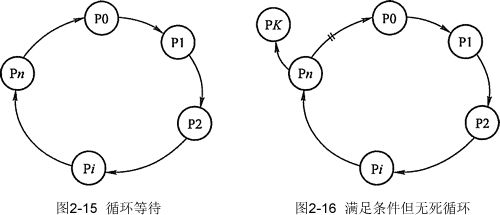

# 死锁的概念以及产生死锁的原因

## 死锁的定义

在多道程序系统中，由于多个进程的并发执行，改善了系统资源的利用率并提高了系统 的处理能力。然而，多个进程的并发执行也带来了新的问题——死锁。所谓死锁是指多个进 程因竞争资源而造成的一种僵局（互相等待），若无外力作用，这些进程都将无法向前推进。

下面我们通过一些实例来说明死锁现象。

先看生活中的一个实例，在一条河上有一座桥，桥面很窄，只能容纳一辆汽车通行。如 果有两辆汽车分别从桥的左右两端驶上该桥，则会出现下述的冲突情况。此时，左边的汽车 占有了桥面左边的一段，要想过桥还需等待右边的汽车让出桥面右边的一段；右边的汽车占 有了桥面右边的一段，要想过桥还需等待左边的汽车让出桥面左边的一段。此时，若左右两 边的汽车都只能向前行驶，则两辆汽车都无法过桥。

在计算机系统中也存在类似的情况。例如，某计算机系统中只有一台打印机和一台输入 设备，进程 P1 正占用输入设备，同时又提出使用打印机的请求，但此时打印机正被进程 P2 所占用，而 P2 在未释放打印机之前，又提出请求使用正被 P1 占用着的输入设备。这样两个进程相互无休止地等待下去，均无法继续执行，此时两个进程陷入死锁状态。

## 死锁产生的原因

#### 1) 系统资源的竞争

通常系统中拥有的不可剥夺资源，其数量不足以满足多个进程运行的需要，使得进程在 运行过程中，会因争夺资源而陷入僵局，如磁带机、打印机等。只有对不可剥夺资源的竞争 才可能产生死锁，对可剥夺资源的竞争是不会引起死锁的。

#### 2) 进程推进顺序非法

进程在运行过程中，请求和释放资源的顺序不当，也同样会导致死锁。例如，并发进程 P1、P2 分别保持了资源 R1、R2，而进程 P1 申请资源 R2，进程 P2 申请资源 R1 时，两者都 会因为所需资源被占用而阻塞。

信号量使用不当也会造成死锁。进程间彼此相互等待对方发来的消息，结果也会使得这 些进程间无法继续向前推进。例如，进程 A 等待进程 B 发的消息，进程 B 又在等待进程 A 发的消息，可以看出进程 A 和 B 不是因为竞争同一资源，而是在等待对方的资源导致死锁。

#### 3) 死锁产生的必要条件

产生死锁必须同时满足以下四个条件，只要其中任一条件不成立，死锁就不会发生。

*   互斥条件：进程要求对所分配的资源（如打印机）进行排他性控制，即在一段时间内某 资源仅为一个进程所占有。此时若有其他进程请求该资源，则请求进程只能等待。
*   不剥夺条件：进程所获得的资源在未使用完毕之前，不能被其他进程强行夺走，即只能 由获得该资源的进程自己来释放（只能是主动释放)。
*   请求和保持条件：进程已经保持了至少一个资源，但又提出了新的资源请求，而该资源 已被其他进程占有，此时请求进程被阻塞，但对自己已获得的资源保持不放。
*   循环等待条件：存在一种进程资源的循环等待链，链中每一个进程已获得的资源同时被 链中下一个进程所请求。即存在一个处于等待状态的进程集合{Pl, P2, ..., pn}，其中 Pi 等 待的资源被 P(i+1)占有（i=0, 1, ..., n-1)，Pn 等待的资源被 P0 占有，如图 2-15 所示。

直观上看，循环等待条件似乎和死锁的定义一样，其实不然。按死锁定义构成等待环所 要求的条件更严，它要求 Pi 等待的资源必须由 P(i+1)来满足，而循环等待条件则无此限制。 例如，系统中有两台输出设备，P0 占有一台，PK 占有另一台，且 K 不属于集合{0, 1, ..., n}。

Pn 等待一台输出设备，它可以从 P0 获得，也可能从 PK 获得。因此，虽然 Pn、P0 和其他 一些进程形成了循环等待圈，但 PK 不在圈内，若 PK 释放了输出设备，则可打破循环等待, 如图 2-16 所示。因此循环等待只是死锁的必要条件。

资源分配图含圈而系统又不一定有死锁的原因是同类资源数大于 1。但若系统中每类资 源都只有一个资源，则资源分配图含圈就变成了系统出现死锁的充分必要条件。