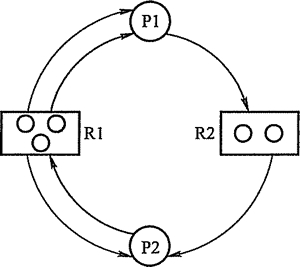

# 死锁的检测和解除

前面绍的死锁预防和避免算法，都是在为进程分配资源时施加限制条件或进行检测，若系统为进程分配资源时不釆取任何措施，则应该提供死锁检测和解除的手段。

## 资源分配图

系统死锁，可利用资源分配图来描述。如图 2-17 所示，用圆圈代表一个进程，用框代表一类资源。由于一种类型的资源可能有多个，用框中的一个点代表一类资源中的一个资源。从进程到资源的有向边叫请求边，表示该进程申请一个单位的该类资源；从资源到进程的边叫分配边，表示该类资源已经有一个资源被分配给了该进程。

图 2-17  资源分配示例图

在图 2-17 所示的资源分配图中，进程 P1 已经分得了两个 R1 资源，并又请求一个 R2 资源；进程 P2 分得了一个 R1 和一个 R2 资源，并又请求一个 R1 资源。

## 死锁定理

可以通过将资源分配图简化的方法来检测系统状态 S 是否为死锁状态。简化方法如下：

1) 在资源分配图中，找出既不阻塞又不是孤点的进程 Pi（即找出一条有向边与它相连，且该有向边对应资源的申请数量小于等于系统中已有空闲资源数量。若所有的连接该进程的边均满足上述条件，则这个进程能继续运行直至完成，然后释放它所占有的所有资源）。消去它所有的请求边和分配边，使之成为孤立的结点。在图 2-18(a)中，P1 是满足这一条件的进程结点，将 P1 的所有边消去，便得到图 248(b)所示的情况。

2) 进程 Pi 所释放的资源，可以唤醒某些因等待这些资源而阻塞的进程，原来的阻塞进程可能变为非阻塞进程。在图 2-17 中，进程 P2 就满足这样的条件。根据第 1) 条中的方法进行一系列简化后,若能消去图中所有的边，则称该图是可完全简化的，如图 2-18(c)所示。

S 为死锁的条件是当且仅当 S 状态的资源分配图是不可完全简化的,该条件为死锁定理。

## 死锁的解除

一旦检测出死锁，就应立即釆取相应的措施，以解除死锁。死锁解除的主要方法有：

1) 资源剥夺法。挂起某些死锁进程，并抢占它的资源，将这些资源分配给其他的死锁进程。但应防止被挂起的进程长时间得不到资源，而处于资源匮乏的状态。

2) 撤销进程法。强制撤销部分、甚至全部死锁进程并剥夺这些进程的资源。撤销的原则可以按进程优先级和撤销进程代价的高低进行。

图 2-18  资源分配图的化简

3) 进程回退法。让一（多）个进程回退到足以回避死锁的地步，进程回退时自愿释放资源而不是被剥夺。要求系统保持进程的历史信息，设置还原点。