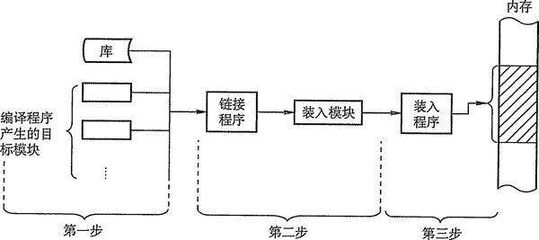
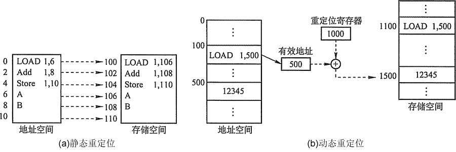
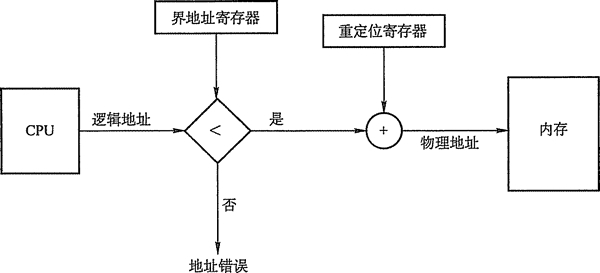

# 内存管理的概念

内存管理(Memory Management)是操作系统设计中最重要和最复杂的内容之一。虽然计算机硬件一直在飞速发展，内存容量也在不断增长，但是仍然不可能将所有用户进程和系统所需要的全部程序和数据放入主存中，所以操作系统必须将内存空间进行合理地划分和有效地动态分配。操作系统对内存的划分和动态分配，就是内存管理的概念。

有效的内存管理在多道程序设计中非常重要，不仅方便用户使用存储器、提高内存利用率，还可以通过虚拟技术从逻辑上扩充存储器。

内存管理的功能有：

*   内存空间的分配与回收：由操作系统完成主存储器空间的分配和管理，使程序员摆脱存储分配的麻烦，提高编程效率。
*   地址转换：在多道程序环境下，程序中的逻辑地址与内存中的物理地址不可能一致，因此存储管理必须提供地址变换功能，把逻辑地址转换成相应的物理地址。
*   内存空间的扩充：利用虚拟存储技术或自动覆盖技术，从逻辑上扩充内存。
*   存储保护：保证各道作业在各自的存储空间内运行，.互不干扰。

在进行具体的内存管理之前，需要了解进程运行的基本原理和要求。

## 程序装入和链接

创建进程首先要将程序和数据装入内存。将用户源程序变为可在内存中执行的程序，通常需要以下几个步骤：

*   编译：由编译程序将用户源代码编译成若干个目标模块。
*   链接：由链接程序将编译后形成的一组目标模块，以及所需库函数链接在一起，形成一个完整的装入模块。
*   装入：由装入程序将装入模块装入内存运行。

这三步过程如图 3-1 所示。

图 3-1  对用户程序的处理步骤

程序的链接有以下三种方式：

*   静态链接：在程序运行之前，先将各目标模块及它们所需的库函数链接成一个完整的可执行程序，以后不再拆开。
*   装入时动态链接：将用户源程序编译后所得到的一组目标模块，在装入内存时，釆用边装入边链接的链接方式。
*   运行时动态链接：对某些目标模块的链接，是在程序执行中需要该目标模块时，才对它进行的链接。其优点是便于修改和更新，便于实现对目标模块的共享。

内存的装入模块在装入内存时，同样有以下三种方式：

1) 绝对装入。在编译时，如果知道程序将驻留在内存的某个位置，编译程序将产生绝对地址的目标代码。绝对装入程序按照装入模块中的地址，将程序和数据装入内存。由于程序中的逻辑地址与实际内存地址完全相同，故不需对程序和数据的地址进行修改。

绝对装入方式只适用于单道程序环境。另外，程序中所使用的绝对地址,可在编译或汇编时给出，也可由程序员直接赋予。而通常情况下在程序中釆用的是符号地址，编译或汇编时再转换为绝对地址。

2) 可重定位装入。在多道程序环境下，多个目标模块的起始地址通常都是从 0 开始，程序中的其他地址都是相对于起始地址的,此时应釆用可重定位装入方式。根据内存的当前情况，将装入模块装入到内存的适当位置。装入时对目标程序中指令和数据的修改过程称为重定位，地址变换通常是在装入时一次完成的，所以又称为静态重定位，如图 3-2(a) 所示。

图 3-2  重定向类型

静态重定位的特点是在一个作业装入内存时，必须分配其要求的全部内存空间，如果没有足够的内存，就不能装入该作业。此外，作业一旦进入内存后，在整个运行期间不能在内存中移动，也不能再申请内存空间。

3) 动态运行时装入，也称为动态重定位，程序在内存中如果发生移动，就需要釆用动态的装入方式。装入程序在把装入模块装入内存后，并不立即把装入模块中的相对地址转换为绝对地址，而是把这种地址转换推迟到程序真正要执行时才进行。因此，装入内存后的所有地址均为相对地址。这种方式需要一个重定位寄存器的支持，如图 3-2(b)所示。

动态重定位的特点是可以将程序分配到不连续的存储区中；在程序运行之前可以只装入它的部分代码即可投入运行，然后在程序运行期间，根据需要动态申请分配内存；便于程序段的共享，可以向用户提供一个比存储空间大得多的地址空间。

## 逻辑地址空间与物理地址空间

编译后，每个目标模块都是从 0 号单元开始编址，称为该目标模块的相对地址（或逻辑地址)。当链接程序将各个模块链接成一个完整的可执行目标程序时，链接程序顺序依次按各个模块的相对地址构成统一的从 0 号单元开始编址的逻辑地址空间。用户程序和程序员只需知道逻辑地址，而内存管理的具体机制则是完全透明的，它们只有系统编程人员才会涉及。不同进程可以有相同的逻辑地址，因为这些相同的逻辑地址可以映射到主存的不同位置。

物理地址空间是指内存中物理单元的集合，它是地址转换的最终地址，进程在运行时执行指令和访问数据最后都要通过物理地址从主存中存取。当装入程序将可执行代码装入内存时，必须通过地址转换将逻辑地址转换成物理地址，这个过程称为地址重定位。

## 内存保护

内存分配前，需要保护操作系统不受用户进程的影响，同时保护用户进程不受其他用户进程的影响。通过釆用重定位寄存器和界地址寄存器来实现这种保护。重定位寄存器含最小的物理地址值，界地址寄存器含逻辑地址值。每个逻辑地址值必须小于界地址寄存器；内存管理机构动态地将逻辑地址与界地址寄存器进行比较，如果未发生地址越界，则加上重定位寄存器的值后映射成物理地址，再送交内存单元，如图 3-3 所示。

当 CPU 调度程序选择进程执行时，派遣程序会初始化重定位寄存器和界地址寄存器。每一个逻辑地址都需要与这两个寄存器进行核对，以保证操作系统和其他用户程序及数据不被该进程的运行所影响。

图 3-3  重定位和界地址寄存器的硬件支持