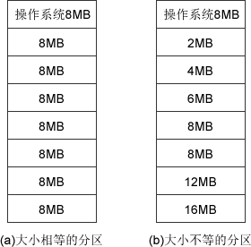
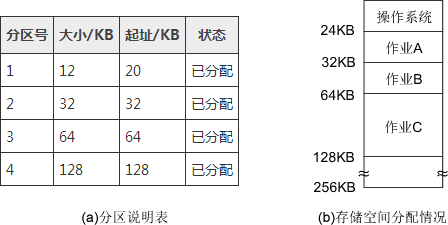
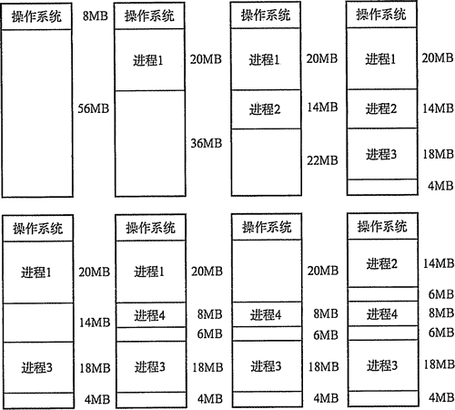

# 内存连续分配管理方式

连续分配方式，是指为一个用户程序分配一个连续的内存空间。它主要包括单一连续分配、固定分区分配和动态分区分配。

## 单一连续分配

内存在此方式下分为系统区和用户区，系统区仅提供给操作系统使用，通常在低地址部分；用户区是为用户提供的、除系统区之外的内存空间。这种方式无需进行内存保护。

这种方式的优点是简单、无外部碎片，可以釆用覆盖技术，不需要额外的技术支持。缺点是只能用于单用户、单任务的操作系统中，有内部碎片，存储器的利用率极低。

## 固定分区分配

固定分区分配是最简单的一种多道程序存储管理方式，它将用户内存空间划分为若干个固定大小的区域，每个分区只装入一道作业。当有空闲分区时，便可以再从外存的后备作业队列中,选择适当大小的作业装入该分区，如此循环。

图 3-4  固定分区分配的两种方法

固定分区分配在划分分区时，有两种不同的方法，如图 3-4 所示。

*   分区大小相等：用于利用一台计算机去控制多个相同对象的场合，缺乏灵活性。
*   分区大小不等：划分为含有多个较小的分区、适量的中等分区及少量的大分区。

为便于内存分配，通常将分区按大小排队，并为之建立一张分区说明表，其中各表项包括每个分区的起始地址、大小及状态（是否已分配），如图 3-5(a)所示。当有用户程序要装入时，便检索该表，以找到合适的分区给予分配并将其状态置为”已分配”；未找到合适分区则拒绝为该用户程序分配内存。存储空间的分配情况如图 3-5(b)所示。

这种分区方式存在两个问题：一是程序可能太大而放不进任何一个分区中，这时用户不得不使用覆盖技术来使用内存空间；二是主存利用率低，当程序小于固定分区大小时，也占用了一个完整的内存分区空间，这样分区内部有空间浪费，这种现象称为内部碎片。

固定分区是可用于多道程序设计最简单的存储分配，无外部碎片，但不能实现多进程共享一个主存区，所以存储空间利用率低。固定分区分配很少用于现在通用的操作系统中，但在某些用于控制多个相同对象的控制系统中仍发挥着一定的作用。

图 3-5  固定分区说明表和内存分配情况

## 动态分区分配

动态分区分配又称为可变分区分配，是一种动态划分内存的分区方法。这种分区方法不预先将内存划分，而是在进程装入内存时，根据进程的大小动态地建立分区，并使分区的大小正好适合进程的需要。因此系统中分区的大小和数目是可变的。

图 3-6 动态分区

如图 3-6 所示，系统有 64MB 内存空间，其中低 8MB 固定分配给操作系统，其余为用户可用内存。开始时装入前三个进程，在它们分别分配到所需空间后，内存只剩下 4MB，进程 4 无法装入。在某个时刻，内存中没有一个就绪进程，CPU 出现空闲，操作系统就换出进程 2，换入进程 4。由于进程 4 比进程 2 小，这样在主存中就产生了一个 6MB 的内存块。之后 CPU 又出现空闲，而主存无法容纳进程 2,操作系统就换出进程 1，换入进程 2。

动态分区在开始分配时是很好的，但是之后会导致内存中出现许多小的内存块。随着时间的推移，内存中会产生越来越多的碎片（图 3-6 中最后的 4MB 和中间的 6MB，且随着进程的换入/换出，很可能会出现更多更小的内存块)，内存的利用率随之下降。这些小的内存块称为外部碎片，指在所有分区外的存储空间会变成越来越多的碎片，这与固定分区中的内部碎片正好相对。克服外部碎片可以通过紧凑（Compaction)技术来解决，就是操作系统不时地对进程进行移动和整理。但是这需要动态重定位寄存器的支持，且相对费时。紧凑的过程实际上类似于 Windows 系统中的磁盘整理程序，只不过后者是对外存空间的紧凑。

在进程装入或换入主存时，如果内存中有多个足够大的空闲块，操作系统必须确定分配哪个内存块给进程使用，这就是动态分区的分配策略，考虑以下几种算法：

*   首次适应(First  Fit)算法：空闲分区以地址递增的次序链接。分配内存时顺序查找，找到大小能满足要求的第一个空闲分区。
*   最佳适应(Best  Fit)算法：空闲分区按容量递增形成分区链，找到第一个能满足要求的空闲分区。
*   最坏适应(Worst  Fit)算法：又称最大适应(Largest Fit)算法，空闲分区以容量递减的次序链接。找到第一个能满足要求的空闲分区，也就是挑选出最大的分区。
*   邻近适应(Next  Fit)算法：又称循环首次适应算法，由首次适应算法演变而成。不同之处是分配内存时从上次查找结束的位置开始继续查找。

在这几种方法中，首次适应算法不仅是最简单的，而且通常也是最好和最快的。在 UNIX 系统的最初版本中，就是使用首次适应算法为进程分配内存空间，其中使用数组的数据结构 (而非链表）来实现。不过，首次适应算法会使得内存的低地址部分出现很多小的空闲分区，而每次分配查找时，都要经过这些分区，因此也增加了查找的开销。

邻近适应算法试图解决这个问题，但实际上，它常常会导致在内存的末尾分配空间（因为在一遍扫描中，内存前面部分使用后再释放时，不会参与分配)，分裂成小碎片。它通常比首次适应算法的结果要差。

最佳适应算法虽然称为“最佳”，但是性能通常很差，因为每次最佳的分配会留下很小的难以利用的内存块，它会产生最多的外部碎片。

最坏适应算法与最佳适应算法相反，选择最大的可用块，这看起来最不容易产生碎片，但是却把最大的连续内存划分开，会很快导致没有可用的大的内存块，因此性能也非常差。

Kunth 和 Shore 分别就前三种方法对内存空间的利用情况做了模拟实验，结果表明：

首次适应算法可能比最佳适应法效果好，而它们两者一定比最大适应法效果好。另外注意,在算法实现时,分配操作中最佳适应法和最大适应法需要对可用块进行排序或遍历查找，而首次适应法和邻近适应法只需要简单查找；回收操作中，当回收的块与原来的空闲块相邻时（有三种相邻的情况，比较复杂)，需要将这些块合并。在算法实现时，使用数组或链表进行管理。除了内存的利用率，这里的算法开销也是操作系统设计需要考虑的一个因素。

表 3-1 三种内存分区管理方式的比较

|   | 作业道数 | 内部碎片 | 外部碎片 | 硬件支持 | 可用空间管理 | 解决碎片方法 | 解决空间不足 | 提高作业道数 |
| 单道连续分配 | 1 | 有 | 无 | 界地址寄存器、越界检查机构 | -- | -- | 覆盖 | 交换 |
| 多道固定连续分配 | <=N(用户空间划为 N 块) | 有 | 无 |  
1.  上下界寄存器、越界检查机构
2.  基地址寄存器、长度寄存器、动态地址转换机构

 | -- | -- |
| 多道可变连续分配 | — | 无 | 有 |  
*   数组
*   链表

 | 紧凑 |

以上三种内存分区管理方法有一共同特点，即用户进程（或作业）在主存中都是连续存放的。这里对它们进行比较和总结，见表 3-1。