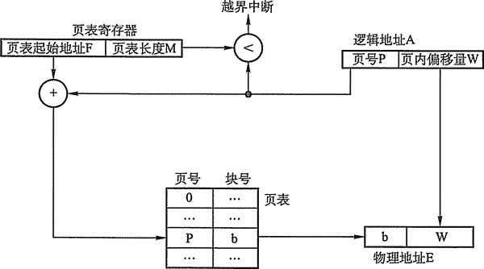
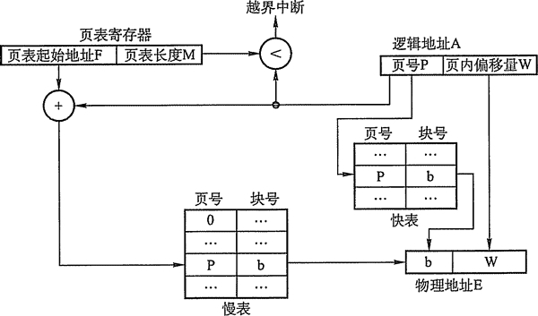

# 内存非连续分配管理方式

非连续分配允许一个程序分散地装入到不相邻的内存分区中，根据分区的大小是否固定分为分页存储管理方式和分段存储管理方式。

分页存储管理方式中，又根据运行作业时是否要把作业的所有页面都装入内存才能运行分为基本分页存储管理方式和请求分页存储管理方式。下面介绍基本分页存储管理方式。

## 基本分页存储管理方式

固定分区会产生内部碎片，动态分区会产生外部碎片，这两种技术对内存的利用率都比较低。我们希望内存的使用能尽量避免碎片的产生，这就引入了分页的思想：把主存空间划分为大小相等且固定的块，块相对较小，作为主存的基本单位。每个进程也以块为单位进行划分，进程在执行时，以块为单位逐个申请主存中的块空间。

分页的方法从形式上看，像分区相等的固定分区技术，分页管理不会产生外部碎片。但它又有本质的不同点：块的大小相对分区要小很多，而且进程也按照块进行划分，进程运行时按块申请主存可用空间并执行。这样，进程只会在为最后一个不完整的块申请一个主存块空间时，才产生主存碎片，所以尽管会产生内部碎片，但是这种碎片相对于进程来说也是很小的，每个进程平均只产生半个块大小的内部碎片（也称页内碎片）。

#### 1) 分页存储的几个基本概念

①页面和页面大小。进程中的块称为页(Page)，内存中的块称为页框（Page Frame，或页帧）。外存也以同样的单位进行划分，直接称为块(Block)。进程在执行时需要申请主存空间，就是要为每个页面分配主存中的可用页框，这就产生了页和页框的一一对应。

为方便地址转换，页面大小应是 2 的整数幂。同时页面大小应该适中，如果页面太小，会使进程的页面数过多，这样页表就过长，占用大量内存，而且也会增加硬件地址转换的开销，降低页面换入/换出的效率；页面过大又会使页内碎片增大，降低内存的利用率。所以页面的大小应该适中，考虑到耷间效率和时间效率的权衡。

②地址结构。分页存储管理的逻辑地址结构如图 3-7 所示。

图 3-7  分页存储管理的地址结构

地址结构包含两部分：前一部分为页号 P，后一部分为页内偏移量 W。地址长度为 32 位，其中 0~11 位为页内地址，即每页大小为 4KB；12~31 位为页号，地址空间最多允许有 2²⁰页。

③页表。为了便于在内存中找到进程的每个页面所对应的物理块，系统为每个进程建立一张页表，记录页面在内存中对应的物理块号，页表一般存放在内存中。

在配置了页表后，进程执行时，通过查找该表，即可找到每页在内存中的物理块号。可见，页表的作用是实现从页号到物理块号的地址映射，如图 3-8 所示。

图 3-8  页表的作用

#### 2) 基本地址变换机构

地址变换机构的任务是将逻辑地址转换为内存中物理地址，地址变换是借助于页表实现的。图 3-9 给出了分页存储管理系统中的地址变换机构。

图 3-9  分页存储管理的地址变换机构

在系统中通常设置一个页表寄存器(PTR)，存放页表在内存的始址 F 和页表长度 M。进程未执行时，页表的始址和长度存放在进程控制块中，当进程执行时，才将页表始址和长度存入页表寄存器。设页面大小为 L，逻辑地址 A 到物理地址 E 的变换过程如下：

1.  计算页号 P(P=A/L)和页内偏移量 W (W=A%L)。
2.  比较页号 P 和页表长度 M，若 P >= M，则产生越界中断，否则继续执行。
3.  页表中页号 P 对应的页表项地址 = 页表起始地址 F + 页号 P * 页表项长度，取出该页表项内容 b，即为物理块号。
4.  计算 E=b*L+W，用得到的物理地址 E 去访问内存。

以上整个地址变换过程均是由硬件自动完成的。

例如，若页面大小 L 为 1K 字节，页号 2 对应的物理块为 b=8，计算逻辑地址 A=2500 的物理地址 E 的过程如下：P=2500/1K=2，W=2500%1K=452，查找得到页号 2 对应的物理块的块号为 8，E=8*1024+452=8644。

下面讨论分页管理方式存在的两个主要问题：

*   每次访存操作都需要进行逻辑地址到物理地址的转换，地址转换过程必须足够快，否则访存速度会降低；
*   每个进程引入了页表，用于存储映射机制，页表不能太大，否则内存利用率会降低。

#### 3) 具有快表的地址变换机构

由上面介绍的地址变换过程可知，若页表全部放在内存中，则存取一个数据或一条指令至少要访问两次内存：一次是访问页表，确定所存取的数据或指令的物理地址，第二次才根据该地址存取数据或指令。显然，这种方法比通常执行指令的速度慢了一半。

为此，在地址变换机构中增设了一个具有并行查找能力的高速缓冲存储器——快表，又称联想寄存器(TLB)，用来存放当前访问的若干页表项，以加速地址变换的过程。与此对应，主存中的页表也常称为慢表，配有快表的地址变换机构如图 3-10 所示。

图 3-10  具有快表的地址变换机构

在具有快表的分页机制中，地址的变换过程：

*   CPU 给出逻辑地址后，由硬件进行地址转换并将页号送入高速缓存寄存器，并将此页号与快表中的所有页号进行比较。
*   如果找到匹配的页号，说明所要访问的页表项在快表中，则直接从中取出该页对应的页框号，与页内偏移量拼接形成物理地址。这样，存取数据仅一次访存便可实现。
*   如果没有找到，则需要访问主存中的页表，在读出页表项后，应同时将其存入快表，以便后面可能的再次访问。但若快表已满，则必须按照一定的算法对旧的页表项进行替换。

注意：有些处理机设计为快表和慢表同时查找，如果在快表中查找成功则终止慢表的查找。

一般快表的命中率可以达到 90%以上，这样，分页带来的速度损失就降低到 10%以下。快表的有效性是基于著名的局部性原理，这在后面的虚拟内存中将会具体讨论。

#### 4) 两级页表

第二个问题：由于引入了分页管理，进程在执行时不需要将所有页调入内存页框中，而只要将保存有映射关系的页表调入内存中即可。但是我们仍然需要考虑页表的大小。以 32 位逻辑地址空间、页面大小 4KB、页表项大小 4B 为例，若要实现进程对全部逻辑地址空间的映射，则每个进程需要 2²⁰，约 100 万个页表项。也就是说，每个进程仅页表这一项就需要 4MB 主存空间，这显然是不切实际的。而即便不考虑对全部逻辑地址空间进行映射的情况，一个逻辑地址空间稍大的进程，其页表大小也可能是过大的。以一个 40MB 的进程为例，页表项共 40KB,如果将所有页表项内容保存在内存中，那么需要 10 个内存页框来保存整个页表。整个进程大小约为 1 万个页面，而实际执行时只需要几十个页面进入内存页框就可以运行，但如果要求 10 个页面大小的页表必须全部进入内存，这相对实际执行时的几十个进程页面的大小来说，肯定是降低了内存利用率的；从另一方面来说，这 10 页的页表项也并不需要同时保存在内存中，因为大多数情况下，映射所需要的页表项都在页表的同一个页面中。

将页表映射的思想进一步延伸，就可以得到二级分页：将页表的 10 页空间也进行地址映射，建立上一级页表，用于存储页表的映射关系。这里对页表的 10 个页面进行映射只需要 10 个页表项，所以上一级页表只需要 1 页就足够（可以存储 2¹⁰=1024 个页表项）。在进程执行时，只需要将这 1 页的上一级页表调入内存即可，进程的页表和进程本身的页面，可以在后面的执行中再 i 周入内存。

如图 3-11 所示，这是 Intel 处理器 80x86 系列的硬件分页的地址转换过程。在 32 位系统中，全部 32 位逻辑地址空间可以分为 2²⁰(4GB/4KB)个页面。这些页面可以再进一步建立顶级页表，需要 2¹⁰个顶级页表项进行索引，这正好是一页的大小，所以建立二级页表即可。

图 3-11  硬件分页地址转换

举例，32 位系统中进程分页的工作过程：假定内核已经给一个正在运行的进程分配的逻辑地址空间是 0x20000000 到 0x2003FFFF，这个空间由 64 个页面组成。在进程运行时，我们不需要知道全部这些页的页框的物理地址，很可能其中很多页还不在主存中。这里我们只注意在进程运行到某一页时，硬件是如何计算得到这一页的页框的物理地址即可。现在进程需要读逻辑地址 0x20021406 中的字节内容，这个逻辑地址按如下进行处理：

    逻辑地址： 0x20021406 (0010 0000 0000 0010 0001 0100 0000 0110 B)

    顶级页表字段：0x80 (00 1000 0000 B)

    二级页表字段：0x21 (00 0010 0001B)

    页内偏移量字段：0x406  (0100 0000 0110 B)

顶级页表字段的 0x80 用于选择顶级页表的第 0x80 表项，此表项指向和该进程的页相关的二级页表；二级页表字段 0x21 用于选择二级页表的第 0x21 表项，此表项指向包含所需页的页框；最后的页内偏移量字段 0x406 用于在目标页框中读取偏移量为 0x406 中的字节。

这是 32 位系统下比较实际的一个例子。看似较为复杂的例子，有助于比较深入地理解，希望读者能自己动手计算一遍转换过程。

建立多级页表的目的在于建立索引，这样不用浪费主存空间去存储无用的页表项，也不用盲目地顺序式查找页表项，而建立索引的要求是最高一级页表项不超过一页的大小。在 64 位操作系统中，页表的划分则需要重新考虑，这是很多教材和辅导书中的常见题目，但是很多都给出了错误的分析，需要注意。

我们假设仍然釆用 4KB 页面大小。偏移量字段 12 位，假设页表项大小为 8B。这样，其上一级分页时，每个页框只能存储 2⁹(4KB/8B)个页表项，而不再是 2¹⁰个，所以上一级页表字段为 9 位。后面同理继续分页。64=12+9+9+9+9+9+7，所以需 6 级分页才能实现索引。很多书中仍然按 4B 页表项分析，虽然同样得出 6 级分页的结果，但显然是错误的。这里给出两个实际的 64 位操作系统的分页级别（注意：里面没有使用全部 64 位寻址，不过由于地址字节对齐的设计考虑，仍然使用 8B 大小的页表项），理解了表 3-2 中的分级方式，相信对多级分页就非常清楚了。

表 3-2 两种系统的分级方式

| 平台 | 页面大小 | 寻址位数 | 分页级数 | 具体分级 |
| Alpha | 8KB | 43 | 3 | 13+10+10+10 |
| X86_64 | 4 KB | 48 | 4 | 12+9+9+9+9 |

## 基本分段存储管理方式

分页管理方式是从计算机的角度考虑设计的，以提高内存的利用率，提升计算机的性能, 且分页通过硬件机制实现，对用户完全透明；而分段管理方式的提出则是考虑了用户和程序员，以满足方便编程、信息保护和共享、动态增长及动态链接等多方面的需要。

#### 1) 分段。

段式管理方式按照用户进程中的自然段划分逻辑空间。例如，用户进程由主程序、两个子程序、栈和一段数据组成，于是可以把这个用户进程划分为 5 个段，每段从 0 开始编址，并分配一段连续的地址空间（段内要求连续，段间不要求连续，因此整个作业的地址空间是二维的）。其逻辑地址由段号 S 与段内偏移量 W 两部分组成。

在图 3-12 中，段号为 16 位，段内偏移量为 16 位，则一个作业最多可有 2¹⁶=65536 个段，最大段长为 64KB。

图 3-12  分段系统中的逻辑地址结构

在页式系统中，逻辑地址的页号和页内偏移量对用户是透明的，但在段式系统中，段号和段内偏移量必须由用户显示提供，在髙级程序设计语言中，这个工作由编译程序完成。

#### 2) 段表。

每个进程都有一张逻辑空间与内存空间映射的段表，其中每一个段表项对应进程的一个段，段表项记录该段在内存中的起始地址和段的长度。段表的内容如图 3-13 所示。

图 3-13  段表项

在配置了段表后，执行中的进程可通过查找段表，找到每个段所对应的内存区。可见，段表用于实现从逻辑段到物理内存区的映射，如图 3-14 所示。

图 3-14  利用段表实现地址映射

#### 3) 地址变换机构。

分段系统的地址变换过程如图 3-15 所示。为了实现进程从逻辑地址到物理地址的变换功能，在系统中设置了段表寄存器，用于存放段表始址 F 和段表长度 M。其从逻辑地址 A 到物理地址 E 之间的地址变换过程如下：

*   从逻辑地址 A 中取出前几位为段号 S，后几位为段内偏移量 W。
*   比较段号 S 和段表长度 M，若 S 多 M，则产生越界中断，否则继续执行。
*   段表中段号 S 对应的段表项地址 = 段表起始地址 F + 段号 S * 段表项长度，取出该段表项的前几位得到段长 C。若段内偏移量>=C，则产生越界中断，否则继续执行。
*   取出段表项中该段的起始地址 b，计算 E = b + W，用得到的物理地址 E 去访问内存。

图 3-15  分段系统的地址变换过程

#### 4) 段的共享与保护。

在分段系统中，段的共享是通过两个作业的段表中相应表项指向被共享的段的同一个物理副本来实现的。当一个作业正从共享段中读取数据时，必须防止另一个作业修改此共享段中的数据。不能修改的代码称为纯代码或可重入代码（它不属于临界资源)，这样的代码和不能修改的数据是可以共享的，而可修改的代码和数据则不能共享。

与分页管理类似，分段管理的保护方法主要有两种：一种是存取控制保护，另一种是地址越界保护。地址越界保护是利用段表寄存器中的段表长度与逻辑地址中的段号比较，若段号大于段表长度则产生越界中断；再利用段表项中的段长和逻辑地址中的段内位移进行比较，若段内位移大于段长，也会产生越界中断。

## 段页式管理方式

页式存储管理能有效地提高内存利用率，而分段存储管理能反映程序的逻辑结构并有利于段的共享。如果将这两种存储管理方法结合起来，就形成了段页式存储管理方式。

在段页式系统中，作业的地址空间首先被分成若干个逻辑段，每段都有自己的段号，然后再将每一段分成若干个大小固定的页。对内存空间的管理仍然和分页存储管理一样，将其分成若干个和页面大小相同的存储块，对内存的分配以存储块为单位，如图 3-16 所示。

图 3-16  段页式管理方式

在段页式系统中，作业的逻辑地址分为三部分：段号、页号和页内偏移量，如图 3-17 所示。

图 3-17  段页式系统的逻辑地址结构

为了实现地址变换，系统为每个进程建立一张段表，而每个分段有一张页表。段表表项中至少包括段号、页表长度和页表起始地址，页表表项中至少包括页号和块号。此外，系统中还应有一个段表寄存器，指出作业的段表起始地址和段表长度。

注意：在一个进程中，段表只有一个，而页表可能有多个。

在进行地址变换时，首先通过段表查到页表起始地址，然后通过页表找到页帧号，最后形成物理地址。如图 3-18 所示，进行一次访问实际需要三次访问主存，这里同样可以使用快表以加快查找速度，其关键字由段号、页号组成，值是对应的页帧号和保护码。

图 3-18  段页式系统的地址变换机构