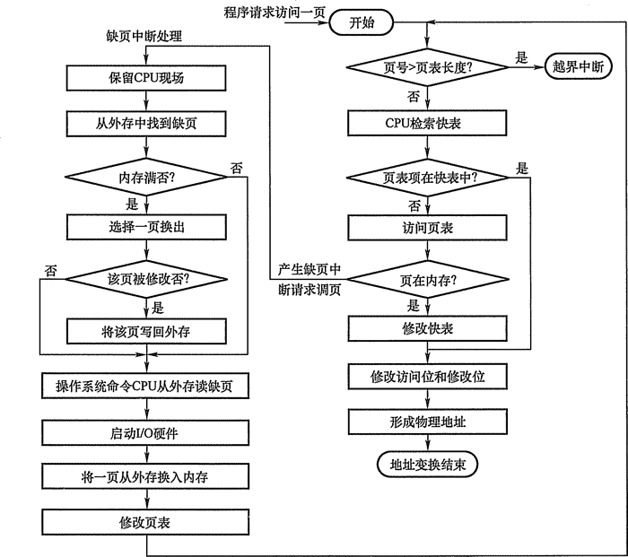

# 请求分页管理方式实现虚拟内存

请求分页系统建立在基本分页系统基础之上，为了支持虚拟存储器功能而增加了请求调页功能和页面置换功能。请求分页是目前最常用的一种实现虚拟存储器的方法。

在请求分页系统中，只要求将当前需要的一部分页面装入内存，便可以启动作业运行。在作业执行过程中，当所要访问的页面不在内存时，再通过调页功能将其调入，同时还可以通过置换功能将暂时不用的页面换出到外存上，以便腾出内存空间。

为了实现请求分页，系统必须提供一定的硬件支持。除了需要一定容量的内存及外存的计算机系统，还需要有页表机制、缺页中断机构和地址变换机构。

## 页表机制

请求分页系统的页表机制不同于基本分页系统，请求分页系统在一个作业运行之前不要求全部一次性调入内存，因此在作业的运行过程中，必然会出现要访问的页面不在内存的情况，如何发现和处理这种情况是请求分页系统必须解决的两个基本问题。为此，在请求页表项中增加了四个字段，如图 3-24 所示。

图 3-24  请求分页系统中的页表项

增加的四个字段说明如下：

*   状态位 P：用于指示该页是否已调入内存，供程序访问时参考。
*   访问字段 A：用于记录本页在一段时间内被访问的次数，或记录本页最近己有多长时间未被访问，供置换算法换出页面时参考。
*   修改位 M：标识该页在调入内存后是否被修改过。
*   外存地址：用于指出该页在外存上的地址，通常是物理块号，供调入该页时参考。

## 缺页中断机构

在请求分页系统中，每当所要访问的页面不在内存时，便产生一个缺页中断，请求操作系统将所缺的页调入内存。此时应将缺页的进程阻塞（调页完成唤醒)，如果内存中有空闲块，则分配一个块，将要调入的页装入该块，并修改页表中相应页表项，若此时内存中没有空闲块，则要淘汰某页（若被淘汰页在内存期间被修改过，则要将其写回外存)。

缺页中断作为中断同样要经历，诸如保护 CPU 环境、分析中断原因、转入缺页中断处理程序、恢复 CPU 环境等几个步骤。但与一般的中断相比，它有以下两个明显的区别：

*   在指令执行期间产生和处理中断信号，而非一条指令执行完后，属于内部中断。
*   一条指令在执行期间，可能产生多次缺页中断。

## 地址变换机构

请求分页系统中的地址变换机构，是在分页系统地址变换机构的基础上，为实现虚拟内存，又增加了某些功能而形成的。

图 3-25 请求分页中的地址变换过程

如图 3-25 所示，在进行地址变换时，先检索快表：

*   若找到要访问的页，便修改页表项中的访问位（写指令则还须重置修改位)，然后利用页表项中给出的物理块号和页内地址形成物理地址。
*   若未找到该页的页表项，应到内存中去查找页表，再对比页表项中的状态位 P，看该页是否已调入内存，未调入则产生缺页中断，请求从外存把该页调入内存。