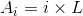
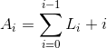
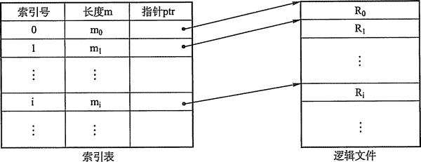
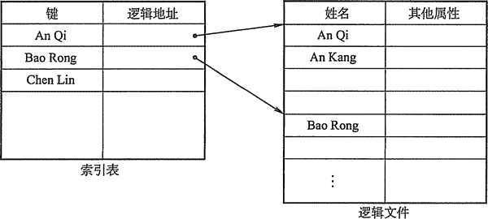

# 文件的逻辑结构：无结构文件(流式文件)和有结构文件(记录式文件)

文件的逻辑结构是从用户观点出发看到的文件的组织形式。文件的物理结构是从实现观点出发，又称为文件的存储结构，是指文件在外存上的存储组织形式。文件的逻辑结构与存储介质特性无关，但文件的物理结构与存储介质的特性有很大关系。

按逻辑结构，文件有无结构文件和有结构文件两种类型：无结构文件和有结构文件。

## 无结构文件（流式文件）

无结构文件是最简单的文件组织形式。无结构文件将数据按顺序组织成记录并积累保存，它是有序相关信息项的集合，以字节(Byte)为单位。由于无结构文件没有结构，因而对记录的访问只能通过穷举搜索的方式，故这种文件形式对大多数应用不适用。但字符流的无结构文件管理简单，用户可以方便地对其进行操作。所以，那些对基本信息单位操作不多的文件较适于釆用字符流的无结构方式，如源程序文件、目标代码文件等。

## 有结构文件（记录式文件）

有结构文件按记录的组织形式可以分为：

#### 1) 顺序文件。

文件中的记录一个接一个地顺序排列，记录可以是定长的或变长的，可以顺序存储或以链表形式存储，在访问时需要顺序搜索文件。顺序文件有以下两种结构：

第一种是串结构，记录之间的顺序与关键字无关。通常的办法是由时间决定，即按存入时间的先后排列，最先存入的记录作为第 1 个记录，其次存入的为第 2 个记录，依此类推。

第二种是顺序结构，指文件中的所有记录按关键字顺序排列。

在对记录进行批量操作时，即每次要读或写一大批记录，对顺序文件的效率是所有逻辑文件中最高的；此外，也只有顺序文件才能存储在磁带上，并能有效地工作，但顺序文件对查找、修改、增加或删除单个记录的操作比较困难。

#### 2) 索引文件。

如图 4-1 所示。对于定长记录文件，如果要查找第 i 个记录，可直接根据下式计算来获得第 i 个记录相对于第一个记录的地址：

然而，对于可变长记录的文件，要查找第 i 个记录时，必须顺序地查找前 i-1 个记录，从而获得相应记录的长度 L，然后才能按下式计算出第 i 个记录的首址：

注意：假定每个记录前用一个字节指明该记录的长度。

图 4-1  索引文件示意图

变长记录文件只能顺序查找，系统开销较大。为此可以建立一张索引表以加快检索速度，索引表本身是定长记录的顺序文件。在记录很多或是访问要求高的文件中，需要引入索引以提供有效的访问。实际中，通过索引可以成百上千倍地提高访问速度。

#### 3) 索引顺序文件。

索引顺序文件是顺序和索引两种组织形式的结合。索引顺序文件将顺序文件中的所有记录分为若干个组，为顺序文件建立一张索引表，在索引表中为每组中的第一个记录建立一个索引项，其中含有该记录的关键字值和指向该记录的指针。

如图 4-2 所示，主文件名包含姓名和其他数据项。姓名为关键字，索引表中为每组的第一个记录（不是每个记录）的关键字值，用指计指向主文件中该记录的起始位置。索引表只包含关键字和指计两个数据项，所有姓名关键字递增排列。主文件中记录分组排列，同一个组中关键字可以无序，但组与组之间关键字必须有序。查找一个记录时，通过索引表找到其所在的组，然后在该组中使用顺序查找就能很快地找到记录。

图 4-2  索引顺序文件示意图

对于含有 N 个记录的顺序文件，查找某关键字值的记录时平均需要查找 N/2 次。在索引顺序文件中，假设 N 个记录分为 N^(1/2)组，索引表中有 N^(1/2)个表项，每组有 N^(1/2)个记录，在查找某关键字值的记录时，先顺序查找索引表，需要查找 N^(1/2)/2 次，然后再在主文件中对应的组中顺序查找，也需要查找 N^(1/2)/2 次，这样总共查找 N^(1/2)/2+N^(1/2)/2=N^(1/2)次。显然，索引顺序文件提高了查找效率，如果记录数很多，可以釆用两级或多级索引。

索引文件和索引顺序文件都提高了存取的速度，但因为配置索引表而增加了存储空间。

#### 4) 直接文件或散列文件(Hash File)

给定记录的键值或通过 Hash 函数转换的键值直接决定记录的物理地址。这种映射结构不同于顺序文件或索引文件，没有顺序的特性。

散列文件有很高的存取速度，但是会引起冲突，即不同关键字的散列函数值相同。