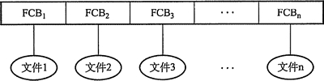
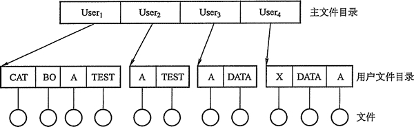
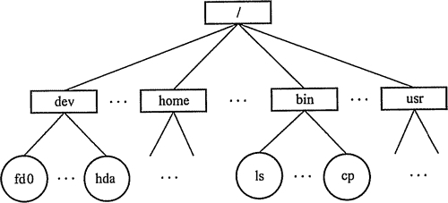
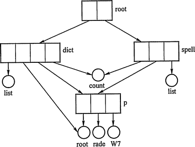

# 文件目录结构：单级、两级、多级(树形)和无环图目录结构

与文件管理系统和文件集合相关联的是文件目录，它包含有关文件的信息，包括属性、 位置和所有权等，这些信息主要是由操作系统进行管理。首先我们来看目录管理的基本要求: 从用户的角度看，目录在用户（应用程序）所需要的文件名和文件之间提供一种映射，所以目录管理要实现“按名存取”；目录存取的效率直接影响到系统的性能，所以要提高对目录的检索速度；在共享系统中，目录还需要提供用于控制访问文件的信息。此外，文件允许重名也是用户的合理和必然要求，目录管理通过树形结构来解决和实现。

## 文件控制块和索引结点

同进程管理一样，为实现目录管理，操作系统中引入了文件控制块的数据结构。

#### 1) 文件控制块。

文件控制块(FCB)是用来存放控制文件需要的各种信息的数据结构，以实现“按名存取”。FCB 的有序集合称为文件目录，一个 FCB 就是一个文件目录项。为了创建一个新文件，系统将分配一个 FCB 并存放在文件目录中，成为目录项。

FCB 主要包含以下信息：

*   基本信息，如文件名、文件的物理位置、文件的逻辑结构、文件的物理结构等。
*   存取控制信息，如文件存取权限等。
*   使用信息，如文件建立时间、修改时间等。

#### 2) 索引结点。

在检索目录文件的过程中，只用到了文件名，仅当找到一个目录项（查找文件名与目录项中文件名匹配）时，才需要从该目录项中读出该文件的物理地址。也就是说，在检索目录时，文件的其他描述信息不会用到，也不需调入内存。因此，有的系统（如 UNIX，见表 4-1）釆用了文件名和文件描述信息分开的方法，文件描述信息单独形成一个称为索引结点的数据结构，简称为 i 结点。在文件目录中的每个目录项仅由文件名和指向该文件所对应的 i 结点的指针构成。

表 4-1 UNIX 的文件目录结构

| 文件名 | 索引结点编号 |
| 文件名 1 |   |
| 文件名 2 |   |
|   |   |
|   |   |

一个 FCB 的大小是 64 字节，盘块大小是 1KB，则在每个盘块中可以存放 16 个 FCB（注意，FCB 必须连续存放）。而在 UNIX 系统中一个目录项仅占 16 字节，其中 14 字节是文件名，2 字节是 i 结点指针。在 1KB 的盘块中可存放 64 个目录项。这样，可使查找文件时平均启动磁盘次数减少到原来的 1/4，大大节省了系统开销。

存放在磁盘上的索引结点称为磁盘索引结点，UNIX 中的每个文件都有一个唯一的磁盘索引结点，主要包括以下几个方面：

*   文件主标识符，拥有该文件的个人或小组的标识符。
*   文件类型，包括普通文件、目录文件或特别文件。
*   文件存取权限，各类用户对该文件的存取权限。
*   文件物理地址，每个索引结点中含有 13 个地址项，即 iaddr(0) ~ iaddr(12)，它们以直接或间接方式给出数据文件所在盘块的编号。
*   文件长度，以字节为单位。
*   文件链接计数，在本文件系统中所有指向该文件的文件名的指针计数。
*   文件存取时间，本文件最近被进程存取的时间、最近被修改的时间以及索引结点最‘ 近被修改的时间。
*   文件被打开时，磁盘索引结点复制到内存的索引结点中，以便于使用。在内存索引结点中又增加了以下内容：
*   索引结点编号，用于标识内存索引结点。
*   状态，指示 i 结点是否上锁或被修改。
*   访问计数，每当有一进程要访问此 i 结点时，计数加 1，访问结束减 1。
*   逻辑设备号，文件所属文件系统的逻辑设备号。
*   链接指针，设置分别指向空闲链表和散列队列的指针。

## 目录结构

在理解一个文件系统的需求前，我们首先来考虑在目录这个层次上所需要执行的操作，这有助于后面文件系统的整体理解。

*   搜索：当用户使用一个文件时，需要搜索目录，以找到该文件的对应目录项。
*   创建文件：当创建一个新文件时，需要在目录中增加一个目录项。
*   删除文件：当删除一个文件时，需要在目录中删除相应的目录项。
*   显示目录：用户可以请求显示目录的内容，如显示该用户目录中的所有文件及属性。
*   修改目录：某些文件属性保存在目录中，因而这些属性的变化需要改变相应的目录项。

操作时，考虑以下几种目录结构：

#### 1) 单级目录结构。

在整个文件系统中只建立一张目录表，每个文件占一个目录项，如图 4-3 所示。

图 4-3 单级目录结构

当访问一个文件时，先按文件名在该目录中查找到相应的 FCB，经合法性检查后执行相应的操作。当建立一个新文件时，必须先检索所有目录项以确保没有“重名”的情况，然后在该目录中增设一项，把 FCB 的全部信息保存在该项中。当删除一个文件时，先从该目录中找到该文件的目录项，回收该文件所占用的存储空间，然后再清除该目录项。

单级目录结构实现了 “按名存取”，但是存在查找速度慢、文件不允许重名、不便于文件共享等缺点，而且对于多用户的操作系统显然是不适用的。

#### 2) 两级目录结构。

单级目录很容易造成文件名称的混淆，可以考虑釆用两级方案，将文件目录分成主文件目录(Master File Directory, MFD)和用户文件目录（User File Directory, UFD)两级，如图 4-4 所示。

图 4-4  两级目录结构

主文件目录项记录用户名及相应用户文件目录所在的存储位置。用户文件目录项记录该用户文件的 FCB 信息。当某用户欲对其文件进行访问时，只需搜索该用户对应的 UFD，这既解决了不同用户文件的“重名”问题，也在一定程度上保证了文件的安全。

两级目录结构可以解决多用户之间的文件重名问题，文件系统可以在目录上实现访问限制。但是两级目录结构缺乏灵活性，不能对文件分类。

#### 3) 多级目录结构（树形目录结构)。

将两级目录结构的层次关系加以推广，就形成了多级目录结构，即树形目录结构，如图 4-5 所示。

用户要访问某个文件时用文件的路径名标识文件，文件路径名是个字符串，由从根目录出发到所找文件的通路上的所有目录名与数据文件名用分隔符链接起来而成。从根目录出发的路径称绝对路径。当层次较多时，每次从根目录查询浪费时间，于是加入了当前目录，进程对各文件的访问都是相对于当前目录进行的。当用户要访问某个文件时，使用相对路径标识文件，相对路径由从当前目录出发到所找文件通路上所有目录名与数据文件名用分隔符“/”链接而成。

图 4-5  树形目录结枸

图 4-5 是 Linux 操作系统的目录结构，“/dev/hda”就是一个绝对路径。若当前目录为 “/bin”，则“./ls”就是一个相对路径，其中符号表示当前工作目录。

通常，每个用户都有各自的“当前目录”,登录后自动进入该用户的“当前目录”。操作系统提供一条专门的系统调用，供用户随时改变“当前目录”。例如，UNIX 系统中， “/etc/passwd”文件就包含有用户登录时默认的“当前目录”，可用 cd 命令改变“当前目录”。

树形目录结构可以很方便地对文件进行分类，层次结构清晰，也能够更有效地进行文件的管理和保护。但是，在树形目录中查找一个文件，需要按路径名逐级访问中间结点，这就增加了磁盘访问次数，无疑将影响查询速度。

#### 4) 无环图目录结构。

树形目录结构可便于实现文件分类，但不便于实现文件共享，为此在树形目录结构的基础上增加了一些指向同一结点的有向边，使整个目录成为一个有向无环图。引入无环图目录结构是为了实现文件共享，如图 4-6 所示。

当某用户要求删除一个共享结点时，若系统只是简单地将它删除，当另一共享用户需要访问时，却无法找到这个文件而发生错误。为此可以为每个共享结点设置一个共享计数器，每当图中增加对该结点的共享链时，计数器加 1;每当某用户提出删除该结点时，计数器减 1。仅当共享计数器为 0 时，才真正删除该结点，否则仅删除请求用户的共享链。

图 4-6  图形目录结构

共享文件（或目录）不同于文件拷贝（副本）。如果有两个文件拷贝，每个程序员看到的是拷贝而不是原件；但如果一个文件被修改，那么另一个程序员的拷贝不会有改变。对于共享文件，只存在一个真正文件，任何改变都会为其他用户所见。

无环图目录结构方便实现了文件的共享,但使得系统的管理变得更加复杂。