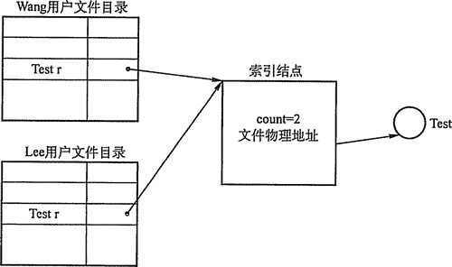
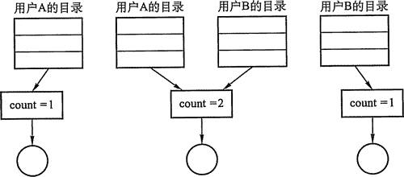

# 共享文件：硬链接和软链接

文件共享使多个用户（进程）共享同一份文件，系统中只需保留该文件的一份副本。如果系统不能提供共享功能，那么每个需要该文件的用户都要有各自的副本，会造成对存储空间的极大浪费。随着计算机技术的发展，文件共享的范围已由单机系统发展到多机系统，进而通过网络扩展到全球。这些文件的分享是通过分布式文件系统、远程文件系统、分布式信息系统实现的。这些系统允许多个客户通过 C/S 模型共享网络中的服务器文件。

现代常用的两种文件共享方法有：

## 基于索引结点的共享方式（硬链接）

在树形结构的目录中，当有两个或多个用户要共享一个子目录或文件时，必须将共享文件或子目录链接到两个或多个用户的目录中，才能方便地找到该文件，如图 4-7 所示。

图 4-7  基于索引结点的共享方式

在这种共享方式中引用索引结点，即诸如文件的物理地址及其他的文件属性等信息，不再是放在目录项中，而是放在索引结点中。在文件目录中只设置文件名及指向相应索引结点的指针。在索引结点中还应有一个链接计数 count,用于表示链接到本索引结点（亦即文件） 上的用户目录项的数目。当 count=2 时，表示有两个用户目录项链接到本文件上，或者说是有两个用户共享此文件。

当用户 A 创建一个新文件时，它便是该文件的所有者，此时将 count 置为 1。当有用户 B 要共享此文件时，在用户 B 的目录中增加一个目录项，并设置一指针指向该文件的索引结点。此时，文件主仍然是用户 A，count=2。如果用户 A 不再需要此文件，不能将文件直接删除。因为，若删除了该文件，也必然删除了该文件的索引结点，这样便会便用户 B 的指针悬空，而用户 B 则可能正在此文件上执行写操作，此时用户 B 会无法访问到文件。因此用户 A 不能删除此文件，只是将该文件的 count 减 1，然后删除自己目录中的相应目录项。用户 B 仍可以使用该文件。当 COunt=0 时，表示没有用户使用该文件，系统将负责删除该文件。如图 4-8 给出了用户 B 链接到文件上的前、后情况。

## 利用符号链实现文件共享（软链接）

为使用户 B 能共享用户 A 的一个文件 F,可以由系统创建一个 LINK 类型的新文件，也取名为 F，并将文件 F 写入用户 B 的目录中，以实现用户 B 的目录与文件 F 的链接。在新文件中只包含被链接文件 F 的路径名。这样的链接方法被称为符号链接。

图 4-8  文件共享中的链接计数

新文件中的路径名则只被看做是符号链，当用户 B 要访问被链接的文件 F 且正要读 LINK 类新文件时，操作系统根据新文件中的路径名去读该文件，从而实现了用户 B 对文件 F 的共享。

在利用符号链方式实现文件共享时，只有文件的拥有者才拥有指向其索引结点的指针。而共享该文件的其他用户则只有该文件的路径名，并不拥有指向其索引结点的指针。这样，也就不会发生在文件主删除一共享文件后留下一悬空指针的情况。当文件的拥有者把一个共享文件删除后，其他用户通过符号链去访问它时，会出现访问失败，于是将符号链删除，此时不会产生任何影响。当然，利用符号链实现文件共享仍然存在问题，例如：一个文件釆用符号链方式共享，当文件拥有者将其删除，而在共享的其他用户使用其符号链接访问该文件之前，又有人在同一路径下创建了另一个具有同样名称的文件，则该符号链将仍然有效，但访问的文件已经改变，从而导致错误。

在符号链的共享方式中，当其他用户读共享文件时，需要根据文件路径名逐个地查找目录，直至找到该文件的索引结点。因此，每次访问时，都可能要多次地读盘，使得访问文件的开销变大并增加了启动磁盘的频率。此外，符号链的索引结点也要耗费一定的磁盘空间。符号链方式有一个很大的优点，即网络共享只需提供该文件所在机器的网络地址以及该机器中的文件路径即可。

上述两种链接方式都存在一个共同的问题，即每个共享文件都有几个文件名。换言之，每增加一条链接，就增加一个文件名。这实质上就是每个用户都使用自己的路径名去访问共享文件。当我们试图去遍历整个文件系统时，将会多次遍历到该共享文件。

硬链接和软链接都是文件系统中的静态共享方法，在文件系统中还存在着另外的共享需求，即两个进程同时对同一个文件进行操作，这样的共享可以称为动态共享。