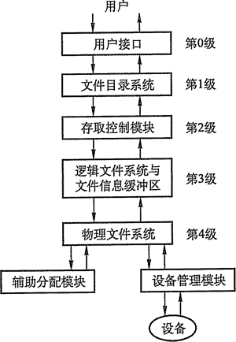

# 文件系统层次结构

现代操作系统有多种文件系统类型（如 FAT32、NTFS、 ext2、ext3、ext4 等），因此文件系统的层次结构也不尽相同。图 4-11 是一种合理的层次结构。

图 4-11 文件系统层次结构

#### 1) 用户调用接口

文件系统为用户提供与文件及目录有关的调用，如新建、打开、读写、关闭、删除文件，建立、删除目录等。此层由若干程序模块组成，每一模块对应一条系统调用，用户发出系统调用时，控制即转入相应的模块。

#### 2) 文件目录系统

文件目录系统的主要功能是管理文件目录，其任务有管理活跃文件目录表、管理读写状态信息表、管理用户进程的打开文件表、管理与组织在存储设备上的文件目录结构、调用下一级存取控制模块。

#### 3) 存取控制验证

实现文件保护主要由该级软件完成，它把用户的访问要求与 FCB 中指示的访问控制权限进行比较，以确认访问的合法性。

#### 4) 逻辑文件系统与文件信息缓冲区

逻辑文件系统与文件信息缓冲区的主要功能是根据文件的逻辑结构将用户要读写的逻辑记录转换成文件逻辑结构内的相应块号。

#### 5) 物理文件系统

物理文件系统的主要功能是把逻辑记录所在的相对块号转换成实际的物理地址。

#### 6) 分配模块

分配模块的主要功能是管理辅存空间，即负责分配辅存空闲空间和回收辅存空间。

#### 7) 设备管理程序模块

设备管理程序模块的主要功能是分配设备、分配设备读写用缓冲区、磁盘调度、启动设备、处理设备中断、释放设备读写缓冲区、释放设备等。