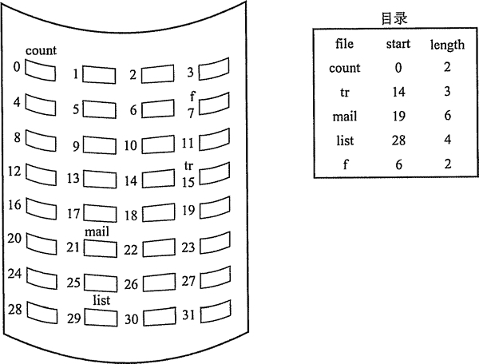
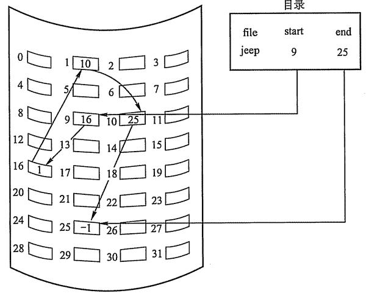
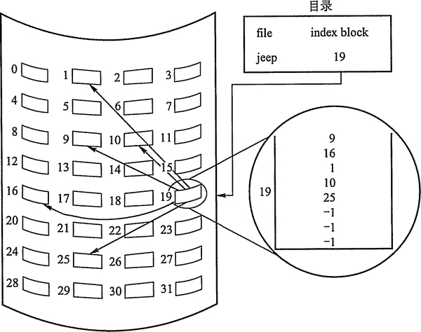
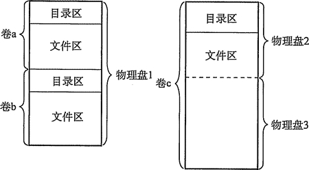
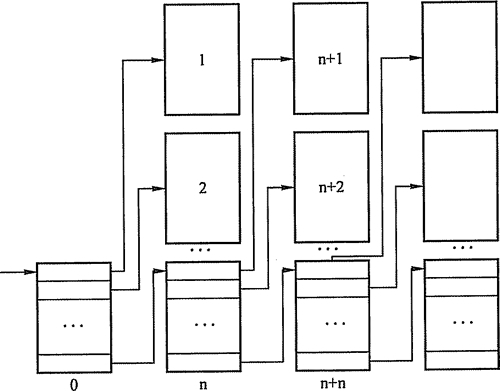

# 文件系统的实现：目录实现和文件实现

## 目录实现

在读文件前，必须先打开文件。打开文件时，操作系统利用路径名找到相应目录项，目 录项中提供了查找文件磁盘块所需要的信息。目录实现的基本方法有线性列表和哈希表两种。

#### 1) 线性列表

最简单的目录实现方法是使用存储文件名和数据块指针的线性表。创建新文件时，必须 首先搜索目录表以确定没有同名的文件存在，然后在目录表后增加一个目录项。删除文件则 根据给定的文件名搜索目录表，接着释放分配给它的空间。若要重用目录项，有许多方法： 可以将目录项标记为不再使用，或者将它加到空闲目录项表上，还可以将目录表中最后一个 目录项复制到空闲位置，并降低目录表长度。釆用链表结构可以减少删除文件的时间。其优 点在于实现简单，不过由于线性表的特殊性，比较费时。

#### 2) 哈希表

哈希表根据文件名得到一个值，并返回一个指向线性列表中元素的指针。这种方法的优 点是查找非常迅速，插入和删除也较简单，不过需要一些预备措施来避免冲突。最大的困难 是哈希表长度固定以及哈希函数对表长的依赖性。

目录查询是通过在磁盘上反复搜索完成，需要不断地进行 I/O 操作，开销较大。所以如 前面所述，为了减少 I/O 操作，把当前使用的文件目录复制到内存，以后要使用该文件时只 要在内存中操作，从而降低了磁盘操作次数，提高了系统速度。

## 文件实现

### 1\. 文件分配方式

文件分配对应于文件的物理结构，是指如何为文件分配磁盘块。常用的磁盘空间分配方 法有三种：连续分配、链接分配和索引分配。有的系统（如 RD0S 操作系统）对三种方法都支持，但是更普遍的是一个系统只提供一种方法的支持。

#### 1) 连续分配。

连续分配方法要求每个文件在磁盘上占有一组连续的块，如图 4-12 所示。 磁盘地址定义了磁盘上的一个线性排序。这种排序使作业访问磁盘时需要的寻道数和寻道时 间最小。

图 4-12  连续分配

文件的连续分配可以用第一块的磁盘地址和连续块的数量来定义。如果文件有 n 块长并 从位置 b 开始，那么该文件将占有块 b, b+1, b+2, …, b+n-1。 一个文件的目录条目包括 开始块的地址和该文件所分配区域的长度。

连续分配支持顺序访问和直接访问。其优点是实现简单、存取速度快。缺点在于，文件 长度不宜动态增加，因为一个文件末尾后的盘块可能已经分配给其他文件，一旦需要增加， 就需要大量移动盘块。此外，反复增删文件后会产生外部碎片（与内存管理分配方式中的碎 片相似)，并且很难确定一个文件需要的空间大小，因而只适用于长度固定的文件。

#### 2) 链接分配。

链接分配是釆取离散分配的方式，消除了外部碎片，故而显著地提高了 磁盘空间的利用率；又因为是根据文件的当前需求，为它分配必需的盘块，当文件动态增长 时，可以动态地再为它分配盘块，故而无需事先知道文件的大小。此外，对文件的增、删、 改也非常方便。链接分配又可以分为隐式链接和显式链接两种形式。

隐式连接如图 4-13 所示。每个文件对应一个磁盘块的链表；磁盘块分布在磁盘的任何 地方，除最后一个盘块外，每一个盘块都有指向下一个盘块的指针，这些指针对用户是透明. 的。目录包括文件第一块的指针和最后一块的指针。

创建新文件时，目录中增加一个新条目。每个目录项都有一个指向文件首块的指针。该 指针初始化为 NULL 以表示空文件，大小字段为 0。写文件会通过空闲空间管理系统找到空 闲块，将该块链接到文件的尾部，以便写入。读文件则通过块到块的指针顺序读块。

隐式链接分配的缺点在于无法直接访问盘块，只能通过指针顺序访问文件，以及盘块指 针消耗了一定的存储空间。隐式链接分配的稳定性也是一个问题，系统在运行过程中由于软 件或者硬件错误导致链表中的指针丢失或损坏，会导致文件数据的丢失。

图 4-13  隐式链接分配

显式链接，是指把用于链接文件各物理块的指针，显式地存放在内存的一张链接表中。 该表在整个磁盘仅设置一张，每个表项中存放链接指针，即下一个盘块号。在该表中，凡是 属于某一文件的第一个盘块号，或者说是每一条链的链首指针所对应的盘块号，均作为文件 地址被填入相应文件的 FCB 的“物理地址”字段中。由于查找记录的过程是在内存中进行 的，因而不仅显著地提高了检索速度，而且大大减少了访问磁盘的次数。由于分配给文件的 所有盘块号都放在该表中，故称该表为文件分配表（File Allocation Table, FAT)。

#### 3) 索引分配。

链接分配解决了连续分配的外部碎片和文件大小管理的问题。但是，链 接分配不能有效支持直接访问（FAT 除外）。索引分配解决了这个问题，它把每个文件的所 有的盘块号都集中放在一起构成索引块（表），如图 4-14 所示。

图 4-14  索引分配

每个文件都有其索引块，这是一个磁盘块地址的数组。索引块的第 i 个条目指向文件的 第 i 个块。目录条目包括索引块的地址。要读第 i 块，通过索引块的第 i 个条目的指针来查 找和读入所需的块。

创建文件时，索引块的所有指针都设为空。当首次写入第 i 块时，先从空闲空间中取得 一个块，再将其地址写到索引块的第 i 个条目。索引分配支持直接访问，且没有外部碎片问 题。其缺点是由于索引块的分配，增加了系统存储空间的开销。索引块的大小是一个重要的 问题，每个文件必须有一个索引块，因此索引块应尽可能小，但索引块太小就无法支持大文 件。可以釆用以下机制来处理这个问题。

链接方案：一个索引块通常为一个磁盘块，因此，它本身能直接读写。为了处理大文件， 可以将多个索引块链接起来。

多层索引：多层索引使第一层索引块指向第二层的索引块，第二层索引块再指向文件块。 这种方法根据最大文件大小的要求，可以继续到第三层或第四层。例如，4096B 的块，能在 索引块中存入 1024 个 4B 的指针。两层索引允许 1048576 个数据块，即允许最大文件为 4GB。

混合索引：将多种索引分配方式相结合的分配方式。例如，系统既釆用直接地址，又采 用单级索引分配方式或两级索引分配方式。

表 4-2 是三种分配方式的比较。

表 4-2 文件三种分配方式的比较

|   | 访问第 n 个记录 | 优  点 | 缺  点 |
| 顺序分配 | 需访问磁盘 1 次 | 顺序存取时速度怏，当文件是定长时 可以根据文件起始地址及记录长度进行 随机访问 | 文件存储要求连续的存储空间，会产 生碎片，也不利于文件的动态扩充 |
| 链接分配 | 需访问磁盘 n 次 | 可以解决外存的碎片问题，提髙了外 存空间的利用率，动态增长较方便 | 只能按照文件的指针链顺序访问，查 找效率低，指针信息存放消耗外存空间 |
| 索引分配 | m 级需访问磁盘 m+1 次 | 可以随机访问，易于文件的增删 | 索引表增加存储空间的开销，索引表 的查找策略对文件系统效率影响较大 |

此外，访问文件需要两次访问外存——首先要读取索引块的内容，然后再访问具体的磁 盘块，因而降低了文件的存取速度。为了解决这一问题，通常将文件的索引块读入内存的缓 冲区中，以加快文件的访问速度。

### 2\. 文件存储空间管理

#### 1) 文件存储器空间的划分与初始化。

一般来说，一个文件存储在一个文件卷中。文件 卷可以是物理盘的一部分，也可以是整个物理盘，支持超大型文件的文件卷也可以由多个物 理盘组成，如图 4-15 所示。

在一个文件卷中，文件数据信息的空间（文件区）和存放文件控制信息 FCB 的空间（目 录区）是分离的。由于存在很多种类的文件表示和存放格式，所以现代操作系统中一般都有 很多不同的文件管理模块，通过它们可以访问不同格式的逻辑卷中的文件。逻辑卷在提供文 件服务前，必须由对应的文件程序进行初始化，划分好目录区和文件区，建立空闲空间管理 表格及存放逻辑卷信息的超级块。

#### 2) 文件存储器空间管理。

文件存储设备分成许多大小相同的物理块，并以块为单位交 换信息，因此，文件存储设备的管理实质上是对空闲块的组织和管理，它包括空闲块的组织、 分配与回收等问题。

图 4-15  逻辑卷与物理盘的关系

①空闲表法

空闲表法属于连续分配方式，它与内存的动态分配方式类似，为每个文件分配一块连续 的存储空间。系统为外存上的所有空闲区建立一张空闲盘块表，每个空闲区对应于一个空闲 表项，其中包括表项序号、该空闲区第一个盘块号、该区的空闲盘块数等信息。再将所有空闲区按其起始盘块号递增的次序排列，见表 4-3。

空闲盘区的分配与内存的动态分配类似，同样是釆 用首次适应算法、循环首次适应算法等。例如，在系统 为某新创建的文件分配空闲盘块时，先顺序地检索空闲 盘块表的各表项，直至找到第一个其大小能满足要求的 空闲区，再将该盘区分配给用户，同时修改空闲盘块表。 系统在对用户所释放的存储空间进行回收时，也釆取类似于内存回收的方法，即要考虑回收区是否与空闲表中插入点的前区和后区相邻接，对 相邻接者应予以合并。

表 4-3 空闲盘块表

| 序号 | 第一个空闲盘块号 | 空闲盘块数 |
| 1 | 2 | 4 |
| 2 | 9 | 3 |
| 3 | 15 | 5 |
| 4 | -- | -- |

②空闲链表法

将所有空闲盘区拉成一条空闲链，根据构成链所用的基本元素不同，可把链表分成两种 形式：空闲盘块链和空闲盘区链。

空闲盘块链是将磁盘上的所有空闲空间，以盘块为单位拉成一条链。当用户因创建文件 而请求分配存储空间时，系统从链首开始，依次摘下适当的数目的空闲盘块分配给用户。当 用户因删除文件而释放存储空间时，系统将回收的盘块依次插入空闲盘块链的末尾。这种方 法的优点是分配和回收一个盘块的过程非常简单，但在为一个文件分配盘块时，可能要重复 多次操作。

空闲盘区链是将磁盘上的所有空闲盘区（每个盘区可包含若干个盘块）拉成一条链。在 每个盘区上除含有用于指示下一个空闲盘区的指针外，还应有能指明本盘区大小（盘块数） 的信息。分配盘区的方法与内存的动态分区分配类似，通常釆用首次适应算法。在回收盘区 时，同样也要将回收区与相邻接的空闲盘区相合并。

③位示图法

位示图是利用二进制的一位来表示磁盘中一个盘块的使用情况，磁盘上所有的盘块都有 一个二进制位与之对应。当其值为“0”时，表示对应的盘块空闲；当其值为“1”时，表示 对应的盘块已分配。位示图法示意如图 4-16 所示。

盘块的分配：

*   顺序扫描位示图，从中找出一个或一组其值为“0”的二进制位。
*   将所找到的一个或一组二进制位，转换成与之对应的盘块号。假定找到的其值为“0” 的二进制位，位于位示图的第 i 行、第 j 列，则其相应的盘块号应按下式计算（n 代表每行 的位数）：

        b = n (i-1) + j

*   修改位示图，令 map[i, j] = 1。

盘块的回收：

*   将回收盘块的盘块号转换成位示图中的行号和列号。

    转换公式为

        i=(b-1)DIVn+l

        j=(b-l)MOD n+1

*   修改位示图，令 map[i, j] = 0。

④成组链接法

空闲表法和空闲链表法都不适合用于大型文件系统，因为这会使空闲表或空闲链表太 大。在 UNIX 系统中釆用的是成组链接法，这种方法结合了空闲表和空闲链表两种方法，克 月艮了表太大的缺点。其大致的思想是:把顺序的 n 个空闲扇区地址保存在第一个空闲扇区内， 其后一个空闲扇区内则保存另一顺序空闲扇区的地址，如此继续，直至所有空闲扇区均予以 链接。系统只需要保存一个指向第一个空闲扇区的指针。假设磁盘最初全为空闲扇区；其成 组链接如图 4-17 所示。通过这种方式可以迅速找到大批空闲块地址。

图 4-17 成组链接法示意图

表示文件存储器空闲空间的“位向量”表或第一个成组链块以及卷中的目录区、文件区 划分信息都需要存放在辅存储器中，一般放在卷头位置，在 UNIX 系统中称为“超级块”。 在对卷中文件进行操作前，“超级块”需要预先读入系统空间的主存，并且经常保持主存“超 级块”与辅存卷中“超级块”的一致性。

注意：本书如无特别提示，所使用的位示图法，行和列都是从 1 开始编号。特别注意， 如果题目中指明从 0 开始编号，则上述的计算方法要进行相应调整。