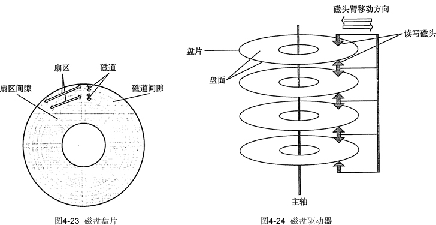

# 磁盘的结构

磁盘(Disk)是由表面涂有磁性物质的金属或塑料构成的圆形盘片，通过一个称为磁头 的导体线圈从磁盘中存取数据。在读/写操作期间，磁头固定，磁盘在下面高速旋转。如图 4-23 所示，磁盘的盘面上的数据存储在一组同心圆中，称为磁道。每个磁道与磁头一样宽, 一个盘面有上千个磁道。磁道又划分为几百个扇区，每个扇区固定存储大小（通常为 512B), 一个扇区称为一个盘块。相邻磁道及相邻扇区间通过一定的间隙分隔开，以避免精度错误。

注意，由于扇区按固定圆心角度划分，所以密度从最外道向里道增加，磁盘的存储能力受限于最内道的最大记录密度。

磁盘安装在一个磁盘驱动器中，它由磁头臂、用于旋转磁盘的主轴和用于数据输入/输 出的电子设备组成。如图 4-24 所示，多个盘片垂直堆叠，组成磁盘组，每个盘面对应一个 磁头，所有磁头固定在一起，与磁盘中心的距离相同且一起移动。所有盘片上相对位置相同 的磁道组成柱面。按照这种物理结构组织，扇区就是磁盘可寻址的最小存储单位，磁盘地址 用“柱面号 • 盘面号 • 扇区号（或块号）”表示。

磁盘按不同方式可以分为若干类型：磁头相对于盘片的径向方向固定的称为固定头磁 盘，每个磁道一个磁头；磁头可移动的称为活动头磁盘，磁头臂可以来回伸缩定位磁道。磁 盘永久固定在磁盘驱动器内的称为固定盘磁盘；可移动和替换的称为可换盘磁盘。