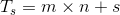
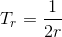
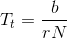
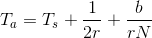
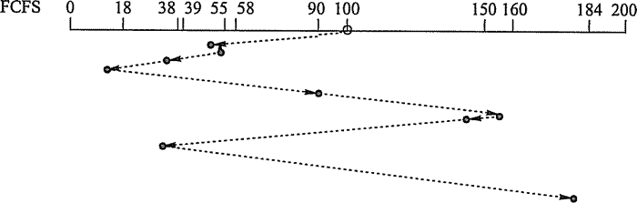
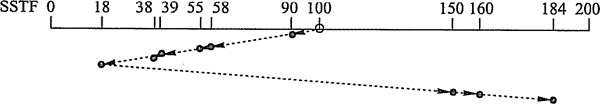
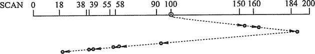
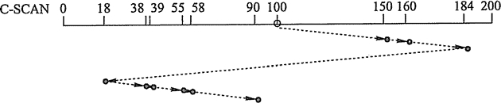
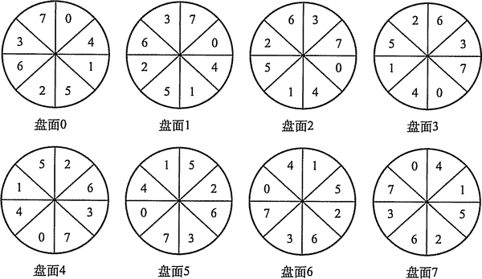

# 磁盘调度算法

一次磁盘读写操作的时间由寻找（寻道）时间、延迟时间和传输时间决定：

1) 寻找时间 T[s]：活动头磁盘在读写信息前，将磁头移动到指定磁道所需要的时间。这个时间除跨越 n 条磁道的时间外，还包括启动磁臂的时间 s，即：

式中，m 是与磁盘驱动器速度有关的常数，约为 0.2ms，磁臂的启动时间约为 2ms。

2)延迟时间 T[r]：磁头定位到某一磁道的扇区（块号）所需要的时间，设磁盘的旋转速度为 r，则：

对于硬盘，典型的旋转速度为 5400r/m，相当于一周 11.1ms，则 T[r]为 5.55ms;对于软盘，其旋转速度在 300~600r/m 之间，则 T[r]为 50~100ms。

3) 传输时间 T[t]：从磁盘读出或向磁盘写入数据所经历的时间，这个时间取决于每次所读/写的字节数 b 和磁盘的旋转速度：

式中，r 为磁盘每秒钟的转数；N 为一个磁道上的字节数。

在磁盘存取时间的计算中，寻道时间与磁盘调度算法相关，下面将会介绍分析几种算法，而延迟时间和传输时间都与磁盘旋转速度相关，且为线性相关，所以在硬件上，转速是磁盘性能的一个非常重要的参数。

总平均存取时间 T[a]可以表示为：

虽然这里给出了总平均存取时间的公式，但是这个平均值是没有太大实际意义的，因为在实际的磁盘 I/O 操作中，存取时间与磁盘调度算法密切相关。调度算法直接决定寻找时间，从而决定了总的存取时间。

目前常用的磁盘调度算法有以下几种：

#### 1) 先来先服务(First Come First Served, FCFS)算法

FCFS 算法根据进程请求访问磁盘的先后顺序进行调度，这是一种最简单的调度算法，如图 4-25 所示。该算法的优点是具有公平性。如果只有少量进程需要访问，且大部分请求都是访问簇聚的文件扇区，则有望达到较好的性能；但如果有大量进程竞争使用磁盘，那么这种算法在性能上往往接近于随机调度。所以，实际磁盘调度中考虑一些更为复杂的调度算法。

图 4-25 FCFS 磁盘调度算法

例如，磁盘请求队列中的请求顺序分别为 55、58、39、18、90、160、150、38、184，磁头初始位置是 100 磁道，釆用 FCFS 算法磁头的运动过程如图 4-25 所示。磁头共移动了 (45+3+19+21+72+70+10+112+146)=498 个磁道，平均寻找长度=498/9=55.3。

#### 2) 最短寻找时间优先(Shortest  Seek  Time  First, SSTF)算法

SSTF 算法选择调度处理的磁道是与当前磁头所在磁道距离最近的磁道，以使每次的寻找时间最短。当然，总是选择最小寻找时间并不能保证平均寻找时间最小，但是能提供比 FCFS 算法更好的性能。这种算法会产生“饥饿”现象。如图 4-26 所示，若某时刻磁头正在 18 号磁道，而在 18 号磁道附近频繁地增加新的请求，那么 SSTF 算法使得磁头长时间在 18 号磁道附近工作，将使 184 号磁道的访问被无限期地延迟，即被“饿死”。

图 4-26  SSTF 磁盘调度算法

例如，磁盘请求队列中的请求顺序分别为 55、58、39、18、90、160、150、38、184，磁头初始位置是 100 磁道，釆用 SSTF 算法磁头的运动过程如图 4-26 所示。磁头共移动了 (10+32+3+16+1+20+132+10+24)=248 个磁道，平均寻找长度=248/9=27.5。

#### 3) 扫描(SCAN)算法（又称电梯算法）

SCAN 算法在磁头当前移动方向上选择与当前磁头所在磁道距离最近的请求作为下一次服务的对象，如图 4-27 所示。由于磁头移动规律与电梯运行相似，故又称为电梯调度算法。SCAN 算法对最近扫描过的区域不公平，因此，它在访问局部性方面不如 FCFS 算法和 SSTF 算法好。

图 4-27  SCAN 磁盘调度算法

例如，磁盘请求队列中的请求顺序分别为 55、58、39、18、90、160、150、38、184，磁头初始位置是 100 磁道。釆用 SCAN 算法时，不但要知道磁头的当前位置，还要知道磁头的移动方向，假设磁头沿磁道号增大的顺序移动，则磁头的运动过程如图 4-27 所示。磁头共移动了(50+10+24+94+32+3+16+1+20)=250 个磁道，平均寻找长度=250/9=27.8。

#### 4) 循环扫描(Circulair SCAN, C-SCAN)算法

在扫描算法的基础上规定磁头单向移动来提供服务，回返时直接快速移动至起始端而不服务任何请求。由于 SCAN 算法偏向于处理那些接近最里或最外的磁道的访问请求，所以使用改进型的 C-SCAN 算法来避免这个问题。

釆用 SCAN 算法和 C-SCAN 算法时磁头总是严格地遵循从盘面的一端到另一端，显然，在实际使用时还可以改进，即磁头移动只需要到达最远端的一个请求即可返回，不需要到达磁盘端点。这种形式的 SCAN 算法和 C-SCAN 算法称为 LOOK 和 C-LOOK 调度。这是因为它们在朝一个给定方向移动前会查看是否有请求。注意，若无特别说明，也可以默认 SCAN 算法和 C-SCAN 算法为 LOOK 和 C-LOOK 调度。

图 4-28  C-SCAN 磁盘调度算法

例如，磁盘请求队列中的请求顺序分别为 55、58、39、18、90、160、150、38、184，磁头初始位置是 100 磁道。釆用 C-SCAN 算法时，假设磁头沿磁道号增大的顺序移动，则磁头的运动过程如图 4-28 所示。磁头共移动了(50+10+24+166+20+1+16+3+32)=322 个磁道，平均寻道长度=322/9=35.8。

对比以上几种磁盘调度算法，FCFS 算法太过简单，性能较差，仅在请求队列长度接近于 1 时才较为理想；SSTF 算法较为通用和自然；SCAN 算法和 C-SCAN 算法在磁盘负载较大时比较占优势。它们之间的比较见表 4-4。

表 4-4  磁盘调度算法比较

|   | 优  点 | 缺  点 |
| FCFS 算法 | 公平、简单 | 平均寻道距离大，仅应用在磁盘 I/O 较少的场合 |
| SSTF 算法 | 性能比“先来先服务”好 | 不能保证平均寻道时间最短，可能出现“饥饿”现象 |
| SCAN 算法 | 寻道性能较好，可避免“饥饿”现象 | 不利于远离磁头一端的访问请求 |
| C-SCAN 算法 | 消除了对两端磁道请求的不公平 | -- |

除减少寻找时间外，减少延迟时间也是提高磁盘传输效率的重要因素。可以对盘面扇区进行交替编号，对磁盘片组中的不同盘面错位命名。假设每个盘面有 8 个扇区，磁盘片组共 8 个盘面，则可以釆用如图 4-29 所示的编号。

图 4-29 磁盘片组扇区编号

磁盘是连续自转设备，磁头读/写一个物理块后，需要经过短暂的处理时间才能开始读/ 写下一块。假设逻辑记录数据连续存放在磁盘空间中，若在盘面上按扇区交替编号连续存放，则连续读/写多个记录时能减少磁头的延迟时间；同柱面不同盘面的扇区若能错位编号，连续读/写相邻两个盘面的逻辑记录时也能减少磁头延迟时间。

由于传输时间由磁盘转速决定，所以无法通过其他方法减少传输时间。以图 4-29 为例，在随机扇区访问情况下，定位磁道中的一个扇区平均需要转过 4 个扇区，这时，延迟时间是传输时间的 4 倍，这是一种非常低效的存取方式。理想化的情况是不需要定位而直接连续读取扇区，没有延迟时间，这样磁盘数据存取效率可以成倍提高。但是由于读取扇区的顺序是不可预测的，所以延迟时间不可避免。图 4-29 中的编号方式是读取连续编号扇区时的一种方法。