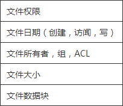
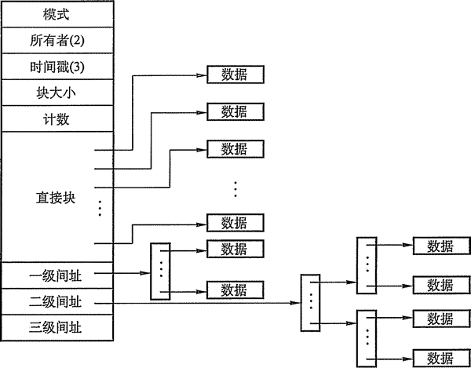

# 文件系统知识点总结

## 磁盘结构

引导控制块(Boot Control Block)包括系统从该分区引导操作系统所需要的信息。如果 磁盘没有操作系统，那么这块的内容为空。它通常为分区的第一块。UFS 称之为引导块(Boot Block)； NTFS 称之为分区引导扇区(Partition Boot Sector)。

分区控制块(Partition Control Block)包括分区详细信息，如分区的块数、块的大小、 空闲块的数量和指计、空闲 FCB 的数量和指针等。UPS 称之为超级块(Superblock)；而 NTFS 称之为主控文件表(Master File Table)。

## 内存结构

内存分区表包含所有安装分区的信息。

内存目录结构用来保存近来访问过的目录信息。对安装分区的目录，可以包括一个指向 分区表的指针。

系统范围的打开文件表，包括每个打开文件的 FCB 复制和其他信息。

单个进程的打开文件表，包括一个指向系统范围内已打开文件表中合适条目和其他信息 的指针。

## 文件系统实现概述

为了创建一个文件，应用程序调用逻辑文件系统。逻 辑文件系统知道目录结构形式，它将分配一个新的 FCB 给文件，把相应目录读入内存，用新的文件名更新该目录 和 FCB,并将结果写回到磁盘。图 4-32 显示了一个典型 的 FCB。

图 4-32  典型的 FCB

一旦文件被创建，它就能用于 I/O，不过首先要打开文件。调用 open 将文件名传给文件 系统，文件系统根据给定文件名搜索目录结构。部分目录结构通常缓存在内存中以加快目录 操作。找到文件后，其 FCB 复制到系统范围的打开文件表。该表不但存储 FCB，也有打开 该文件的进程数量的条目。

然后，单个进程的打开文件表中会增加一个条目，并通过指针将系统范围的打开文件表 的条目同其他域（文件当前位置的指针和文件打开模式等）相连。调用 open 返回的是一个 指向单个进程的打开文件表中合适条目的指针。所以文件操作都是通过该指针进行。

文件名不必是打开文件表的一部分，因为一旦完成对 FCB 在磁盘上的定位，系统就不 再使用文件名了。对于访问打开文件表的索引，UNIX 称之为文件描述符(File Descriptor)；而 Windows 2000 称之为文件句柄(File Handle)。因此，只要文件没有被关闭，所有文件操 作通过打开文件表来进行。

当一个进程关闭文件，就删除一个相应的单个进程打开文件表的条目即目录项，系统范 围内打开文件表的打开数也会递减。当打开文件的所有用户都关闭了一个文件时，更新的文 件信息会复制到磁盘的目录结构中，系统范围的打开文件表的条目也将删除。

在实际中，系统调用 open 会首先搜索系统范围的打开文件表以确定某文件是否已被其 他进程所使用。如果是，就在单个进程的打开文件表中创建一项，并指向现有系统范围的打 开文件表的相应条目。该算法在文件已打开时，能节省大量开销。

## 混合索引分配的实现

混合索引分配已在 UNIX 系统中釆用。在 UNK SystemV 的索引结点中，共设置了 13 个地址项，即 iaddr(O)~iaddr(12)，如图 4-33 所示。在 BSD UNIX 的索引结点中，共设置了 13 个地址项，它们都把所有的地址项分成两类，即直接地址和间接地址。

图 4-33 UNIX 系统的 inode 结构示意图

#### 1) 直接地址

为了提高对文件的检索速度，在索引结点中可设置 10 个直接地址项，即用 iaddr(O)~iaddr(9)来存放直接地址。换言之，在这里的每项中所存放的是该文件数据所在盘块的盘块 号。假如每个盘块的大小为 4KB，当文件不大于 40KB 时，便可直接从索引结点中读出该文 件的全部盘块号。

#### 2)  一次间接地址

对于大、中型文件，只釆用直接地址并不现实。可再利用索引结点中的地址项 iaddr(lO) 来提供一次间接地址。这种方式的实质就是一级索引分配方式。图中的一次间址块也就是索 引块，系统将分配给文件的多个盘块号记入其中。在一次间址块中可存放 1024 个盘块号， 因而允许文件长达 4MB。

#### 3) 多次间接地址

当文件长度大于 4MB+40KB（—次间址与 10 个直接地址项）时，系统还须釆用二次间 址分配方式。这时，用地址项 iaddr(11)提供二次间接地址。该方式的实质是两级索引分配方 式。系统此时是在二次间址块中记入所有一次间址块的盘号。在釆用二次间址方式时，文件 最大长度可达 4GB。同理，地址项 iaddr(12)作为三次间接地址，其所允许的文件最大长度可 达 4TB。