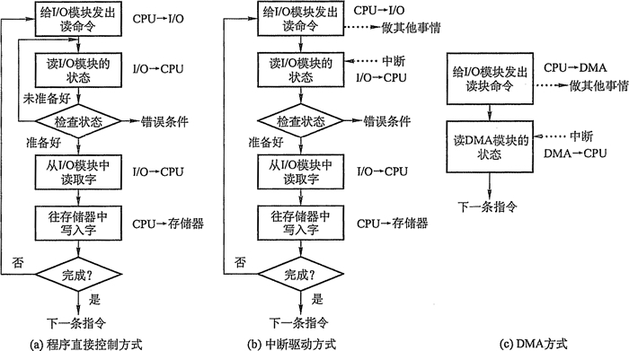
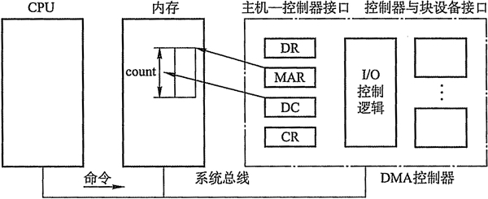

# I/O(输入/输出)控制方式

设备管理的主要任务之一是控制设备和内存或处理机之间的数据传送，外围设备和内存之间的输入/输出控制方式有四种，下面分别介绍。

## 程序直接控制方式

如图 5-1(a)所示，计算机从外部设备读取数据到存储器，每次读一个字的数据。对读入的每个字，CPU 需要对外设状态进行循环检查，直到确定该字已经在 I/O 控制器的数据寄存器中。在程序直接控制方式中，由于 CPU 的高速性和 I/O 设备的低速性，致使 CPU 的绝大部分时间都处于等待 I/O 设备完成数据 I/O 的循环测试中，造成了 CPU 资源的极大浪费。在该方式中，CPU 之所以要不断地测试 I/O 设备的状态，就是因为在 CPU 中没有釆用中断机构，使 I/O 设备无法向 CPU 报告它已完成了一个字符的输入操作。

程序直接控制方式虽然简单易于实现，但是其缺点也是显而易见的，由于 cpu 和 I/O 设备只能串行工作，导致 CPU 的利用率相当低。

## 中断驱动方式

中断驱动方式的思想是，允许 I/O 设备主动打断 CPU 的运行并请求服务，从而“解放”CPU，使得其向 I/O 控制器发送读命令后可以继续做其他有用的工作。如图 5-1(b)所示，我们从 I/O 控制器和 CPU 两个角度分别来看中断驱动方式的工作过程：

从 I/O 控制器的角度来看，I/O 控制器从 CPU 接收一个读命令，然后从外围设备读数据。一旦数据读入到该 I/O 控制器的数据寄存器，便通过控制线给 CPU 发出一个中断信号，表示数据已准备好，然后等待 CPU 请求该数据。I/O 控制器收到 CPU 发出的取数据请求后，将数据放到数据总线上，传到 CPU 的寄存器中。至此，本次 I/O 操作完成，I/O 控制器又可幵始下一次 I/O 操作。

图 5-1  I/O 控制方式

从 CPU 的角度来看，CPU 发出读命令，然后保存当前运行程序的上下文（现场，包括程序计数器及处理机寄存器），转去执行其他程序。在每个指令周期的末尾，CPU 检查中断。当有来自 I/O 控制器的中断时，CPU 保存当前正在运行程序的上下文，转去执行中断处理程序处理该中断。这时，CPU 从 I/O 控制器读一个字的数据传送到寄存器，并存入主存。接着， CPU 恢复发出 I/O 命令的程序（或其他程序）的上下文，然后继续运行。

中断驱动方式比程序直接控制方式有效，但由于数据中的每个字在存储器与 I/O 控制器之间的传输都必须经过 CPU,这就导致了中断驱动方式仍然会消耗较多的 CPU 时间。

## DMA 方式

在中断驱动方式中，I/O 设备与内存之间的数据交换必须要经过 CPU 中的寄存器，所以速度还是受限，而 DMA（直接存储器存取）方式的基本思想是在 I/O 设备和内存之间开辟直接的数据交换通路，彻底“解放” CPU。DMA 方式的特点是：

*   基本单位是数据块。
*   所传送的数据，是从设备直接送入内存的，或者相反。
*   仅在传送一个或多个数据块的开始和结束时，才需 CPU 干预，整块数据的传送是在 DMA 控制器的控制下完成的。

图 5-2 列出了 DMA 控制器的组成。

图 5-2 DMA 控制器的组成

为了实现在主机与控制器之间成块数据的直接交换，必须在 DMA 控制器中设置如下四类寄存器：

1.  命令/状态寄存器(CR)：用于接收从 CPU 发来的 I/O 命令或有关控制信息，或设备的状态。
2.  内存地址寄存器(MAR)：在输入时，它存放把数据从设备传送到内存的起始目标地址；在输出时，它存放由内存到设备的内存源地址。
3.  数据寄存器(DR)：用于暂存从设备到内存，或从内存到设备的数据。
4.  数据计数器(DC)：存放本次 CPU 要读或写的字（节）数。

如图 5-1(c)所示，DMA 方式的工作过程是：CPU 读写数据时，它给 I/O 控制器发出一条命令，启动 DMA 控制器，然后继续其他工作。之后 CPU 就把控制操作委托给 DMA 控制器，由该控制器负责处理。DMA 控制器直接与存储器交互，传送整个数据块，每次传送一个字，这个过程不需要 CPU 参与。当传送完成后，DMA 控制器发送一个中断信号给处理器。因此只有在传送开始和结束时才需要 CPU 的参与。

DMA 控制方式与中断驱动方式的主要区别是中断驱动方式在每个数据需要传输时中断

CPU，而 DMA 控制方式则是在所要求传送的一批数据全部传送结束时才中断 CPU；此外，中断驱动方式数据传送是在中断处理时由 CPU 控制完成的，而 DMA 控制方式则是在 DMA 控制器的控制下完成的。

## 通道控制方式

I/O 通道是指专门负责输入/输出的处理机。I/O 通道方式是 DMA 方式的发展，它可以进一步减少 CPU 的干预，即把对一个数据块的读（或写）为单位的干预，减少为对一组数据块的读（或写）及有关的控制和管理为单位的干预。同时，又可以实现 CPU、通道和 I/O 设备三者的并行操作，从而更有效地提高整个系统的资源利用率。

例如，当 CPU 要完成一组相关的读（或写）操作及有关控制时，只需向 I/O 通道发送一条 I/O 指令，以给出其所要执行的通道程序的首地址和要访问的 I/O 设备，通道接到该指令后，通过执行通道程序便可完成 CPU 指定的 I/O 任务，数据传送结束时向 CPU 发中断请求。I/O 通道与一般处理机的区别是：通道指令的类型单一，没有自己的内存，通道所执行

的通道程序是放在主机的内存中的，也就是说通道与 CPU 共享内存。

I/O 通道与 DMA 方式的区别是：DMA 方式需要 CPU 来控制传输的数据块大小、传输的内存位置，而通道方式中这些信息是由通道控制的。另外，每个 DMA 控制器对应一台设备与内存传递数据，而一个通道可以控制多台设备与内存的数据交换。