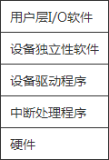
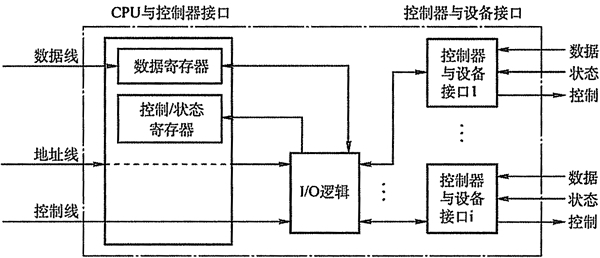

# I/O 子系统的层次结构

I/O 软件涉及的面非常广，往下与硬件有着密切的联系，往上又与用户直接交互，它与进程管理、存储器管理、文件管理等都存在着一定的联系，即它们都可能需要 I/O 软件来实现 I/O 操作。

为了使复杂的 I/O 软件具有清晰的结构，良好的可移植性和适应性，在 I/O 软件中普遍釆用了层次式结构，将系统输入/输出功能组织成一系列的层次，每一层都利用其下层提供的服务，完成输入/输出功能中的某些子功能，并屏蔽这些功能实现的细节，向高层提供服务。在层次式结构的 I/O 软件中，只要层次间的接口不变，对某一层次中的软件的修改都不会引起其下层或高层代码的变更，仅最底层才涉及硬件的具体特性。

图 5-3  I/O 层次结构

一个比较合理的层次划分如图 5-3 所示。整个 I/O 系统可以看成具有四个层次的系统结构，各层次及其功能如下：

1) 用户层 I/O 软件：实现与用户交互的接口，用户可直接调用在用户层提供的、与 I/O 操作有关的库函数，对设备进行操作。

一般而言，大部分的 I/O 软件都在操作系统内部，但仍有一小部分在用户层，包括与用户程序链接在一起的库函数，以及完全运行于内核之外的一些程序。用户层软件必须通过一组系统调用来获取操作系统服务。   

2) 设备独立性软件：用于实现用户程序与设备驱动器的统一接口、设备命令、设备保护、以友设备分配与释放等，同时为设备管理和数据传送提供必要的存储空间。

设备独立性也称设备无关性，使得应用程序独立于具体使用的物理设备。为了实现设备独立性而引入了逻辑设备和物理设备这两个概念。在应用程序中，使用逻辑设备名来请求使用某类设备；而在系统实际执行时，必须将逻辑设备名映射成物理设备名使用。

使用逻辑设备名的好处是：

*   增加设备分配的灵活性；
*   易于实现 I/O 重定向，所谓 I/O 重定向，是指用于 I/O 操作的设备可以更换（即重定向），而不必改变应用程序。

为了实现设备独立性，必须再在驱动程序之上设置一层设备独立性软件。总的来说，设备独立性软件的主要功能可分以为以下两个方面：

*   执行所有设备的公有操作。包括：对设备的分配与回收；将逻辑设备名映射为物理设备名；对设备进行保护，禁止用户直接访问设备；缓冲管理；差错控制；提供独立于设备的大小统一的逻辑块，屏蔽设备之间信息交换单位大小和传输速率的差异。
*   向用户层（或文件层）提供统一接口。无论何种设备，它们向用户所提供的接口应该是相同的。例如，对各种设备的读/写操作，在应用程序中都统一使用 read/write 命令等。

3) 设备驱动程序：与硬件直接相关，负责具体实现系统对设备发出的操作指令，驱动 I/O 设备工作的驱动程序。

通常，每一类设备配置一个设备驱动程序，它是 I/O 进程与设备控制器之间的通信程序，常以进程形式存在。设备驱动程序向上层用户程序提供一组标准接口，设备具体的差别被设备驱动程序所封装，用于接收上层软件发来的抽象 I/O 要求，如 read 和 write 命令，转换为具体要求后，发送给设备控制器，控制 I/O 设备工作；它也将由设备控制器发来的信号传送给上层软件。从而为 I/O 内核子系统隐藏设备控制器之间的差异。

4)中断处理程序：用于保存被中断进程的 CPU 环境，转入相应的中断处理程序进行处理，处理完并恢复被中断进程的现场后，返回到被中断进程。

中断处理层的主要任务有：进行进程上下文的切换，对处理中断信号源进行测试，读取设备状态和修改进程状态等。由于中断处理与硬件紧密相关，对用户而言，应尽量加以屏蔽，故应放在操作系统的底层，系统的其余部分尽可能少地与之发生联系。

5) 硬件设备：I/O 设备通常包括一个机械部件和一个电子部件。为了达到设计的模块性和通用性，一般将其分开：电子部件称为设备控制器（或适配器），在个人计算机中，通常是一块插入主板扩充槽的印刷电路板；机械部件则是设备本身。

设备控制器通过寄存器与 CPU 通信，在某些计算机上，这些寄存器占用内存地址的一部分，称为内存映像 I/O；另一些计算机则釆用 I/O 专用地址，寄存器独立编址。操作系统通过向控制器寄存器写命令字来执行 I/O 功能。控制器收到一条命令后，CPU 可以转向进行其他工作，而让设备控制器自行完成具体的 I/O 操作。当命令执行完毕后，控制器发出一个中断信号，操作系统重新获得 CPU 的控制权并检查执行结果，此时，CPU 仍旧是从控制器寄存器中读取信息来获得执行结果和设备的状态信息。

设备控制器的主要功能为：

*   接收和识别 CPU 或通道发来的命令，如磁盘控制器能接收读、写、查找等命令。
*   实现数据交换，包括设备和控制器之间的数据传输；通过数据总线或通道，控制器和主存之间的数据传输。
*   发现和记录设备及自身的状态信息，供 CPU 处理使用。
*   设备地址识别。

为实现上述功能，设备控制器（如图 5-4）必须包含以下组成部分：

*   设备控制器与 CPU 的接口。该接口有三类信号线：数据线、地址线和控制线。数据线通常与两类寄存器相连接：数据寄存器（存放从设备送来的输入数据或从 CPU 送来的输出数据）和控制/状态寄存器（存放从 CPU 送来的控制信息或设备的状态信息)。
*   设备控制器与设备的接口。设备控制器连接设备需要相应数量的接口，一个接口连接一台设备。每个接口中都存在数据、控制和状态三种类型的信号。
*   I/O 控制逻辑。用于实现对设备的控制。它通过一组控制线与 CPU 交互，对从 CPU 收到的 I/O 命令进行译码。CPU 启动设备时，将启动命令发送给控制器，同时通过地:址线把地址发送给控制器，由控制器的 I/O 逻辑对地址进行译码，并相应地对所选设备进行控制。

图 5-4  设备控制器的组成