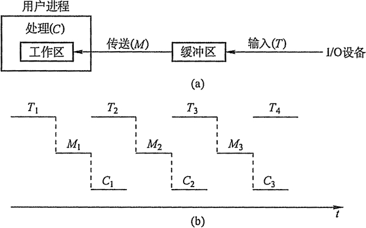
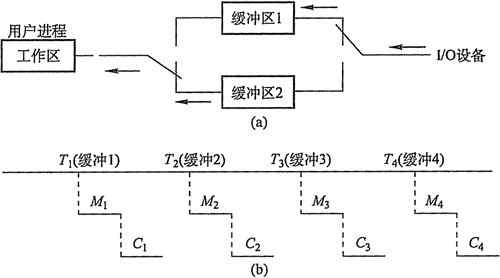
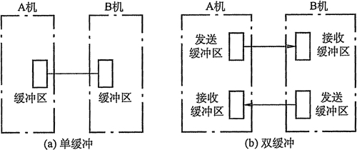
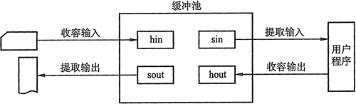

# 高速缓存与缓冲区

## 1\. 磁盘高速缓存(Disk Cache)

操作系统中使用磁盘高速缓存技术来提高磁盘的 I/O 速度，对高速缓存复制的访问要比原始数据访问更为高效。例如，正在运行的进程的指令既存储在磁盘上，也存储在物理内存上，也被复制到 CPU 的二级和一级高速缓存中。

不过，磁盘高速缓存技术不同于通常意义下的介于 CPU 与内存之间的小容量高速存储器，而是指利用内存中的存储空间来暂存从磁盘中读出的一系列盘块中的信息。因此，磁盘高速缓存在逻辑上属于磁盘，物理上则是驻留在内存中的盘块。

高速缓存在内存中分为两种形式：一种是在内存中开辟一个单独的存储空间作为磁速缓存，大小固定；另一种是把未利用的内存空间作为一个缓沖池，供请求分页系统和磁盘 I/O 时共享。

## 2\. 缓冲区(Buffer)

在设备管理子系统中，引入缓冲区的目的主要有：

*   缓和 CPU 与 I/O 设备间速度不匹配的矛盾。
*   减少对 CPU 的中断频率，放宽对 CPU 中断响应时间的限制。
*   解决基本数据单元大小（即数据粒度）不匹配的问题。
*   提高 CPU 和 I/O 设备之间的并行性。

其实现方法有：

*   釆用硬件缓冲器，但由于成本太高，除一些关键部位外，一般不釆用硬件缓冲器
*   釆用缓冲区（位于内存区域）。

根据系统设置缓冲器的个数，缓冲技术可以分为：

#### 1) 单缓冲

在设备和处理机之间设置一个缓冲区。设备和处理机交换数据时，先把被交换数据写入缓冲区，然后需要数据的设备或处理机从缓冲区取走数据。

如图 5-5 所示，在块设备输入时，假定从磁盘把一块数据输入到缓冲区的时间为 T，操作系统将该缓冲区中的数据传送到用户区的时间为 M，而 CPU 对这一块数据处理的时间为 C。由于 T 和 C 是可以并行的，当 T>C 时，系统对每一块数据的处理时间为 M 十 T，反之则为 M+C，故可把系统对每一块数据的处理时间表示为 Max(C, T)+M。

图 5-5  单缓冲工作示意图

#### 2) 双缓冲

根据单缓冲的特点，CPU 在传送时间 M 内处于空闲状态，由此引入双缓冲。 I/O 设备输入数据时先装填到缓冲区 1，在缓冲区 1 填满后才开始装填缓冲区 2，与此同时处理机可以从缓冲区 1 中取出数据放入用户进程处理，当缓冲区 1 中的数据处理完后，若缓冲区 2 已填满，则处理机又从缓冲区 2 中取出数据放入用户进程处理，而 I/O 设备又可以装填缓冲区 1。双缓冲机制提高了处理机和输入设备的并行操作的程度。

如图 5-6 所示，系统处理一块数据的时间可以粗略地认为是 MAC(C, T)。如果 C<T，可使块设备连续输入（图中所示情况)；如果 C>T，则可使 CPU 不必等待设备输入。对于字符设备，若釆用行输入方式，则釆用双缓冲可使用户在输入完第一行之后，在 CPU 执行第一行中的命令的同时，用户可继续向第二缓冲区输入下一行数据。而单缓冲情况下则必须等待一行数据被提取完毕才可输入下一行的数据。

图 5-6  双缓冲工作示意图

如果两台机器之间通信仅配置了单缓冲，如图 5-7(a)所示。那么，它们在任一时刻都只能实现单方向的数据传输。例如，只允许把数据从 A 机传送到 B 机，或者从 B 机传送到 A 机，而绝不允许双方同时向对方发送数据。为了实现双向数据传输，必须在两台机器中都设置两个缓冲区，一个用做发送缓冲区，另一个用做接收缓冲区，如图 5-7(b)所示。

图 5-7  双机通信时缓冲区的设置

#### 3) 循环缓冲

包含多个大小相等的缓冲区，每个缓冲区中有一个链接指针指向下一个缓冲区，最后一个缓冲区指针指向第一个缓冲区，多个缓冲区构成一个环形。

循环缓冲用于输入/输出时，还需要有两个指针 in 和 out。对输入而言，首先要从设备接收数据到缓冲区中，in 指针指向可以输入数据的第一个空缓冲区；当运行进程需要数据时，从循环缓冲区中取一个装满数据的缓冲区，并从此缓冲区中提取数据，out 指针指向可以提取数据的第一个满缓冲区。输出则正好相反。

#### 4) 缓冲池

由多个系统公用的缓冲区组成，缓冲区按其使用状况可以形成三个队列：空缓冲队列、装满输入数据的缓冲队列（输入队列）和装满输出数据的缓沖队列（输出队列）。还应具有四种缓冲区：用于收容输入数据的工作缓冲区、用于提取输入数据的工作缓冲区、 用于收容输出数据的工作缓冲区及用于提取输出数据的工作缓冲区，如图 5-8 所示。

图 5-8  缓冲区的工作方式

当输入进程需要输入数据时，便从空缓冲队列的队首摘下一个空缓冲区，把它作为收容输入工作缓冲区，然后把输入数据输入其中，装满后再将它挂到输入队列队尾。当计算进程需要输入数据时，便从输入队列取得一个缓冲区作为提取输入工作缓冲区，计算进程从中提取数据，数据用完后再将它挂到空缓冲队列尾。当计算进程需要输出数据时，便从空缓冲队列的队首取得一个空缓冲区，作为收容输出工作缓冲区，当其中装满输出数据后，再将它挂到输出队列队尾。当要输出时，由输出进程从输出队列中取得一个装满输出数据的缓冲区，作为提取输出工作缓冲区，当数据提取完后，再将它挂到空缓冲队列的队尾。

## 3\. 高速缓存与缓冲区的对比

高速缓存是可以保存数据拷贝的高速存储器，访问高速缓存比访问原始数据更高效速度更快。其对比见表 5-1。

表 5-1 高速缓存和缓冲区的对比

|   | 高速缓存 | 缓冲区 |
|   | 相同点 | 都是介于高速设备和低速设备之间 |
| 区别 | 存放数据 | 存放的是低速设备上的某些数据的复制数据，也就是高速缓存上有的低速设备上面必然有 | 存放的是低速设备传递给高速设备的数据（或者是高速设备传送给低速设备的数据)，而这些数据在低速设备（或者高速设备）却不一定有备份，这些数据在从缓存区传送到髙速设备（或者低速设备） |
| 目的 | 高速缓存存放的是高速设备经常要访问的数据，如果高速设备要访问的数据不在高速缓存中，高速设备就需要访问低速设备 | 高速设备和低速设备的通信都要经过缓存区，高速设备永远不会直接去访问低速设备 |