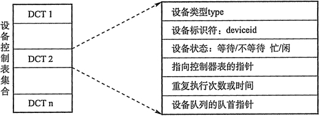
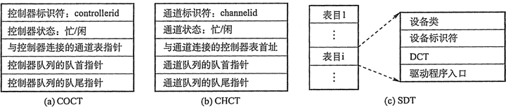

# 输入/输出(I/O)设备分配与回收

## 1\. 设备分配概述

设备分配是指根据用户的 I/O 请求分配所需的设备。分配的总原则是充分发挥设备的使用效率，尽可能地让设备忙碌，又要避免由于不合理的分配方法造成进程死锁。从设备的特性来看，釆用下述三种使用方式的设备分别称为独占设备、共享设备和虚拟设备三类。

1) 独占式使用设备。指在申请设备时，如果设备空闲，就将其独占，不再允许其他进程申请使用，一直等到该设备被释放才允许其他进程申请使用。例如，打印机，在使用它打印时，只能独占式使用，否则在同一张纸上交替打印不同任务的内容，无法正常阅读。

2) 分时式共享使用设备。独占式使用设备时，设备利用率很低，当设备没有独占使用的要求时，可以通过分时共享使用，提高利用率。例如，对磁盘设备的 I/O 操作，各进程的每次 I/O 操作请求可以通过分时来交替进行。

3) 以 SPOOLing 方式使用外部设备。SPOOLing 技术是在批处理操作系统时代引入的，即假脱机 I/O 技术。这种技术用于对设备的操作，实质上就是对 I/O 操作进行批处理。

## 2\. 设备分配的数据结构

设备分配依据的主要数据结构有设备控制表(DCT)、控制器控制表(COCT)、通道控制表(CHCT)和系统设备表(SDT)，各数据结构功能如下：

设备控制表 DCT：系统为每一个设备配置一张 DCT,如图 5-9 所示。它用于记录设备的特性以及与 I/O 控制器连接的情况。DCT 包括设备标识符、设备类型、设备状态、指向控制器控制表 COCT 的指针等。其中，设备状态指示设备是忙还是空闲，设备队列指针指向等待使用该设备的进程组成的等待队列，控制表指针指向与该设备相连接的设备控制器。

图 5-9 设备控制表

控制器控制表 COCT：每个控制器都配有一张 COCT，如图 5-10a 所示。它反映设备控制器的使用状态以及和通道的连接情况等。

通道控制表 CHCT：每个通道配有一张 CHCT，如图 5-10b 所示。

系统设备表 SDT：整个系统只有一张 SDT，如图 5-10c 所示。它记录已连接到系统中的所有物理设备的情况，每个物理设备占一个表目。

图 5-10  COCT、CHCT 和 SDT

由于在多道程序系统中，进程数多于资源数，会引起资源的竞争。因此，要有一套合理的分配原则，主要考虑的因素有：I/O 设备的固有属性，I/O 设备的分配算法，设备分配的安全性以及设备独立性。

## 3\. 设备分配的策略

1) 设备分配原则：设备分配应根据设备特性、用户要求和系统配置情况。分配的总原则既要充分发挥设备的使用效率，又要避免造成进程死锁，还要将用户程序和具体设备隔离开。

2) 设备分配方式：设备分配方式有静态分配和动态分配两种。

静态分配主要用于对独占设备的分配，它在用户作业开始执行前，由系统一次性分配该作业所要求的全部设备、控制器（和通道)。一旦分配后，这些设备、控制器（和通道）就一直为该作业所占用，直到该作业被撤销。静态分配方式不会出现死锁，但设备的使用效率低。因此，静态分配方式弁不符合分配的总原则。

动态分配是在进程执行过程中根据执行需要进行。当进程需要设备时，通过系统调用命令向系统提出设备请求，由系统按照事先规定的策略给进程分配所需要的设备、I/O 控制器，一旦用完之后，便立即释放。动态分配方式有利于提高设备的利用率，但如果分配算法使用不当，则有可能造成进程死锁。

3) 设备分配算法：常用的动态设备分配算法有先请求先分配、优先级高者优先等。

对于独占设备，既可以釆用动态分配方式也可以静态分配方式，往往釆用静态分配方式，即在作业执行前，将作业所要用的这一类设备分配给它。共享设备可被多个进程所共享，一般釆用动态分配方式，但在每个 I/O 传输的单位时间内只被一个进程所占有，通常釆用先请求先分配和优先级高者先分的分配算法。

## 4\. 设备分配的安全性

设备分配的安全性是指设备分配中应防止发生进程死锁。

1) 安全分配方式：每当进程发出 I/O 请求后便进入阻塞状态，直到其 I/O 操作完成时才被唤醒。这样，一旦进程已经获得某种设备后便阻塞，不能再请求任何资源，而且在它阻塞时也不保持任何资源。i 点是设备分配安全；缺点是 CPU 和 I/O 设备是串行工作的（对同一进程而言)。

2) 不安全分配方式：进程在发出 I/O 请求后继续运行，需要时又发出第二个、第三个 I/O 请求等。仅当进程所请求的设备已被另一进程占用时，才进入阻塞状态。优点是一个进程可同时操作多个设备，从而使进程推进迅速；缺点是这种设备分配有可能产生死锁。

## 5\. 逻辑设备名到物理设备名的映射

为了提高设备分配的灵活性和设备的利用率、方便实现 I/O 重定向，因此引入了设备独立性。设备独立性是指应用程序独立于具体使用的物理设备。

为了实现设备独立性，在应用程序中使用逻辑设备名来请求使用某类设备，在系统中设置一张逻辑设备表(Logical Unit Table, LUT)，用于将逻辑设备名映射为物理设备名。LUT 表项包括逻辑设备名、物理设备名和设备驱动程序入口地址；当进程用逻辑设备名来请求分配设备时，系统为它分配相应的物理设备，并在 LUT 中建立一个表项，以后进程再利用逻辑设备名请求 I/0 操作时，系统通过查找 LUT 来寻找相应的物理设备和驱动程序。

在系统中可釆取两种方式建立逻辑设备表：

*   在整个系统中只设置一张 LUT。这样，所有进程的设备分配情况都记录在这张表中，故不允许有相同的逻辑设备名，主要适用于单用户系统中。
*   为每个用户设置一张 LUT。当用户登录时，系统便为该用户建立一个进程，同时也为之建立一张 LUT，并将该表放入进程的 PCB 中。