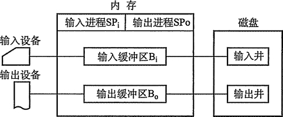

# SPOOLing 技术(假脱机技术)

为了缓和 CPU 的高速性与 I/O 设备低速性之间的矛盾而引入了脱机输入/输出技术。该 技术是利用专门的外围控制机，将低速 I/O 设备上的数据传送到高速磁盘上；或者相反。 SPOOLing 的意思是外部设备同时联机操作，又称为假脱机输入/输出操作，是操作系统中釆 用的一项将独占设备改造成共享设备的技术。

SPOOLing 系统组成如图 5-11 所示。

## 输入井和输出井

在磁盘上开辟出的两个存储区域。输入井模拟脱机输入时的磁盘，用于收容 I/O 设备输 入的数据。输出井模拟脱机输出时的磁盘，用于收容用户程序的输出数据。

图 5-11  SPOOLing 系统的组成

## 输入缓冲区和输出缓冲区

在内存中开辟的两个缓冲区。输入缓冲区用于暂存由输入设备送来的数据，以后再传送 到输入井。输出缓冲区用于暂存从输出井送来的数据，以后再传送到输出设备。

## 输入进程和输出进程

输入进程模拟脱机输入时的外围控制机，将用户要求的数据从输入机通过输入缓冲区再 送到输入井。当 CPU 需要输入数据时，直接将数据从输入井读入内存。输出进程模拟脱机 输出时的外围控制机，把用户要求输出的数据先从内存送到输出并，待输出设备空闲时，再 将输出井中的数据经过输出缓冲区送到输出设备。

共享打印机是使用 SPOOLing 技术的一个实例，这项技术已被广泛地用于多用户系统和 局域网络中。当用户进程请求打印输出时，SPOOLing 系统同意为它打印输出，但并不真正 立即把打印机分配给该用户进程，而只为它做两件事：

*   由输出进程在输出井中为之申请一个空闲磁盘块区，并将要打印的数据送入其中。
*   输出进程再为用户进程申请一张空白的用户请求打印表，并将用户的打印要求填入 其中，再将该表挂到请求打印队列上。

SPOOLing 系统的主要特点有：提高了 I/O 的速度；将独占设备改造为共享设备；实现 了虚拟设备功能。