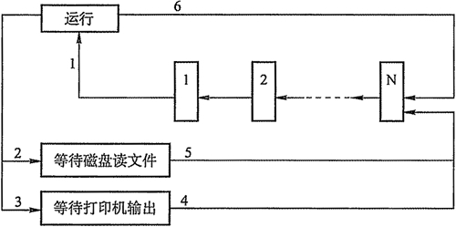

# 关于进程与线程的习题

提示：以下习题涉及教程 2.6 节及其前面的内容，请至少阅读完 2.6 节后再浏览习题。

## 一、单项选择题

1.    一个进程是（ ）。

A.由协处理器执行的一个程序    B. 一个独立的程序+数据集

C. PCB 结构与程序和数据的组合    D. —个独立的程序

2.下列关于线程的叙述中，正确的是（    ）。

A.线程包含 CPU 现场，可以独立执行程序

B.每个线程有自己独立的地址空间

C.进程只能包含一个线程

D.线程之间的通信必须使用系统调用函数

3.进程之间交换数据不能通过（ ）途径进行。

A.共享文件    B.消息传递

C.访问进程地址空间    D.访问共享存储区

4.进程与程序的根本区别是（ ）。

A.静态和动态特点

B.是不是被调入到内存中

C.是不是具有就绪、运行和等待三种状态

D.是不是占有处理器

5.下面的叙述中，正确的是（ ）。

A.进程获得处理器运行是通过调度得到的

B.优先级是进程调度的重要依据，一旦确定不能改动

C.在单处理器系统中，任何时刻都只有一个进程处于运行状态

D.进程申请处理器而得不到满足时，其状态变为阻塞状态

6.若某一进程拥有 100 个线程，这些线程都属于用户级线程，则在系统调度执行时间上占用的时间片是（ ）。

A. 1    B. 100    C. 1/100    D. 0

7.操作系统是根据（）来对并发执行的进程进行控制和管理的。

A.进程的基本状态    B.进稈控制块

C.多道程序设计    D.进程的优先权

8.在任何时刻，一个进程的状态变化（ ）引起另一个进程的状态变化。

A.必定    B.—定不    C.不一定    D.不可能

9.在单处理器系统中，如果同时存在 10 个进程，则处于就绪队列中的进程最多有 ( )个。

A. 1    B. 8    C. 9    D. 10

10.一个进程释放了一台打印机，它可能会改变（ ）的状态。

A.自身进程    B.输入/输出进程

C.另一个等待打印机的进程    D.所有等待打印机的进程

11.假定系统进程所请求的一次 I/O 操作完成后,将使进程状态从（）。

A.运行状态变为就绪状态    B.运行状态变为阻塞状态

C.就绪状态变为运行状态    D.阻塞状态变为就绪状态

12.—个进程的基本状态可以从其他两种基本状态转变过去，这个基本的状态一定是( )。

A.执行状态    B.阻塞状态    C.就绪状态    D.完成状态

13.并发进程失去封闭性，是指（ ）。

A.多个相对独立的进程以各自的速度向前推进

B.并发进程的执行结果与速度无关

C.并发进程执行时，在不同时刻发生的错误

D.并发进程共享变量，其执行结果与速度有关

14.通常用户进程被建立后（ ）。

A.便一直存在于系统中，直到被操作人员撤销

B.随着进程运行的正常或不正常结束而撤销

C.随着时间片轮转而撤销与建立

D.随着进程的阻塞或者唤醒而撤销与建立

15.进程在处理器上执行时（ ）。

A.进程之间是无关的，具有封闭特性

B.进程之间都有交互性，相互依赖、相互制约，具有并发性

C.具有并发性，即同时执行的特性

D.进程之间可能是无关的，但也可能是有交互性的

16.下面说法正确的是（ ）。

A.不论是系统支持的线程还是用户级线程，其切换都需要内核的支持

B.线程是资源分配的单位，进程是调度和分派的单位

C.不管系统中是否有线程，进程都是拥有资源的独立单位

D.在引入线程的系统中，进程仍是资源调度和分派的基本单位

17.在多对一的线程模型中，当一个多线程进程中的某个线程被阻塞后（）。

A.该进程的其他线程仍可继续运行    B.整个进程都将阻塞

C.该阻塞线程将被撤销    D.该阻塞线程将永远不可能再执行

18.用信箱实现进程间互通信息的通信机制要有两个通信原语它们是（）。

A.发送原语和执行原语    B.就绪原语和执行原语

C.发送原语和接收原语    D.就绪原语和接收原语

19.下列几种关于进程的叙述，（ ）最不符合操作系统对进程的理解。

A.进程是在多程序环境中的完整的程序

B.进程可以由程序、数据和 PCB 描述

C.线程（Thread)是一种特殊的进程

D.进程是程序在一个数据集合上的运行过程，它是系统进行资源分配和调度的一个独立单元

20.支持多道程序设计的操作系统在运行过程中，不断地选择新进程运行来实现 CPU 的共享，但其中（）不是引起操作系统选择新进程的直接原因。

A.运行进程的时间片用完    B.运行进程出错

C.运行进程要等待某一事件发生    D.有新进程进入就绪状态

21.若一个进程实体由 PCB、共享正文段、数据堆段和数据栈段组成，请指出下列 C 语言程序中的内容及相关数据结构各位于哪一段中。

Ⅰ.全局赋值变量（ ）    Ⅱ.未赋值的局部变量（ ）

Ⅲ.函数调用实参传递值（）    Ⅳ.用 malioc()要求动态分配的存储区（）

Ⅴ.常量值（如 1995，“string”）( )     Ⅳ.进程的优先级（ ）

A. PCB    B.正文段    C.堆段    D.栈段

22.同一程序经过多次创建，运行在不同的数据集上，形成了（）的进程。

A.不同    B.相同    C.同步    D.互斥

23.系统动态 DLL 库中的系统线程，被不同的进程所调用，它们是（）的线程。

A.不同    B.相同    C.可能不同，也可能相同    D.不能被调用

24.    PCB 是进程存在的唯一标志，下列（ ）不属于 PCB。

A.进程 ID    B. CPU 状态    C.堆栈指针    D.全局变量

25.一个计算机系统中，进程的最大数目主要受到（）限制。

A.内存大小    B.用户数目

C.打开的文件数    D.外部设备数量

26.进程创建完成后会进入一个序列，这个序列称为（    ）。

A.阻塞队列    B.挂起序列    C.就绪队列    D.运行队列

27.在一个多道系统中，若就绪队列不空，就绪的进程数目越多，处理器的效率（）。

A.越高    B.越低    C.不变    D.不确定

28.在具有通道设备的单处理器系统中实现并发技术后，（ ）。

A.各进程在某一时刻并行运行，CPU 与 I/O 设备间并行工作

B.各进程在某一时间段内并行运行，CPU 与 I/O 设备间串行工作

C.各进程在某一时间段内并行运行，CPU 与 I/O 设备间并行工作

D.各进程在某一时刻并行运行，CPU 与 I/O 设备间串行工作

29.进程自身决定（    ）。

A.从运行状态到阻塞状态    B.从运行状态到就绪状态

C.从就绪状态到运行状态    D.从阻塞状态到就绪状态

30.对进程的管理和控制使用（    ）。

A.指令    B.原语    C.信号量    D.信箱

31.【2010 年计算机联考真题】

下列选项中，导致创建新进程的操作是（ ）。

Ⅰ.用户登录成功    Ⅱ.设备分配    Ⅲ.启动程序执行

A.仅Ⅰ和Ⅱ    B.仅Ⅱ和Ⅲ    C.仅Ⅰ和Ⅲ    D. Ⅰ、Ⅱ、Ⅲ

32.在下面的叙述中，正确的是（ ）。

A.引入线程后，处理器只能在线程间切换

B.引入线程后，处理器仍在进程间切换

C.线程的切换，不会引起进程的切换

D.线程的切换，可能引起进程的切换

33.下面的叙述中，正确的是（ ）。

A.线程是比进程更小的能独立运行的基本单位，可以脱离进程独立运行

B.引入线程可提高程序并发执行的程度，可进一步提高系统效率

C.线程的引入增加了程序执行时的时空开销

D.—个进程一定包含多个线程

34.下面的叙述中，正确的是（ ）。

A.同一进程内的线程可并发执行，不同进程的线程只能串行执行

B.同一进程内的线程只能串行执行，不同进程的线程可并发执行

C.同一进程或不同进程内的线程都只能串行执行

D.同一进程或不同进程内的线程都可以并发执行

35.在支持多线程的系统中，进程 P 创建的若干个线程不能共享的是（ ）。

A.进程 P 的代码段    B.进程 P 中打开的文件

C.进程 P 的全局变量    D.进程 P 中某线程的栈指针

36.在以下描述中，（ ）并不是多线程系统的特长。

A.利用线程并行地执行矩阵乘法运算

B.Web 服务器利用线程响应 HTTP 请求

C.键盘驱动程序为每一个正在运行的应用配备一个线程，用以响应该应用的键盘输入

D.基于 GUI 的调试程序用不同的线程分别处理用户输入、计算和跟踪等操作

37.【2012 年计算机联考真题】

下列关于进程和线程的叙述中，正确的是（ ）。

A.不管系统是否支持线程，进程都是资源分配的基本单位

B.线程是资源分配的基本单位，进程是调度的基本单位

C.系统级线程和用户级线程的切换都需要内核的支持

D.同一进程中的各个线程拥有各自不同的地址空间

38.在进程转换时，下列（）转换是不可能发生的。

A.就绪状态 -> 运行状态    B.运行状态 -> 就绪状态

C.运行状态 -> 阻塞状态    D.阻塞状态 -> 运行状态

39.当（ ）时，进程从执行状态转变为就绪状态。

A.进程被调度程序选中    B.时间片到

C.等待某一事件    D.等待的事件发生

40.两个合作进程(Cooperating Processes)无法利用（）交换数据。

A.文件系统    B.共享内存

C.高级语言程序设计中的全局变量    D.消息传递系统

41.以下可能导致一个进程从运行状态变为就绪状态的事件是（ ）。

A. 一次 I/O 操作结束    B.运行进程需做 I/O 操作

C.运行进程结束    D.出现了比现在进程优先级更高的进程

42.( )必会引起进程切换。

A. —个进程创建后，进入就绪状态     B. 一个进程从运行状态变为就绪状态

C. 一个进程从阻塞状态变为就绪状态    D.以上答案都不对

43.进程处于（ ）时，它是处于非阻塞状态。

A.等待从键盘输入数据    B.等待协作进程的一个信号

C.等待操作系统分配 CPU 时间    D.等待网络数据进入内存

44.【2010 年计算机联考真题】

下列选项中，降低进程优先级的合理时机是（）。

A.进程时间片用完

B.进程刚完成 I/O 操作，进入就绪队列

C.进程长期处于就绪队列

D.进程从就绪状态转为运行状态

45.一个进程被唤醒，意味着（ ）。

A.该进程可以重新竞争 CPU    B.优先级变大

C. PCB 移动到就绪队列之首    D.进程变为运行状态

46.进程创建时，不需要做的是（ ）。

A.填写一个该进程的进程考项    B.分配该进程适当的内存

C.将该进程插入就绪队列    D.为该进程分配 CPU

47.计算机两个系统中两个协作进程之间不能用来进行进程间通信的是（）。

A.数据库    B.共享内存    C.消息传递机制    D.管道

48.下列说法不正确的是(    )。

A. 一个进程可以创建一个或多个线程    B. —个线程可以创建一个或多个线程

C. 一个线程可以创建一个或多个进程    D. 一个进程可以创建一个或多个进程

## 二、综合应用题

1.进程和程序之间可以形成一对一、一对多、多对一、多对多的关系，请分别举例说明在什么情况下会形成这样的关系。

2.父进程创建子进程和主程序调用子程序有何不同？

3.为什么进程之间的通信必须借助于操作系统内核功能？简单说明进程通信的几种主要方式。

4.什么是多线程？多线程与多任务有什么区别？

5.回答下列问题：

1)若系统中没有运行进程，是否一定没有就绪进程？为什么？

2)若系统中既没有运行进程，也没有就绪进程，系统中是否就没有进程？为什么？

3)在釆用优先级进程调度时，运行进程是否一定是系统中优先级最高的进程？

6.现代操作系统一般都提供多进程（或称多任务）运行环境，回答以下问题：

1)为支持多进程的并发执行，系统必须建立哪些关于进程的数据结构？

2)为支持进程状态的变迁，系统至少应提供哪些进程控制原语？

3)执行每一个进程控制原语时，进程状态发生什么变化？相应的数据结构发生什么变化？

7.某分时系统中的进程可能出现如图 2-3 所示的状态变化，请回答下列问题：

1)根据图 2-3,该系统应釆用什么进程调度策略？

2)把图 2-3 中的每一个状态变化可能的原因填在表 2-2 中。

表 2-2 状态变化

| 变化 | 原 因 |
| 1 |   |
| 2 |   |
| 3 |   |
| 4 |   |
| 5 |   |
| 6 |   |

图 2-3 进程状态变化

各题答案及解析请查看：[`club.coderbbs.com/thread-101-1-1.html`](http://club.coderbbs.com/thread-101-1-1.html)