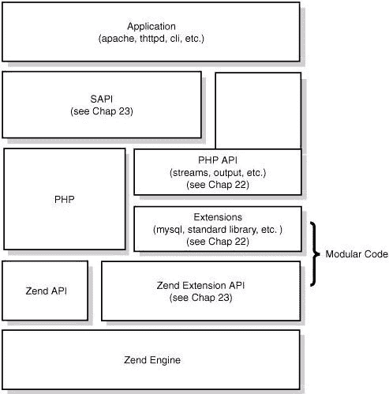
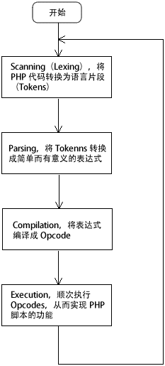

# PHP 运行原理和机制

> 原文：[`c.biancheng.net/view/6108.html`](http://c.biancheng.net/view/6108.html)

虽然说 PHP 学起来相对简单，但是要精通也不是一件简单的事，我们除了要知道怎么使用之外，还得知道它的工作原理。

PHP 是一种适用于 Web 开发的脚本语言，可以将它看做是一个用 C 语言实现的包含大量组件的软件框架。

了解 PHP 的底层实现，有助于我们更好的运用它，优化我们程序的性能，从而实现更加强大的功能。

## PHP 的设计理念及特点

PHP 被设计为一种适用于 Web 开发的动态脚本语言，底层完全由 C 语言实现，它具备以下特点。

*   解释型：程序一行一行的边解释边运行；
*   弱类型：和 C/C++、JAVA、C# 等语言不同，PHP 是一种弱类型的语言。定义 PHP 变量时不用指明它的类型，它的类型根据赋值的数据自动调整；另外，一个变量的类型也不是一成不变的，在运行过程中可以给变量赋值不同类型的数据，从而修改变量的类型。这种机制的灵活性在 Web 开发中非常方便和高效；
*   多进程模型：由于 PHP 是多进程模型，不同请求间互不干涉，这样保证了一个请求挂掉不会对全盘服务造成影响；当然，随着时代发展，PHP 也已经支持了多线程模型；
*   使用引擎（Zend） + 组件（ext）的模式降低内部耦合；
*   中间层（sapi）隔绝 web server 和 PHP。

## PHP 的四层体系

PHP 的核心架构如下图所示：
图 1：PHP 的核心架构
从上图可以看出，PHP 从下到上是可以分为 4 层：

#### 1) Zend 引擎（核心）

Zend 引擎整体用 C 语言实现，是 PHP 的内核部分，它负责将 PHP 代码翻译（词法、语法解析等一系列编译过程）为可执行的 opcode 操作码，并实现相应的处理方法、基本的数据结构（如 hashtable、oo）、内存分配及管理、提供相应的 API 方法供外部调用。

Zend 是一切的核心，所有的外围功能均围绕 Zend 实现。

#### 2) Extensions（扩展）

围绕着 Zend 引擎，Extensions 通过组件化的方式提供各种基础服务，我们常见的各种内置函数（例如变量操作函数、字符串操作函数等）以及标准库等都是通过 Extensions 来实现。

用户也可以根据需要实现自己的 Extension 组件以达到功能扩展、性能优化等目的，这就是高手常说的“编写 PHP 扩展”。

#### 3) SAPI（服务器应用程序编程接口）

SAPI 全称是 Server Application Programming Interface，译为“服务器应用程序编程接口”。

SAPI 通过一系列钩子函数，使得 PHP 可以和外围交互数据，这是 PHP 非常优雅和成功的一个设计，通过 SAPI 成功的将 PHP 本身和上层应用解耦隔离，PHP 可以不再考虑如何针对不同应用进行兼容，而应用本身也可以针对自己的特点实现不同的处理方式。

#### 4) Application（上层应用）

这就是我们平时编写的 PHP 程序，通过不同的 SAPI 方式得到各种各样的应用模式，例如通过 Web 服务器实现网站后台、在命令行下以脚本方式运行等。

#### 总结

如果将 PHP 看作一辆汽车，那么车的框架就是 PHP 本身，Zend 是车的引擎（发动机），Ext 下面的各种组件就是车的轮子，SAPI 可以看做是公路，车可以跑在不同类型的公路上，而一次 PHP 程序的执行就是汽车真正跑在公路上。

要想让汽车跑得快，性能优异的引擎+合适的车轮+正确的跑道都是缺一不可的。

## PHP 常见的运行模式

SAPI 即服务器应用程序编程接口，是 PHP 与其他应用交互的接口，PHP 脚本要执行有很多方式，比如通过 Web 服务器、命令行下或者嵌入在其他程序中。

SAPI 提供了一个和外部通信的接口，常见的 SAPI 有：cgi、fast-cgi、cli、apache 模块的 DLL、isapi 等。

#### CGI

CGI 即通用网关接口（Common Gateway Interface），它是一段程序，通俗的讲 CGI 就象是一座桥，把网页和 WEB 服务器中的执行程序连接起来，它把 HTML 接收的指令传递给服务器的执行程序，再把服务器执行程序的结果返还给 HTML。

CGI 的跨平台性能极佳，几乎可以在任何操作系统上实现。

CGI 在遇到连接请求后，会先要创建 CGI 的子进程，激活一个 CGI 进程，然后处理请求，处理完后结束这个子进程，这就是 fork-and-execute 模式。

综上所述，使用 CGI 方式的服务器有多少连接请求就会有多少 CGI 子进程，子进程反复加载 会导致 CGI 性能低下。当用户请求数量非常多时，会大量挤占系统的资源，如内存、CPU 时间等，造成性能低下。

#### FastCGI

fast-cgi 是 CGI 的升级版本，FastCGI 像是一个常驻（long-live）型的 CGI，它激活后可以一直执行着。

FastCGI 的工作原理：

*   Web Server 启动时载入 FastCGI 进程管理器（IIS ISAPI 或 Apache Module）；
*   FastCGI 进程管理器自身初始化，启动多个 CGI 解释器进程（可见多个 php-cgi）并等待来自 Web Server 的连接；
*   当客户端请求到达 Web Server 时，FastCGI 进程管理器选择并连接到一个 CGI 解释器。Web server 将 CGI 环境变量和标准输入发送到 FastCGI 子进程 php-cgi；
*   FastCGI 子进程完成处理后将标准输出和错误信息从同一连接返回 Web Server。当 FastCGI 子进程关闭连接时，请求便处理完成了。FastCGI 子进程接着等待并处理来自 FastCGI 进程管理器（运行在 Web Server 中）的下一个连接。 在 CGI 模式中，php-cgi 在此便退出了。

#### APACHE2HANDLER

PHP 作为 Apache 的模块，Apache 服务器在系统启动后，预先生成多个进程副本驻留在内存中，一旦有请求出现，就立即使用这些空余的子进程进行处理，这样就不存在生成子进程造成的延迟了。这些服务器副本在处理完一次 HTTP 请求之后并不立即退出，而是停留在计算机中等待下次请求。对于客户浏览器的请求反应更快，性能较高。

#### apache 模块的 DLL

该运行模式是我们以前在 windows 环境下使用 apache 服务器经常使用的，而在模块化（DLL）中，PHP 是与 Web 服务器一起启动并运行的。（是 apache 在 CGI 的基础上进行的一种扩展，可以加快 PHP 的运行效率）

#### ISAPI

ISAPI 即 Internet Server Application Program Interface，是微软提供的一套面向 Internet 服务的 API 接口。一个 ISAPI 的 DLL，可以在被用户请求激活后长驻内存，等待用户的另一个请求，还可以在一个 DLL 里设置多个用户请求处理函数，此外 ISAPI 的 DLL 应用程序和 WWW 服务器处于同一个进程中，效率要显著高于 CGI。

#### CLI

CLI（全称：command-line interface）命令行界面，是在图形用户界面得到普及之前使用最为广泛的用户界面，它通常不支持鼠标，用户通过键盘输入指令，计算机接收到指令后，予以执行。也有人称之为字符用户界面（CUI）。

## PHP 的执行流程和 opcode

我们再来看看 PHP 代码执行所经过的流程。

图 2：PHP 的执行流程 
一段 PHP 代码会经过词法解析、语法解析等阶段，会被翻译成一个个指令（opcode），然后 zend 虚拟机会顺序执行这些指令。PHP 本身是用 C 语言实现的，因此最终调用的也是 C 语言的函数，实际上我们可以把 PHP 看做一个 C 语言开发的软件。

PHP 执行的核心就是翻译出来的一条一条指令，也就是 opcode，opcode 是 PHP 程序执行的最基本单位。

在计算机科学领域中，操作码（Operation Code）被用于描述机器语言指令中，指定要执行某种操作的那部分机器码，构成 opcode 的指令格式和规范由处理器的指令规范指定。

一个 opcode 由两个参数（op1，op2）、返回值和处理函数组成。PHP 程序最终被翻译为一组 opcode 处理函数的顺序执行。

下面列举了几个常见的处理函数：

*   ZEND_ASSIGN_SPEC_CV_CV_HANDLER : 变量分配 （$a=$b）；
*   ZEND_DO_FCALL_BY_NAME_SPEC_HANDLER：函数调用；
*   ZEND_CONCAT_SPEC_CV_CV_HANDLER：字符串拼接 $a.$b；
*   ZEND_ADD_SPEC_CV_CONST_HANDLER: 加法运算 $a+2；
*   ZEND_IS_EQUAL_SPEC_CV_CONST：判断相等 $a==1；
*   ZEND_IS_IDENTICAL_SPEC_CV_CONST：判断相等 $a===1。

## HashTable

HashTable 是 Zend 的核心数据结构，在 PHP 里面几乎并用来实现所有常见功能，我们知道的 PHP 数组即是其典型应用，此外在 zend 内部，如函数符号表、全局变量等也都是基于 HashTable。

HashTable 具有如下特点：

*   支持典型的 key->value 查询；
*   可以当做数组使用；
*   添加、删除节点是 O（1）复杂度；
*   key 支持混合类型，同时存在关联数组合索引数组；
*   Value 支持混合类型：array("string",2332)；
*   支持线性遍历，如 foreach。

## Zval

由于 PHP 是一门弱类型语言，本身不严格区分变量的类型。PHP 在声明变量的时候不需要指定类型。PHP 在程序运行期间可能进行变量类型的隐式转换。和其他强类型语言一样，程序中也可以进行显式的类型转换。Zval 是 Zend 中另一个非常重要的数据结构，用来标识并实现 PHP 变量。

Zval 主要由以下 3 部分组成。

*   Type：指定了变量所述的类型（整数、字符串、数组等）；
*   refcount&is_ref：用来实现引用计数；
*   value：是核心部分，存储了变量的实际数据。

Zval 用来保存一个变量的实际数据。因为要存储多种类型，所以 zval 是一个 union，也由此实现了弱类型。

引用计数在内存回收、字符串操作等地方使用得非常广泛。PHP 中的变量就是引用计数的典型应用。Zval 的引用计数通过成员变量 is_ref 和 ref_count 实现。通过引用计数，多个变量可以共享同一份数据，避免频繁复制带来的大量消耗。

在进行赋值操作时，Zend 将变量指向相同的 Zval，同时 ref_count++，在 unset 操作时，对应的 ref_count-1。只有 ref_count 为 0 时才会真正执行销毁操作。如果是引用赋值，Zend 就会修改 is_ref 为 1。

PHP 变量通过引用计数实现变量共享数据，当试图写入一个变量时，Zend 若发现该变量指向的 Zval 被多个变量共享，则为其复制一份 ref_count 为 1 的 Zval，并递减原 Zval 的 refcount，这个过程称为“Zval 分离”。可见，只有在有写操作发生时，Zend 才进行复制操作，因此也叫 copy-on-write（写时复制）。

对于引用型变量，其要求和非引用型相反，引用赋值的变量间必须是捆绑的，修改一个变量就修改了所有捆绑变量。