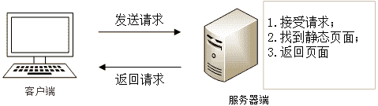
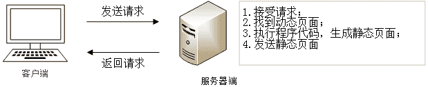

# 静态网页与动态网页的区别

> 原文：[`c.biancheng.net/view/7186.html`](http://c.biancheng.net/view/7186.html)

网页可分为静态网页与动态网页两种形式。在介绍这两种网页之前，我们先来了解一下网络构成中的服务器（Server）与客户机（Client）。

服务器是安装有服务器软件并且可以向客户机提供网页浏览、数据库查询等服务的设备。而客户机则与之相反，它通过客户端软件（如浏览器）从服务器上获得网页浏览、软件下载等服务。简单地讲服务器就是服务提供者，而客户机则是服务获得者。

## 静态网页

在网站设计中，静态网页是网站建设的基础，纯粹 HTML 格式的网页通常被称为“静态网页”，静态网页是标准的 HTML 文件，它的文件扩展名是 .htm、.html，可以包含文本、图像、声音、FLASH 动画、客户端脚本和 ActiveX 控件等。

静态网页是相对于动态网页而言，是指没有后台数据库、不含程序和不可交互的网页。静态网页相对更新起来比较麻烦，适用于一般更新较少的展示型网站。

容易误解的是，静态网页并不是静止不动的，它也可以出现各种动态的效果，如 GIF 动画、FLASH、滚动字幕等。

静态网页服务的实现首先需要客户机通过浏览器向服务器发出请求，然后服务器接受请求并根据请求从服务器端的网页中找到对应的页面，最后返回给客户机浏览器。这个过程中所发送的页面都是事先编辑好的，它并不能自动生成。

图 1：静态网页的实现模式 
静态网页有以下特点：

*   静态网页不能自动更新，若要对静态页面进行更新，就要重新编写 HTML 源文件，然后再上传。因此静态网页的制作和维护工作量相当大。
*   静态网页的内容不随浏览用户、浏览时间等条件的变化而变化。无论何人、何时、何地浏览网页，它的内容都是一成不变的（不包括使用 JavaScript 实现的一些简单特效）。
*   静态网页一经发布，无论浏览者浏览与否，它都是真实存在的一个文件，都对应一个 URL（文件在网上的地址）。
*   用静态网页实现人机交互有相当大的局限性。由于不能动态生成页面，所以用静态网页来实现人机交互是很困难的，在功能上有很大限制。

## 动态页面

动态网页是基本的 HTML 语法规范与 PHP、Java、Python 等程序语言、数据库等多种技术的融合，以期实现对网站内容和风格的高效、动态、交互式的管理。因此，可以理解为凡是结合了 HTML 以外的高级程序设计语言和数据库技术进行的网页编程技术生成的网页都是动态网页。

也就是说，动态网页相对于静态网页来说，页面代码虽然没有变，但是显示的内容却是可以随着时间、环境或者数据库操作的结果而发生改变的。

动态网页与网页上的各种动画、滚动字幕等视觉上的动态效果没有直接关系，动态网页也可以是纯文字内容的，也可以包含各种动画的内容，这些只是网页具体内容的表现形式，无论网页是否具有动态效果，只要是采用了动态网站技术（如 PHP、JSP 等）生成的网页都可以称为动态网页。

与静态网页相比，动态网页有以下特点：

*   动态网页在服务器端运行，客户机上看到的只是它的返回结果，不可能看到它的源文件。而静态网页则只能通过服务器把网页文件原封不动地传给客户机，本身不进行任何处理。
*   不同的人、不同时间、不同地点浏览同一个动态网页，根据代码处理结果不同，会返回不同的内容。
*   动态网页只有经客户浏览时才会返回一个完整的网页，而其本身并不是一个独立存在于服务器的网页文件。
*   与静态网页相比，动态网页更容易实现人机交互。与数据库相联系，能实现更为强大的功能。
*   由动态网页构建的网站维护起来比由静态网页构建的网站容易，只需要更新调用的数据（如数据库内容）即可。

与静态网页的实现方法不同，动态网页服务的实现首先需要客户机向服务器发送请求，然后服务器根据用户请求把动态网页内部的代码先在服务器上进行相应的处理，最后服务器把生成的结果发送给客户机，如下图所示：

图 2：动态网页的实现模式

## 动态网页与传统网页的区别

#### 1) 更新和维护

静态网页内容一经发布到网站服务器上，无论是否有用户访问，这些网页内容都是保存在网站服务器上的。如果要修改网页的内容，就必须修改其源文件，然后重新上传到服务器上。静态网页没有数据库的支持，当网站信息量很大的时候网页的制作和维护都很困难。

动态网页可以根据不同的用户请求，时间或者环境的需求动态的生成不同的网页内容，并且动态网页一般以数据库技术为基础，可以大大降低网站维护的工作量。

#### 2) 交互性

静态网页由于很多内容都是固定的，在功能方面有很大的限制，所以交互性较差。

动态网页则可以实现更多的功能，如用户的登录、注册、查询等。

#### 3) 响应速度

静态网页内容相对固定，容易被搜索引擎检索，且不需要连接数据库，因此响应速度较快。

动态网页实际上并不是独立存在于服务器上的网页文件，只有当用户请求时服务器才返回一个完整的网页，其中涉及到数据的连接访问和查询等一系列过程，所以响应速度相对较慢。