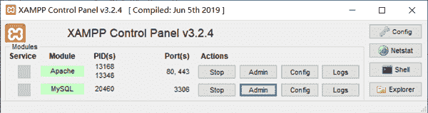

# 搭建 PHP 开发环境

> 原文：[`c.biancheng.net/view/6110.html`](http://c.biancheng.net/view/6110.html)

对于初学者，推荐在 Windows 操作系统下使用 XAMPP 一键安装 PHP 集成开发环境（Apache、PHP、MySQL），XAMPP 提供 PHP 7 的安装版本，读者只需要到官方网站 [`www.apachefriends.org/download.html`](https://www.apachefriends.org/download.html) 下载即可。下载界面如图所示。


下载后得到一个 EXE 文件，双击该文件安装。安装完成后，查看该集成环境安装目录，如图所示。


双击 manager-windows.exe 即可打开管理窗口，在 Manage Servers 选项卡查看 MySQL 及 Apache 运行状态，如图所示。


应用目录默认位于安装目录的 apache2/htdocs 目录下，在该目录下新建 test.php 并编辑其内容：

```

<?php
echo phpinfo();
```

在浏览器中访问 http://localhost/test.php，页面显示如图所示。

出现以上页面，则说明安装成功。