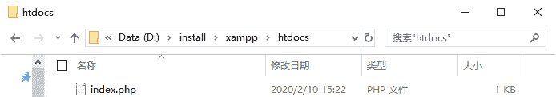
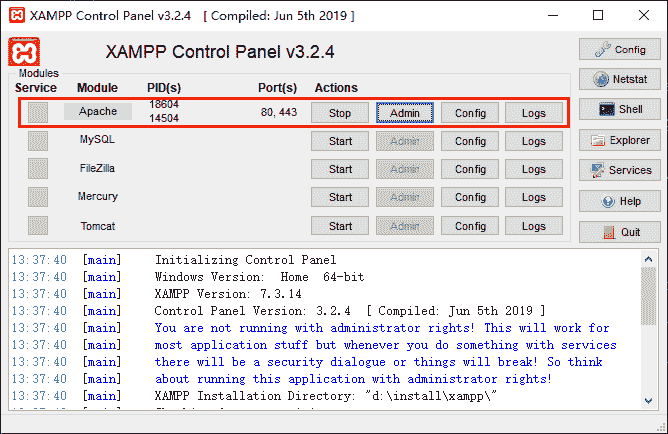
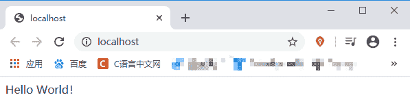

# 第一个 PHP 程序

> 原文：[`c.biancheng.net/view/6112.html`](http://c.biancheng.net/view/6112.html)

通过前面对 PHP 的介绍，相信大家已经对 PHP 有了一定的了解，那么本节我们就带领大家实现一个简单 PHP 程序——在浏览器中输出“Hello World！”。

想要在页面输出“Hello World！”非常简单，仅需要几行代码就可以搞定，如下所示：

```

<?php
    echo "Hello World！";
?>
```

上面代码中 `<?php` 和 `?>` 分别表示 PHP 文件的开始和结束标记，在这里结束标记 `?>` 并不是必须的，可以省略。两个标记之间是我们所写的 PHP 代码，代码与开始/结束标记也可以在同一行，但必须以空格分开，如下所示：

```

<?php echo 'Hello World！'; ?>
```

其中，echo 是输出语句，用于输出一个字符串，也就是 echo 后面以 `" "` 包裹的部分（这里使用 `' '` 也是可以的）。末尾的英文状态的分号 `;` 表示一条语句的结束。

PHP 源文件的格式为“.php”，理论上 PHP 的源文件可以放在任意目录下，但是为了方便运行我们还是尽量将它放置在服务器环境相应的目录下，比如下面列举的这些：

*   XAMPP 集成环境：XAMPP 安装目录下的 htdocs 文件夹中；
*   PHPStudy 集成环境：PHPStudy 安装目录下的 WWW 文件夹中。

提示：因开发环境的不同，PHP 源文件的存放目录略有不同，比较常见的就是 htdocs、WWW 这两个目录。

本教程中使用的就是 XAMPP 集成环境，所以首先需要在 htdocs 目录下创建一个 index.php 文件，index 在这里是首页的意思，PHP 程序默认会首先运行名为 index 的文件（如 index.php、index.html 等），当然这也不是绝对的，我们也可以通过修改配置文件的方式让 PHP 程序首先运行指定的文件，这些我们会在后面详细介绍。


图：新建一个 index.php 文件
创建好 index.php 文件后，将我们上面的代码复制到文件中并保存。

在开始运行之前，我们首先需要确认一下 XAMPP 的 apache 服务处于开启状态，如下图所示：


图：开启 apache 服务
然后就可以在浏览器中输入 localhost，或者点击上图红框中的 Admin 按钮就可以运行我们的 PHP 程序了，如下图所示：


图：运行第一个 PHP 程序