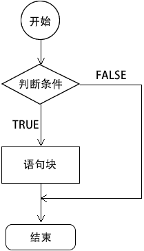
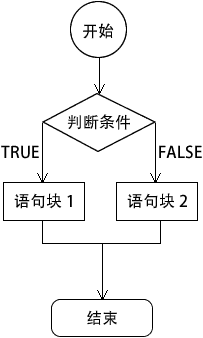
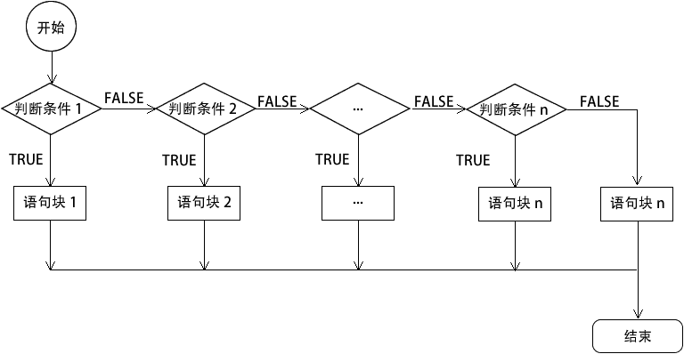

# PHP if else 语句

> 原文：[`c.biancheng.net/view/6120.html`](http://c.biancheng.net/view/6120.html)

无论在何种编程语言中，流程控制都是很重要的内容。由于 PHP 的大部分语法都继承了 C 语言的特点，因此在流程控制方面，PHP 有着和 C 语言类似的流程控制。

if else 语句是流程控制中根据条件判断执行的一种。该语句执行时先对条件进行判断，然后根据判断结果做出相应的操作。它又可以细分为三种，分别是 if 语句、if...else 语句、if...else if...else 语句。

## 1\. if 语句

if 语句是流程控制中最简单的一种。只判断某个条件是否为真，如果为真就执行特定的语句块。语法格式如下：

if (判断条件) {
    语句块;
}

如果需要执行的语句块包含一条以上的语句，则要使用`{ }`把 它们括起来，表示一个整体；如果要执行的语句只有一条，就可以省略大括号标记。像下面这样：

if (判断条件)
    一条语句;

if 语句的执行流程如下图所示：


图：if 语句流程图
【示例】 定义一个数组，使用 if 语句判断这个数字是不是偶数，代码如下所示：

```

<?php
    $num = 34;

    if ($num % 2 == 0) {
        echo '$num ='.$num.', 是偶数！';
    }
?>
```

运行结果如下：

$num =34, 是偶数！

## 2\. if...else 语句

if 语句只能对判断结果为真的情况执行操作，这在很多情况下是不够的，于是就有了 if...else 这种形式的语句。与 if 判断不同，if...else 语句不仅对判断结果为真的情况执行操作，对非真的情况也可以执行相应的操作。

else 语句延伸了 if 语句，可以在 if 语句中表达式的值为 FALSE 时执行相应的语句。另外需要注意的是，else 语句是 if 语句的从句，必须和 if 语句一起使用，不能单独存在。

if...else 语句的语法格式如下：

if (判断条件) {
    语句块 1;
} else {
    语句块 2;
}

在上面的格式中，如果“判断条件”为真，则执行“语句块 1”；否则执行“语句块 2”。“语句块 1”和“语句块 2”都可以包含多条语句。与 if 语句相同的是，如果“语句块 1”和“语句块 2”中都只包含一条语句的话，可以省略大括号`{ }`，如下所示：

if (判断条件)
    语句块 1;
else
    语句块 2;

if...else 语句的执行流程如下图所示：


图：if...else 语句流程图
【示例】使用 rand() 函数生成一个随机数 $num，然后判断这个随机数是偶数还是奇数，代码如下所示：

```

<?php
    $num = rand(1,31);  //生成一个 1~31 之间的随机数

    if ($num % 2 == 0) {
        echo '$num ='.$num.', 是偶数！';
    } else {
        echo '$num ='.$num.', 是奇数！';
    }
?>
```

运行结果如下：

$num =27, 是奇数！

## 3\. if...else if...else 语句

else if 语句和 else 语句一样，它延伸了 if 语句，else if 语句会根据不同的表达式来确定执行哪个语句块。

在 PHP 中也可以将 else if 这两个关键字合并在一起（如 elseif）来使用。else if 语句的语法格式如下所示：

if (判断条件 1) {
    语句块 1;
} else if (判断条件 2) {
    语句块 2;
} else if (判断条件 3) {
    语句块 3;
}
......
else if (判断条件 n) {
    语句块 n;
}
else{
    语句块 n+1;
}

在上面的 else if 的语法中，如果第一个“判断条件 1”为 TRUE，则执行“语句块 1”语句；如果第二个“判断条件 2”为 TRUE，则执行“语句块 2”语句；以此类推。如果表达式的条件都不为 TRUE，则执行 else 子句中的“语句块 n+1”语句，当然最后的 else 语句也可以省略。

在 else if 语句中同时只能有一个表达式为 TRUE，即在 else if 语句中只能有一个语句块被执行。如果有多个表达式的值为 TRUE 时，只会执行第一个表达式所对应的语句块。

if...else if...else 语句的执行流程如下图所示：


图：if...else if...else 语句流程图
【示例】根据成绩判断成绩的优、良、中、差级别，代码如下所示：

```

<?php
    $score = 89; 

    if ($score > 90) {
        echo '成绩的级别为：优！';
    } else if ($score > 70) {
        echo '成绩的级别为：良！';
    } else if ($score > 60) {
        echo '成绩的级别为：中！';
    } else {
        echo '成绩的级别为：差！';
    }
?>
```

运行结果如下：

成绩的级别为：良！