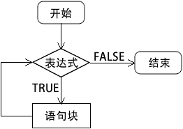
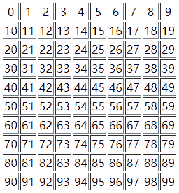
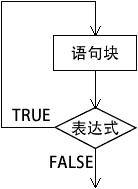

# PHP while 和 do while 循环

> 原文：[`c.biancheng.net/view/6122.html`](http://c.biancheng.net/view/6122.html)

循环语句可以在满足条件的情况下反复执行某一个操作。在 PHP 中提供了 4 个循环控制语句，分别是 while、do while、for 和 foreach 循环语句。本节我们主要介绍一下 while 和 do while 循环语句。

## 1\. while 循环

while 循环的作用是反复执行某一项操作，是循环语句中最简单的一个。该语句的特点是：先判断表达式，当表达式结果为真时执行相应的语句。

while 循环的语法格式如下：

while (表达式) {
    语句块;
}

当表达式的值为真时，将执行循环体内的 PHP 语句块，执行结束后，再返回到表达式继续进行判断，判断为真时继续执行语句块中的代码，直到表达式的值为假时才跳出循环。

while 循环的执行过程如下图所示：


图：while 循环执行流程
while 循环中“表达式”的计算结果一定要是布尔型的 TRUE 或 FALSE，如果是其他类型的值也会自动转换为布尔类型的值。通常这个表达式是使用比较运算符或者逻辑运算符计算后的值。“语句块”是一条语句或一个复合语句（代码块）。当 while 循环语句中只有一条语句时可以将包裹代码块的大括号`{ }`省略。如果是多条语句的代码块，则一定要使用大括号`{ }`包裹起来。

【示例】使用 while 循环打印数字 1~10，代码如下所示：

```

<?php
    $num = 1;

    while($num <= 10) {
        echo $num.($num == 10 ? '' : ', ');
        $num++;
    }
?>
```

运行结果如下：

1, 2, 3, 4, 5, 6, 7, 8, 9, 10

while 循环与 if 语句一样也可以多层嵌套在一起使用，比如我们可以使用两层嵌套的 while 循环输出一个表格，代码如下所示：

```

<?php
    echo '<table border="1">';
    $x = 0;
    while ($x < 10) {
        echo '<tr align="center">';
        $y = 0;
            while ($y < 10) {
                echo '<td>'.($x*10+$y).'</td>';
                $y++;
            }
        echo '</tr>';
        $x++;
    }
    echo '</table>';
?>
```

运行结果如下图所示：

## 2\. do while 循环

do while 和 while 循环非常相似，区别在于 do while 循环的表达式是在每次循环结束时检查而不是在开始时，而且不论表达式的结果如何 do while 循环语句都会执行一次，因为表达式的值是每次循环结束后才检查的。而在 while 循环中就不同了，表达式的值在循环开始时检查，如果一开始就为 FALSE，则整个循环立即终止。

do while 循环语句的格式如下：

do {
    语句块;
} while (表达式);

其中 while 语句中“表达式”的计算结果也一定要是布尔型的 TRUE 或 FALSE。“语句块”也可以是一条语句或一个复合语句（代码块）。当 do while 语句语句块中只有一条语句时，也可以省略大括号`{ }`。

注意：使用 do while 时最后一定要有一个分号`;`，分号也是 do while 循环语法的一部分。

do while 循环语句的执行流程是：先执行一次循环体中的语句块，然后判断表达式的值，当表达式的值为 TRUE 时，返回重新执行循环体中的语句块，如此反复，直到表达式的值等于 FALSE 为止，此时循环结束。其特点是先执行循环体，然后判断循环条件是否成立。

do while 循环语句的执行流程如下图所示：


图：do while 循环执行流程
【示例】使用 do while 循环计算 1~50 之间整数的和。

```

<?php
    $sum = 0;
    $i = 1;
    do {
        $sum += $i;
        $i++;
    } while ($i <= 50);
    echo '1 + 2 + 3 +...+ 49 + 50 = '. $sum;
?>
```

运行结果如下：

1 + 2 + 3 +...+ 49 + 50 = 1275