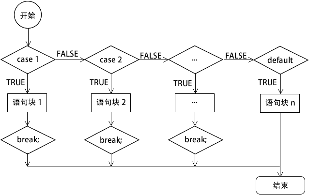

# PHP switch case 语句

> 原文：[`c.biancheng.net/view/6126.html`](http://c.biancheng.net/view/6126.html)

switch 语句和 if...else if...else 语句相似，也是一种分支结构，与 if...else if...else 语句相比 switch 语句更加简洁明了。

switch 语句由一个表达式和多个 case 标签组成，case 标签后紧跟一个代码块，case 标签作为这个代码块的标识。switch 语句的语法格式如下：

switch(表达式){
    case 值 1:
        语句块 1;
        break;
    case 值 2:
        语句块 2;
        break;
    ... ...
    case 值 n:
        语句块 n;
        break;
    default:
        语句块 n+1;
}

switch 语句根据表达式的值，依次与 case 中的值进行比较，如果不相等，继续查找下一个 case；如果相等，就会执行对应的语句，直到 switch 语句结束或遇到 break 为止。

一般来说，switch 语句最终都有一个默认值 default，如果在前面的 case 中没有找到相符的条件，则执行默认语句，和 else 语句类似。

switch 语句的执行流程如下图所示：


图：switch 语句执行流程
在使用 switch 语句时应该注意以下几点：

*   和 if 语句不同的是，switch 语句后面表达式的数据类型只能是整型或字符串，不能是 bool 型。通常这个表达式是一个变量名称，虽然 PHP 是弱类型语言，在 switch 后面表达式的变量可以是任意类型数据，但为了保证匹配执行的准确性，最好只使用整型或字符串中的一种类型。
*   和 if 语句不同的是，switch 语句后面的花括号是必须有的。
*   case 语句的个数没有规定，可以无限增加。但 case 标签和 case 标签后面的值之间应该有一个空格，值后面必须有一个冒号，这是语法的一部分。
*   switch 匹配完成以后，将依次逐条执行匹配的分支模块中的语句，直到 switch 结构结束或者遇到了 break 语句才停止执行。所以，如果一个分支语句的后面没有写上 break 语句，程序将会继续执行下一个分支语句的内容。
*   与 if 语句中的 else 类似，switch 语句中 default 标签直接在后面加上一个冒号，看似没有条件，其实是有条件的，条件就是“表达式”的值不能与前面任何一个 case 标签后的值相等，这时才执行 default 分支中的语句。default 标签和 if 中的 else 子句一样，它不是 switch 语句中必需的，可以省略。

【示例】使用 date() 函数获取当前星期的英文缩写，根据缩写打印今天是星期几，代码如下所示：

```

<?php
    $week = date('D');

    switch($week){
        case 'Mon':
            echo '星期一';
            break;
        case 'Tue':
            echo '星期二';
            break;
        case 'Wed':
            echo '星期三';
            break;
        case 'Thu':
            echo '星期四';
            break;
        case 'Fri':
            echo '星期五';
            break;
        case 'Sat':
            echo '星期六';
            break;
        case 'Sun':
            echo '星期日';
            break;
    }
?>
```

运行结果如下：

星期四