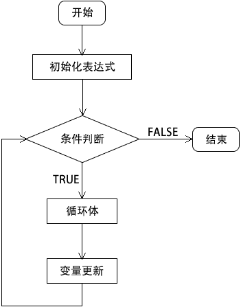

# PHP for 循环

> 原文：[`c.biancheng.net/view/6127.html`](http://c.biancheng.net/view/6127.html)

for 循环是 PHP 中最复杂的循环结构。for 循环语句能够按照已知的循环次数进行循环操作，适用于明确知道执行次数的情况。

for 循环的格式和前面介绍的 while 和 do while 两种循环语句不一样，for 循环将控制循环次数的变量预先定义在 for 语句中。虽然 for 循环是 PHP 中最复杂的循环结构，但使用起来非常方便。

for 循环的语法格式如下：

for (初始化表达式; 条件判断; 变量更新) {
    循环体;
}

参数说明如下：

*   初始化表达式：通常用于声明一个计数器的初始值，即循环开始的值；
*   条件判断：用于控制是否执行循环体中的代码，如果条件为 FALSE ，则立即退出循环；
*   变量更新：循环每执行一次，马上修改计数器的值；
*   循环体：条件判断为真时，需要执行的若干代码。

for 循环语句的执行流程如下图所示：


图：for 循环执行流程
【示例】通过 for 循环来计算 100 的阶乘，实现代码如下所示：

```

<?php
    $sum = 1;

    for ($i = 1; $i <= 100; $i++) {
        $sum *= $i;
    }
    echo '100! = '.$sum;
?>
```

运行结果如下：

100! = 9.3326215443944E+157

注意：在 for 循环语句中，循环计数器无论是采用递增还是递减的方式，前提是一定要保证循环能够结束，无期限的循环（死循环）会导致程序的崩溃。

for 循环语句也可以像 while 语句一样嵌套使用，即在 for 循环语句中包含另外的一个或多个 for 循环语句。通过对 for 循环语句进行嵌套，可以完成一些复杂的编程。比如打印九九乘法表，示例代码如下：

```

<?php
    for ($i = 1; $i <= 9; $i++) {
        for ($j = 1; $j <= $i; $j++) {
            echo $j.' * '.$i.' = '.$i*$j.'&nbsp;&nbsp;';
        }
        echo '<br>';
    }
?>
```

运行结果如下：

1 * 1 = 1 
1 * 2 = 2  2 * 2 = 4 
1 * 3 = 3  2 * 3 = 6  3 * 3 = 9 
1 * 4 = 4  2 * 4 = 8  3 * 4 = 12  4 * 4 = 16 
1 * 5 = 5  2 * 5 = 10  3 * 5 = 15  4 * 5 = 20  5 * 5 = 25 
1 * 6 = 6  2 * 6 = 12  3 * 6 = 18  4 * 6 = 24  5 * 6 = 30  6 * 6 = 36 
1 * 7 = 7  2 * 7 = 14  3 * 7 = 21  4 * 7 = 28  5 * 7 = 35  6 * 7 = 42  7 * 7 = 49 
1 * 8 = 8  2 * 8 = 16  3 * 8 = 24  4 * 8 = 32  5 * 8 = 40  6 * 8 = 48  7 * 8 = 56  8 * 8 = 64 
1 * 9 = 9  2 * 9 = 18  3 * 9 = 27  4 * 9 = 36  5 * 9 = 45  6 * 9 = 54  7 * 9 = 63  8 * 9 = 72  9 * 9 = 81