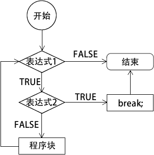
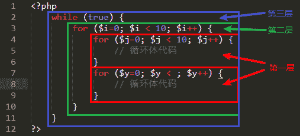

# PHP break：跳出循环

> 原文：[`c.biancheng.net/view/7273.html`](http://c.biancheng.net/view/7273.html)

break 关键字可以使程序跳出当前的循环，可以在 switch、for、while 和 do while 等语句中使用，这样可以终止循环体的代码并立即跳出当前的循环，执行循环之后的代码。

break 关键字的执行流程如下图所示：


图：break 关键字执行流程
【示例】使用 while 声明一个无限循环，在循环中不断生成 1~20 之内的随机数，当随机数等于 10 时，使用 break 退出循环，实现代码如下：

```

<?php
    while (true) {
        $num = rand(1, 20);
        echo $num.', ';
        if ($num == 10) {
            echo '$num = 10，退出循环！<br>';
            break;
        }
    }
    echo '成功退出 while 循环！';
?>
```

运行结果如下：

12, 13, 9, 14, 19, 12, 17, 8, 10, $num = 10，退出循环！
成功退出 while 循环！

break 语句不仅可以跳出当前的循环，还可以指定跳出几层循环。语法格式为：

break n;

其中，参数 n 指定要跳出的循环层数，如下图所示：


图：参数 n 示意图
【示例】使用 3 层循环，最外层的 while 循环和中间层的 for 循环都为无限循环，最里面并列两个 for 循环：程序首先执行第一个 for 循环，当变量 $i 等于 3 时，跳出当前循环（第一层循环），继续执行第二个 for 循环，当第二个 for 循环中的变量制等于 4 时，将直接跳出最外层循环。实现代码如下：

```

<?php
    while (true) {
        for (;;) {
            for ($i=0; $i < 10; $i++) {
                echo '$i = '.$i.', <br>';
                if($i == 3) {
                    echo '变量 $i 等于 3，跳出第一层循环。<br>';
                    break 1;
                }
            }
            for ($j=0; $j < 10; $j++) {
                echo '$j = '.$j.', <br>';
                if($j == 4) {
                    echo '变量 $j 等于 4，跳出最外层循环。';
                    break 3;
                }
            }
        }
        echo '由于前面直接跳出了最外层循环，所以这里的打印信息是看不到的！';
    }
?>
```

运行结果如下：

$i = 0,
$i = 1,
$i = 2,
$i = 3,
变量 $i 等于 3，跳出第一层循环。
$j = 0,
$j = 1,
$j = 2,
$j = 3,
$j = 4,
变量 $j 等于 4，跳出最外层循环。