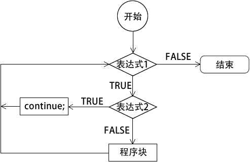
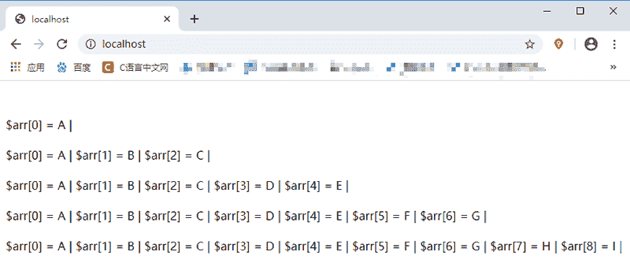

# PHP continue：跳过本次循环执行下次循环

> 原文：[`c.biancheng.net/view/7275.html`](http://c.biancheng.net/view/7275.html)

continue 是用在循环结构中的，它可以控制程序放弃本次循环中 continue 语句之后的代码并进行下一次循环。continue 本身并不跳出循环结构，只是放弃这一次循环。如果在非循环结构中（例如 if 或 switch 语句中）使用 continue，程序将会出错。

continue 关键字和 break 关键字的区别在于，continue 关键字只是结束本次循环，而 break 关键字会终止整个循环的执行。

continue 关键字的执行流程如下图所示：


图：continue 执行流程
【示例】使用 for 循环输出 1~10 之间的所有数字，当数字为偶数时跳过当前循环，实现代码如下：

```

<?php
    for ($i = 1; $i <= 10; $i++) {
        if($i % 2 == 0) {
            continue;
        }
        echo '$i = '.$i.', <br>';
    }
?>
```

运行结果如下：

$i = 1,
$i = 3,
$i = 5,
$i = 7,
$i = 9,

与 break 关键字相同，continue 也可以接受一个可选的数字参数来决定跳过几重循环的循环末尾，默认值是 1，即跳到当前循环的末尾。语法格式如下：

continue n;

示例代码如下：

```

<?php
    $arr = array('A','B','C','D','E','F','G','H','I','J');

    for ($i=0; $i < 10; $i++) {
        echo '<br>';
        if($i % 2 == 0){
            continue;
        }
        for (;;) {
            for ($j=0; $j < count($arr); $j++) {
                if($j == $i){
                    continue 3;
                }else{
                    echo '$arr['.$j.'] = '.$arr[$j].' | ';
                }
            }
        }
        echo "由于前面跳出了循环，所以这句换无法打印出来！";
    }
?>
```

运行结果如下图所示：

