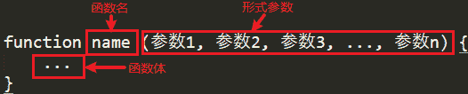
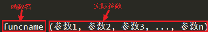

# PHP 函数的参数：形式参数+实际参数

> 原文：[`c.biancheng.net/view/7285.html`](http://c.biancheng.net/view/7285.html)

通过前面对定义函数的学习我们知道，函数的参数列表是由零个或多个参数组成的，每个参数之间使用逗号分隔开。参数是函数内部和函数外部进行数据交换的端口，函数中数据的传入都是由参数来完成的。

如果函数没有参数列表，函数执行的任务就是固定的，用户在调用函数时不能改变函数内部的一些执行行为。

如果函数有参数列表，函数就可以从外部获取函数执行所需要的数据值。也就是用户在调用函数时，在函数体还没有执行之前，将一些数据通过函数的参数列表传递到函数内部，这样函数在执行函数体时，就可以根据用户传递过来的数据决定函数体内部如何执行。

根据参数使用的位置，参数分为形式参数和实际参数两种。

## 1\. 形式参数

形式参数就是定义函数时函数名后面括号内的参数列表（简称“形参”），就像它的名字一样，形参本身没有具体的值。因为函数体中需要使用外部传入的参数，为了使参数可以正确地传递进来，就需要通过形式参数与函数体里面的数据进行传递，形式参数如下图所示。


图：形式参数
【示例】一个函数的形式参数如下所示：

```

<?php
    function hello($str){
        echo '参数 $str 的值为：'.$str.'<br>';
        echo 'C 语言中文网';
    }
?>
```

其中，代码第 2 行函数名后面括号中的变量 $str 就是该函数的形式参数。

## 2\. 实际参数

实际参数就是我们在调用函数时函数名后面括号中的若干个参数（简称“实参”），实参和形参需要按顺序一一对应，它会替换形式参数在函数体中对应的变量值，函数的参数可以是一个具体的值，也可以是一个变量，实际参数如下图所示。


图：实际参数
【示例】下面通过代码来演示一下调用函数时使用的实际参数：

```

<?php
    function add($a, $b){
        echo $a.' + '.$b.' = '.($a+$b).'<br>';
    }

    add(11, 32);
?>
```

其中，代码第 6 行函数名后面括号中的 11、32 就是实际参数。

注意：实际参数一定要和形式参数的个数相相同，并且一一对应，不然程序会出错。

【示例】调用函数时，当实际参数与形式参数个数不同时，将发生一个致命错误：

```

<?php
    function add($a, $b){
        echo $a.' + '.$b.' = '.($a+$b).'<br>';
    }

    add(11);
?>
```

运行结构如下：

Fatal error: Uncaught ArgumentCountError: Too few arguments to function add().