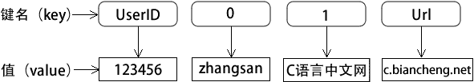

# PHP 数组

> 原文：[`c.biancheng.net/view/7278.html`](http://c.biancheng.net/view/7278.html)

数组是 PHP 中最重要的数据类型之一，在 PHP 中的应用非常广泛。因为 PHP 是弱数据类型的编程语言，所以 PHP 中的数组变量可以存储任意多个、任意类型的数据，并且可以实现其他强数据类型中的堆、栈、队列等数据结构的功能。

使用数组的目的，就是将多个相互关联的数据，组织在一起形成集合，作为一个单元使用，达到批量数据处理的目的。

## 什么是数组

数组就是一组数据的集合，把一系列数据组织起来，形成一个可操作的整体。PHP 中的数组较为复杂，但比其他许多高级语言中的数组更为灵活。

数组 array 是一组有序的变量，其中每个值被称为一个元素。每个元素由一个特殊的标识符来区分，这个标识符称为键（也称为下标）。

数组中的每个实体都包含两项，分别是键（key）和值（value）。可以通过键值来获取相应的数组元素，这些键可以是数值键，也可以是关联键。如果说变量是存储单个值的容器，那么数组就是存储多个值的容器。

PHP 数组比其他高级语言中的数组更加灵活，不但支持以数字为键名的索引数组，而且支持以字符串或字符串、数字混合为键名的关联数组。而在其他高级语言中，如 Java 或者 C++ 等语言的数组，只支持数字索引数组。

PHP 数组的结构如下图所示：


图：PHP 数组的结构

## 数组的类型

在 PHP 数组中，无论什么类型的键名都会有一个值与其相对应，即一个键/值对，根据数组键名数据类型的不同，我们可以把 PHP 数组分为两种：以数字作为键名的称为索引数组（Indexed Array）；以字符串或字符串、数字混合为键名的数组称为关联数组（Associative Array）。

#### 1) 索引数组

索引数组的下标（键名）由数字组成，默认从 0 开始，每个数字对应一个数组元素在数组中的位置，不需要特别指定，PHP 会自动为索引数组的键名赋一个整数值，然后从这个值开始自动递增。如下所示：

```

$arr = array(0=>'C 语言中文网', 1=>'PHP 教程', 2=>'PHP 数组', 3=>'http://c.biancheng.net/php/')
```

#### 2) 关联数组

关联数组的下标（键名）由数值和字符串混合的形式组成，如果一个数组中有一个键名不是数字，那么这个数组就是关联数组。如下所示：

```

$arr = array('name'=>'C 语言中文网', 'course'=>'PHP 教程', 'title'=>'PHP 数组', 'url'=>'http://c.biancheng.net/php/')
```

关联数组的键名可以是任何一个整数或字符串。如果键名是一个字符串，则要给这个键名加上一个定界修饰符——单引号`' '`或双引号`" "`。对于索引数组，为了避免混清，最好也加上定界符。