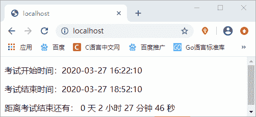

# PHP 实现倒计时功能

> 原文：[`c.biancheng.net/view/7477.html`](http://c.biancheng.net/view/7477.html)

在我们日常生活，倒计时在某种意义上来说几乎无处不在，比如淘宝限时购物、高考倒计时、假期倒计时等等。而在我们的开发过程中，也可能会遇到实现倒计时功能的需求。

对于初入门的 PHP 新手来说，或许有一点难度，但是只要掌握了倒计时的实现原理，就很容易实现了。另外，实现倒计时功能不能单纯的使用 PHP 语言，还需要借助 JavaScript 才行。如果大家对 JavaScript 感兴趣可以阅读本站的《JS 入门教程》。

【示例】下面我们通过一段简单的代码为大家演示一下，如何使用 PHP 实现倒计时功能。

```

<!DOCTYPE html>
<html>
<head>
    <title>PHP 实现倒计时功能</title>
</head>
<body>
<?php
    // 设置时区
    date_default_timezone_set('PRC');
    //配置考试的开始结束时间
    $starttimestr = date('Y-m-d H:i:s', strtotime('now'));
    $endtimestr   = date('Y-m-d H:i:s', strtotime('+2 hours 30 minutes'));
    $starttime    = strtotime($starttimestr);
    $endtime      = strtotime($endtimestr);
    $nowtime      = time();
    if ($nowtime < $starttime) {
        exit("考试已经结束了，考试时间是：{$starttimestr}至{$endtimestr}");
    }
    if ($endtime >= $nowtime) {
        $lefttime = $endtime - $nowtime; //实际剩下的时间（秒）
    } else {
        $lefttime = 0;
        exit("考试已经结束！");
    }
?>
<p>考试开始时间：<?php echo $starttimestr; ?></p>
<p>考试结束时间：<?php echo $endtimestr; ?></p>
<p>
    距离考试结束还有：
    <span id="RemainD"></span> 天
    <span id="RemainH"></span> 小时
    <span id="RemainM"></span> 分钟
    <span id="RemainS"></span> 秒
</p>

<script type="text/javascript">
    var runtimes = 0;
    function GetRTime() {
        var lefttime = <?php echo $lefttime; ?> * 1000 - runtimes * 1000;
        if (lefttime >= 0) {
            var nD = Math.floor(lefttime / (1000 * 60 * 60 * 24)) % 24;
            var nH = Math.floor(lefttime / (1000 * 60 * 60)) % 24;
            var nM = Math.floor(lefttime / (1000 * 60)) % 60;
            var nS = Math.floor(lefttime / 1000) % 60;
            document.getElementById("RemainD").innerHTML = nD;
            document.getElementById("RemainH").innerHTML = nH;
            document.getElementById("RemainM").innerHTML = nM;
            document.getElementById("RemainS").innerHTML = nS;
            runtimes++;
            setTimeout("GetRTime()", 1000);
        } else {
            alert('考试结束了！');
            location.reload();
        }
    }

    onload = function() {
        GetRTime();
    }
</script>
</body>
</html>
```

运行结果如下图所示：

