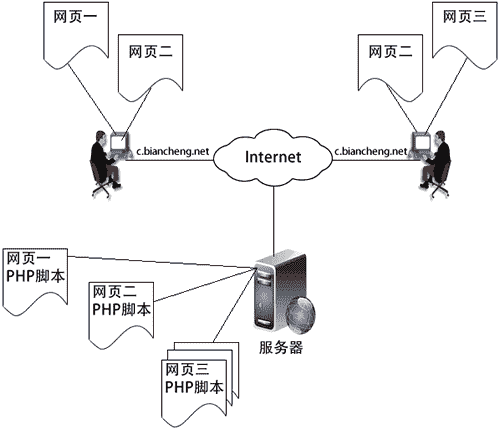

# PHP 会话控制简述

> 原文：[`c.biancheng.net/view/7589.html`](http://c.biancheng.net/view/7589.html)

会话控制是一种面向连接的可靠通信方式，通常根据会话控制记录判断用户登录的行为。例如，当我们登录某个邮箱系统以后，可以在其中完成查看邮件、收信、发信等操作，这些操作有可能需要访问多个页面来完成。

在同一个系统上，多个页面之间互相切换时，还能保持用户的登录状态，并且访问的都是用户自己的信息。这种能够在网站中跟踪一个用户，并且可以处理在同一个网站中同一个用户在多个页面共享数据的机制，都需要使用会话控制的思想完成。

## 为什么要使用会话控制

我们在浏览网页时，访问每一个 Web 页面都需要使用到“HTTP 协议”，而 HTTP 协议是无状态协议，也就是说 HTTP 协议没有一个内建机制来维护两个事务之间的状态。当一个用户请求一个页面以后，再请求同一个网站上的另外一个页面时，HTTP 协议不能告诉我们这两个请求是来自同一个用户，会被当做独立的请求，而并不会将这两次访问联系在一起，如下图所示。

图：用户连续请求 Web 服务器中的多个页面
上图中，如果某网站的用户通过浏览器请求 Web 服务器中的“网页一”时，该页面会经由服务器处理以后动态地将内容响应到浏览器。由于 HTTP 协议的无状态性，当用户通过“网页一”中的链接，或直接在地址栏中输入 Web 服务器 URL 来请求本站的其他网页时，会被看做是和前一次毫无关系的连接，和使用者相关的资料并不会自动传递到新请求的页面中。例如，在第一个页面中登录了一次，再转到同一个网站的其他页面时，如果还想使用该用户的身份访问，则必须再重复执行登入的动作，因为 HTTP 协议是无状态的，不能在不同页面之间跟踪用户。

会话控制的思想就是允许服务器跟踪同一个客户端做出的连续请求。这样，我们就可以很容易地做到用户登录的支持，而不是在每浏览一个网页都去重复执行登入的动作。当然，使用会话控制除了可以在同一个网站中跟踪 Web 用户之外，对同一个访问者的请求还可以在多个页面之间为其共享数据。

## 会话控制的方式

由于 HTTP 是无状态的协议，所以不能维护两个事务之间的状态。PHP 系统为了防止这种情况的发生，提供了如下三种网页之间传递数据的方法。

*   使用超链接或者 header() 函数，并在 URL 的 GET 请求中附加参数的形式，将数据从一个页面转向另一个 PHP 脚本中。也可以通过网页中的各种隐藏表单来储存使用者的资料，并将这些信息在提交表单时传递给服务器中的 PHP 脚本；
*   使用 Cookie 将用户的状态信息存放在浏览器中，并通过浏览器来存取 Cookie 中的信息；
*   相对于 Cookie 还可以使用 Session，将访问者的状态信息存放于服务器之中，让其他程序能透过服务器中的文件或数据库，来存取使用者的信息。

在上面三种网页间数据的传递方式之中，使用 URL 或表单的方式主要是用来处理参数的传递或是多条信息的输入，适合于两个脚本之间的简单数据传递。例如，通过表单修改或删除数据时，可以将数据对应的 ID 传递给其他脚本。

如果需要传递的数据比较多，页面传递的次数比较频繁，或者是需要传递数组时，使用 URL 或表单就有些烦琐了。特别是在项目中跟踪一个用户时，要为不同权限的用户提供不同的动态页面，需要每个页面都知道现在的用户是谁，对于这种情况我们通常选用 Cookie 和 Session 技术。