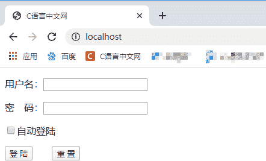
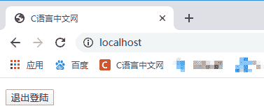

# PHP 使用 Cookie 实现自动登陆

> 原文：[`c.biancheng.net/view/7611.html`](http://c.biancheng.net/view/7611.html)

大部分 Web 系统软件都会有登录和退出模块，这是为了维护系统的安全性，确保只有通过身份验证的用户才能访问该系统。而本节我们要介绍的自动登录，就是在用户第一次成功登录某个网站后的一段时间内，再次登录这个网站时就不再需要填写用户名和密码，而是可以直接进入。

要实现自动登录功能我们大多是利用浏览器的 Cookie 来实现。实现思路是在用户登陆成功后使用 Cookie 来保存用户的登陆信息，并在 PHP 脚本中跟踪登录用户的信息，在 Cookie 的有效期内让用户一直保持登陆状态。下面来看一下具体的实现代码：

```

<?php
    /**
     * 首页
     */
    function index(){
        $logout = isset($_POST['logout'])?$_POST['logout']:'';
        $user   = isset($_COOKIE['user'])?$_COOKIE['user']:'';
        $rem    = isset($_COOKIE['remember'])?$_COOKIE['remember']:'';
        if($logout == 'true'){  //判断是否执行退出登陆
            logout();
        }else if($user == ''){  //如果 Cookie 中没有用户信息则执行登陆操作
            login();
        }else{  //显示首页
            //首页的 html 代码
            $str = <<<html
                <!DOCTYPE html>
                <html lang="en">
                <head>
                    <meta charset="UTF-8">
                    <title>C 语言中文网</title>
                </head>
                <body>
                    <form action="" method="post">
                        <p><input type="hidden" value="true" name="logout" /></p>
                        <p><input type="submit" value="退出登陆" /></p>
                    </form>
                </body>
                </html>
            html;
            echo $str;
        }
    }

    /**
     * 登陆
     */
    function login(){
        //获取提交的用户信息
        $user   = isset($_POST['user'])?trim($_POST['user']):'';
        $pwd    = isset($_POST['pwd'])?trim($_POST['pwd']):'';
        $rem    = isset($_POST['remember'])?$_POST['remember']:'';
        if($user == ''){    //如果用户名为空，则显示登陆页面
            // 登陆页面的 html 代码
            $info = <<<html
                <!DOCTYPE html>
                <html lang="en">
                <head>
                    <meta charset="UTF-8">
                    <title>C 语言中文网</title>
                </head>
                <body>
                    <form action="" method="post">
                        <p>用户名：<input type="text" name="user" /></p>
                        <p>密&emsp;码：<input type="password" name="pwd" /></p>
                        <p><input type="checkbox" name="remember" value='true'/>自动登陆</p>
                        <p><input type="submit" value="登 陆" />&emsp;&emsp;<input type="reset" value="重 置" /></p>
                    </form>
                </body>
                </html>
            html;
            echo $info;
        }else{
            if(!empty($user) && !empty($pwd)){  // 登陆成功，并记录 Cookie 信息
                if($rem != ''){
                    setcookie('user',$user,time()+3600*24*7);
                    setcookie('remember',$rem,time()+3600*24*7);
                }else{
                    setcookie('user',$user);
                }
                echo '<script>alert(\'登陆成功\');location.replace(location.href);</script>';
            }else{  //登陆失败时，刷新页面
                echo '<script>alert(\'用户名或密码不能为空\');location.replace(location.href);</script>';
            }
        }
    }

    /**
     * 退出登陆
     */
    function logout(){
        // 清除 Cookie 信息，并刷新页面
        isset($_COOKIE['user']) ? setcookie('user','',time()-1) : '';
        isset($_COOKIE['remember']) ? setcookie('remember','',time()-1) : '';
        echo '<script>alert(\'退出成功\');location.replace(location.href);</script>';
    }

    index(); //执行 index 函数
?>
```

运行上面的代码会显示如下界面：


图：登陆界面
示例程序只是为了演示自动登陆的实现原理，所以实现代码并不是很完善，随意输入任意的用户名、密码都可以登陆成功。登陆成功后会显示一个退出登陆按钮，如下所示：


图：退出登陆按钮
登陆成功后，在 Cookie 的有效期内，当我们再次访问这个页面时就不再需要登陆操作了，直接就会显示如上图所示的页面。