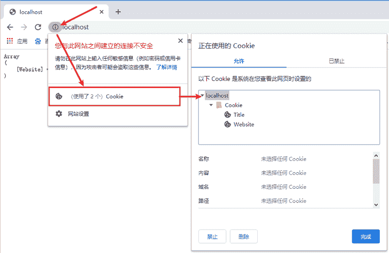

# PHP Cookie 的优点与缺点

> 原文：[`c.biancheng.net/view/7593.html`](http://c.biancheng.net/view/7593.html)

Cookie 是 Web 服务器在用户访问 Internet 站点时传递到 Web 浏览器的消息。浏览器会将每条消息以键值对的形式存储在用户计算机上的一个小文件中。当用户从服务器请求另一个页面时，浏览器会将 Cookie 发送回服务器。这些文件通常包含有关用户访问网页的信息，以及一些用户自愿提供的信息，例如：用户名，用户首选项，记住密码选项等。

本节我们来介绍一下 Cookie 的优点与缺点。

## 1、Cookie 的优点

#### 1) Cookie 易于使用和实现

Cookie 的使用要比任何其他 Internet 协议容易得多，直接使用系统函数就可以操作。

#### 2) 占用内存少

不需要任何服务器资源，由于 Cookie 是存储在用户的计算机上的，所以不会给服务器带来额外的负担。

#### 3) 持久性

Cookie 最强大的一个方面就是持久性。当在客户端的浏览器上设置 Cookie 时，它可以持续数天，数月甚至数年。这样可以轻松保存用户首选项和访问信息，并在用户每次返回站点时保持此信息可用。此外，由于 Cookie 存储在客户端的硬盘上，因此如果服务器崩溃，它们仍然可用。

#### 4) 易于管理

大多数浏览器都可以让用户轻松的清除保持的 Cookie 信息。以 Chrome 浏览器为例，删除 Cookie 信息的方式如下图所示：

图：清除浏览器中的 Cookie 信息

## 2、Cookie 的缺点

#### 1) 隐私问题

大多数用户主要关心的是隐私。启用 Cookie 的 Web 浏览器会跟踪您访问过的所有网站。这意味着，经过许可第三方也可以访问这些 Cookie 信息。在某些情况下，这些第三方可以是广告商或者其他用户等。

#### 2) 不安全

Cookie 安全性是一个大问题，因为它们是以明文形式存储的，可能会造成安全风险，因为任何人都可以打开并篡改这些 Cookie 信息，这就意味着很容易被黑客入侵和修改。

#### 3) 大小有限制，只能储存简单字符串信息

Cookie 文本的大小一般为 4kb，Cookie 的数量也存在一些限制，每个站点只能容纳 20 个 Cookie 信息。另外，Cookie 仅限于简单的字符串信息，他们无法存储复杂的信息。

#### 4) 可以被禁用

用户可以选择在浏览器的设置中禁用 Cookie。这意味着用户可以决定不在他的浏览器上使用 Cookie，这可能会在我们浏览网站时产生一些问题。