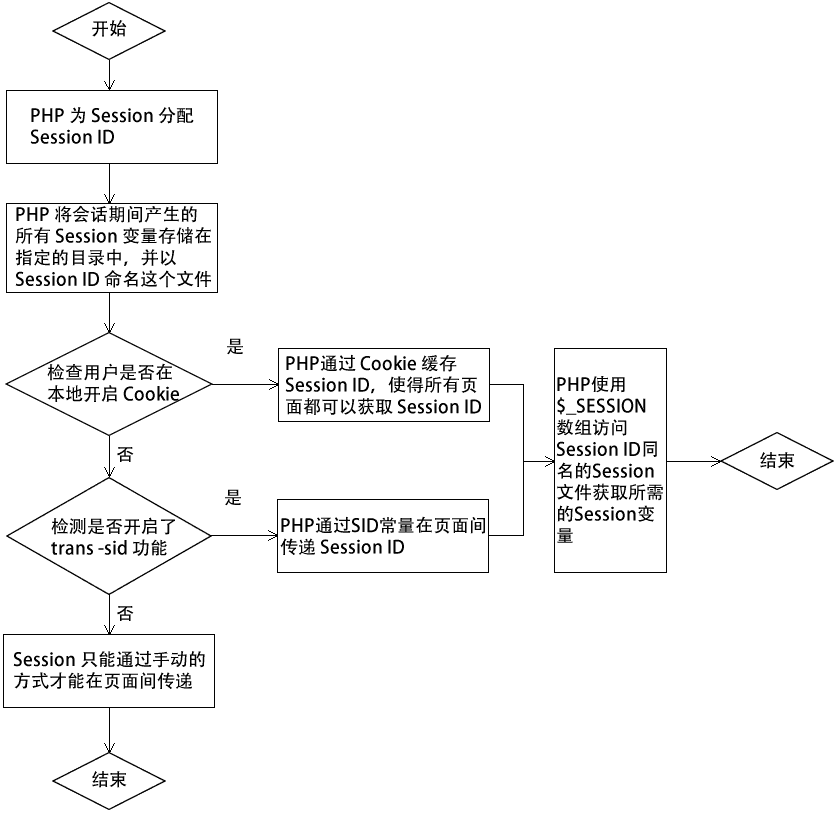

# PHP Session 是什么

> 原文：[`c.biancheng.net/view/7621.html`](http://c.biancheng.net/view/7621.html)

在 PHP 中，Session 是一种服务器端的机制，服务器使用一种散列表的结构（类似于 JSON）来保存信息。相比于保存在客户端的 Cookie，Session 将用户交互信息保存在了服务器端，使得同一个客户端每次和服务端交互时，不需要每次都传回所有的 Cookie 值，而是只需要传回一个 ID 即可，这个 ID 是客户端第一次访问服务器的时候生成的，而且是唯一的。

还有一点就是，因为 Cookie 存储在客户端，所以用户有权禁用 Cookie，而 Session 是存储在服务器端的，用户无法禁用。

## Session 简介

Session 在 Web 技术中占有非常重要的地位。由于网页是一种无状态的连接程序，无法记录用户的浏览状态，所以需要通过 Session 来记录用户的有关信息，以供用户再次以这个身份对 Web 服务器发起请求。

Session 中文是“会话”的意思，与 Cookie 类似，都是用来储存使用者相关资料的，比如用户名、访问权限、登陆时间等。与 Cookie 最大不同之处在于 Cookie 是将资料存放于客户端电脑之中，而 Session 则是将数据存放于服务器系统之下。

当开启一个 Session 时，PHP 将会创建一个随机的 Session ID（例如“t5is1r7ct740dn390kuv3mpcse”），每个用户的 Session ID 都是唯一的，而且 Session ID 与服务器上存储该用户 Session 数据的文本文件名称相同。

Session ID 会分别保存在客户端和服务器端两个位置。

*   客户端，使用临时的 Cookie 保存在浏览器指定目录中，Cookie 名称默认为“PHPSESSID”；
*   服务器端，以文本文件形式保存在指定的 Session 目录中。

默认情况下，这个 Session ID 将作为一个 Cookie 发送给 Web 浏览器，接下来 PHP 页面将使用这个 Cookie 来访问 Session 的信息。

与 Cookie 相比，Session 拥有以下的优势：

*   通常情况下 Session 更加安全，因为 Session 中的数据不会在客户端和服务器端来回重复传递；
*   Session 能够存储比 Cookie 更多的信息；
*   在用户禁用 Cookie 的情况下，使用一些方法任然能保持 Session 正常工作。

## Session 的工作原理

我们可以使用 PHP 脚本创建和存储 Session 中的数据。在创建一个 Session 后，所有 Session 变量在用户一次会话期间里访问的所有页面都有效。其工作机制如下图所示。

图：Session 工作原理

## Session 的存储方式

Session 默认会以文本的形式存储在服务器的临时目录中，文件名以“sess_”作为前缀，后面加上“Session ID”，例如“sess_t5is1r7ct740dn390kuv3mpcse”。

我们可以在 php.ini 中找到 Session 的相关配置，下面是一些常用的配置信息：

session.save_handler = files                  #session 的存储方式，默认是文件，还可以是 redis 或者是 memcache
session.save_path = "d:/wamp/tmp"    #session 文件的存储目录
session.use_cookies = 1                        #是否使用 cookie 存储 session_id
session.name = PHPSESSID                  #客户端存储 session_id 的会话名
session.auto_start = 0                           #是否自动开启 session
session.cookie_lifetime = 0                   #设置客户端中存储的 session_id 的过期时间，以秒为单位
session.use_only_cookies=0                 #是否只使用 cookie 来处理 session_id
session.gc_divisor = 1000                     #进程比率
session.gc_probability = 1                    #垃圾回收的处理几率
session.gc_maxlifetime = 1440             #设置 session 文件的过期时间

## Session 的生命周期

Session 在以下情况会被删除，也就是失效：

*   Session 超时，超时指的是连续一定时间服务器没有收到该 Session 所对应客户端的请求，并且这个时间超过了服务器设置的 Session 超时的最大时间；
*   程序调用方法主动销毁 Session；
*   服务器关闭或服务停止。