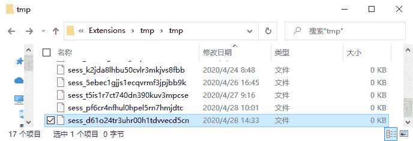

# PHP session_start()：开启 Session

> 原文：[`c.biancheng.net/view/7625.html`](http://c.biancheng.net/view/7625.html)

Session 的使用不同于 Cookie，在使用 Session 之前必须先启动，以便让 PHP 核心程序，将和 Session 相关的内建环境变量预先载入到内存中。

在 PHP 中可以使用 session_start() 函数来开启一个新的 Session 会话，其语法格式如下：

session_start ([array $options = array()])

其中，参数 $options（可选参数）为一个关联数组，如果提供该参数，那么会用其中的项目覆盖会话配置指示中的配置项。此数组中的键无需包含 `session.` 前缀。

$optines 参数可以设置的配置项，大家可以通过 [`www.php.net/manual/zh/session.configuration.php`](http://https://www.php.net/manual/zh/session.configuration.php) 查询。

除了常规的会话配置指示项，还可以在此数组中包含 read_and_close 选项。如果将此选项的值设置为 TRUE，那么会话文件会在读取完毕之后马上关闭，因此，可以在会话数据没有变动的时候，避免不必要的文件锁。

session_start() 会创建新会话或者重用现有会话。 如果通过 GET 或者 POST 方式，或者使用 cookie 提交了会话 ID，则会重用现有会话。session_start() 函数执行成功会开始会话并返回 TRUE，反之返回 FALSE。

当会话自动开始或者通过 session_start() 手动开始的时候，PHP 内部会调用会话管理器的 open 和 read 回调函数。会话管理器可能是 PHP 默认的，也可能是扩展提供的（SQLite 或者 Memcached 扩展），也可能是通过 session_set_save_handler() 设定的用户自定义会话管理器。

通过 read 回调函数返回的现有会话数据（使用特殊的序列化格式存储），PHP 会自动反序列化数据并且填充 $_SESSION 超级全局变量。

【示例】使用 session_start() 开启 Session。

```

<?php
    session_start([
        'cookie_lifetime' => 60*60*24,  // 设置 cookie 的有效时间为 1 天
    ]);

    echo 'Session ID 为：'.$_COOKIE['PHPSESSID'];
?>
```

运行结果如下：

Session ID 为：d61o24tr3uhr00h1tdvvecd5cn

调用 session_start() 函数会生成一个唯一的 Session ID，并保存在浏览器的 Cookie 中，默认名称为“PHPSESSID”。同时，在本地目录中生成一个以“sess_”加上 Session ID 组成的 Session 文件，用来存储 Session 中的数据，如下图所示：


图：生成的 Session 文件