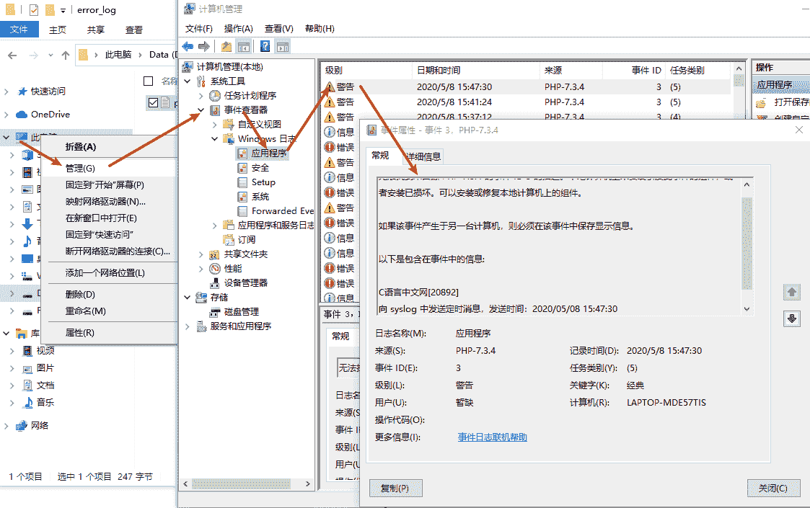

# PHP error_log()：错误日志的配置和使用方法

> 原文：[`c.biancheng.net/view/7638.html`](http://c.biancheng.net/view/7638.html)

对于 PHP 开发者来说，一旦某个项目投入使用，应该立即将配置文件 php.ini 中的 display_errors 选项关闭，以免因为这些错误所透露的路径、数据库连接、数据表等信息而遭到黑客攻击。但是任何一个项目在投入使用后，都难免会有错误出现，那么如何记录一些对开发者有用的错误报告呢？

我们可以在单独的文本文件中将错误报告作为日志记录。错误日志的记录，可以帮助开发人员或者管理人员查看系统是否存在问题。如果需要将程序中的错误报告写入错误日志中，只要在 PHP 的配置文件中，将配置项 log_errors 开启即可。

错误报告默认会记录到 Web 服务器的日志文件里，例如记录到 Apache 服务器的错误日志文件 error.log 中。当然也可以将错误日志记录到指定的文件中或发送到系统的 syslog（系统日志）中，下面来分别介绍一下。

## 1、使用指定的文件记录错误报告日志

如果想使用自己指定的文件记录错误日志，一定要确保这个文件存放在文档根目录之外，以减少遭到攻击的可能。并且该文件一定要让 PHP 脚本具有写权限。假设在 Linux 操作系统中，将 /usr/local/ 目录下的 error.log 文件作为错误日志文件，并设置 Web 服务器进程用户具有写的权限。然后在 PHP 的配置文件中，将 error_log 指令的值设置为这个错误日志文件的绝对路径。

需要将 php.ini 中的配置指令做如下修改：

error_reporting  =  E_ALL                             // 将会向 PHP 报告发生的每个错误  
display_errors = Off                                     // 不显示满足上条 指令所定义规则的所有错误报告  
log_errors = On                                           // 决定日志语句记录的位置  
log_errors_max_len = 1024                         // 设置每个日志项的最大长度  
error_log = E:/php_log/php_error.log         // 指定产生的错误报告写入的日志文件位置 

PHP 的配置文件按上面的方式设置完成以后，并重新启动 Web 服务器。这样，在执行 PHP 的任何脚本文件时，产生的所有错误报告都不会在浏览器中显示，而会记录在自己指定的错误日志 E:/php_log/php_error.log 中。

此外，不仅可以记录满足 error_reporting 所定义规则的所有错误，而且还可以使用 PHP 中的 error_log() 函数把错误信息发送到 web 服务器的错误日志或者到一个文件里。

error_log() 函数的原型如下所示：

error_log ( string $message [, int $message_type = 0 [, string $destination [, string $extra_headers ]]] ) : bool

参数说明如下：

*   $message：需要记录的错误信息；
*   $message_type：设置错误应该发送到何处。可能的信息类型有以下几个：
    *   0：（默认值）将 $message 发送到 PHP 的系统日志，使用操作系统的日志机制或者一个文件，取决于配置文件中 error_log 设置了什么；
    *   1：将 $message 发送到参数 $destination 设置的邮件地址。 第四个参数 $extra_headers 只有在这个类型里才会被用到；
    *   2：（已废弃）不再是一个选项；
    *   3：$message 被发送到位置为 $destination 的文件里。字符 $message 不会默认被当做新的一行；
    *   4：将 $message 直接发送到 SAPI 的日志处理程序中。
*   $destination：目标，也就是错误消息被发送到的目的地。它的含义描述于以上，由 $message_type 参数所决定；
*   $extra_headers：额外的头。当 $message_type 设置为 1 的时候使用。 该信息类型使用了 mail() 的同一个内置函数。

【示例】以登入 Mysql 数据库为例，当登入失败时记录错误信息。

```

<?php
    $link = mysqli_connect("127.0.0.1", "my_user", "my_password", "my_db");

    if (!$link) {
        error_log('Mysql 数据库连接失败！',0);
        exit();
    }
?>
```

运行上面的代码，会在 php.ini 配置文件中 error_log 一项所设置的目录中生成对应的错误日志文件，文件内容如下：

[08-May-2020 13:17:31 PRC] PHP Warning:  mysqli_connect(): (HY000/1045): Access denied for user 'my_user'@'localhost' (using password: YES) in D:\WWW\index.php on line 2
[08-May-2020 13:17:31 PRC] Mysql 数据库连接失败！

## 2、错误信息记录到操作系统的日志里

错误报告也可以被记录到操作系统日志里，但不同的操作系统之间的日志管理也是不同的。在 Linux 上错误语句将送往 syslog（基于 UNIX 的日志工具），而在 Windows 上错误将发送到事件日志里，可以通过事件查看器来查看。

如果希望将错误报告写到操作系统的日志里，将 php.ini 配置文件中 error_log 项的值设置为 syslog 即可。

具体需要在 php.ini 中修改的配置指令如下所示：

error_reporting  =  E_ALL                   // 报告所发生的每个错误  
display_errors = Off                           // 不显示满足上条指令所定义规则的所有错误报告  
log_errors = On                                 // 决定日志语句记录的位置  
log_errors_max_len = 1024               // 设置每个日志项的最大长度  
error_log = syslog                             // 指定产生的错误报告写入操作系统的日志里 

除了一般的错误输出之外，PHP 还允许向系统 syslog 中发送定制的消息。虽然通过前面介绍的 error_log() 函数，也可以向 syslog 中发送定制的消息，但在 PHP 中为这个特性提供了需要一起使用的 3 个专用函数，如下所示：

#### 1) openlog()

打开一个当前系统中日志器的连接，为向系统插入日志消息做好准备。并将提供的第一个字符串参数插入到每个日志消息中，该函数还需要指定两个将在日志上下文使用的参数，可以参考官方文档使用。

#### 2) syslog()

该函数向系统日志中发送一个定制消息。需要两个必选参数，第一个参数通过指定一个常量定制消息的优先级。例如 LOG_WARNING 表示一般的警告；LOG_EMERG 表示严重地可以预示着系统崩溃的问题，一些其他的表示严重程度的常量可以参考官方文档使用。第二个参数则是向系统日志中发送的定制消息，需要提供一个消息字符串，也可以是 PHP 引擎在运行时提供的错误字符串。

#### 3) closelog()

该函数在向系统日志中发送完成定制消息以后调用，用来关闭由 openlog() 函数打开的日志连接。

【示例】使用上面介绍的四个函数向系统 syslog 中发送定制的消息。

```

<?php
    openlog("C 语言中文网", LOG_PID, LOG_USER);
    syslog(LOG_WARNING, "向 syslog 中发送定时消息，发送时间：".date("Y/m/d H:i:s"));
    closelog();
?>
```

以 Windows 系统为例，通过右击“我的电脑/此电脑”选择“管理”选项，然后到系统工具菜单中，选择“事件查看器”，再找到“Windows 日志”下的“应用程序”选项，就可以看到我们自己定制的警告消息了。如下图所示：


图：向系统 syslog 中发送定制的消息
使用指定的文件还是使用 syslog 记录错误日志，取决于你所使用的 Web 服务器环境。如果你可以控制 Web 服务器，使用 syslog 是最理想的，因为你能利用 syslog 的解析工具来查看和分析日志。但如果你的网站在共享服务器的虚拟主机中运行，就只有使用单独的文本文件记录错误日志了。