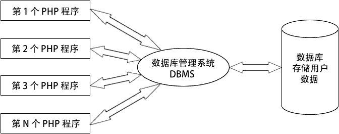

# MySQL 数据库简介

> 原文：[`c.biancheng.net/view/7668.html`](http://c.biancheng.net/view/7668.html)

PHP 在开发 Web 站点或一些管理系统时，需要对大量的数据进行保存，虽然 XML 文件或者文本文件也可以作为数据的载体，但不易进行管理和对大量数据的存储，所以在项目开发时，数据库就显得非常重要。

PHP 可以连接的数据库种类较多，其中 MySQL 数据库与其兼容较好，在 PHP 数据库开发中被广泛地应用。

## MySQL 是什么

MySQL 是一款安全、跨平台、高效的，并与 PHP、Java 等主流编程语言紧密结合的数据库系统。该数据库系统是由瑞典的 MySQL AB 公司开发、发布并支持，由 MySQL 的初始开发人员 David Axmark 和 Michael Monty Widenius 于 1995 年建立的。

MySQL 的象征符号是一只名为 Sakila 的海豚，代表着 MySQL 数据库的速度、能力、精确和优秀本质。

图：MySQL 图标
目前 MySQL 被广泛地应用在 Internet 上的中小型网站中。由于其体积小、速度快、总体拥有成本低，尤其是开放源码这一特点，使得很多公司都采用 MySQL 数据库以降低成本。

MySQL 数据库可以称得上是目前运行速度最快的 SQL 语言数据库之一。除了具有许多其他数据库所不具备的功能外，MySQL 数据库还是一种完全免费的产品，用户可以直接通过网络下载 MySQL 数据库，而不必支付任何费用。

## MySQL 特点

下面总结了一下 MySQL 具备的特点。

#### 1) 功能强大

MySQL 中提供了多种数据库存储引擎，各引擎各有所长，适用于不同的应用场合，用户可以选择最合适的引擎以得到最高性能，可以处理每天访问量超过数亿的高强度的搜索 Web 站点。MySQL5 支持事务、视图、存储过程、触发器等。

#### 2) 支持跨平台

MySQL 支持至少 20 种以上的开发平台，包括 Linux、Windows、FreeBSD 、IBMAIX、AIX、FreeBSD 等。这使得在任何平台下编写的程序都可以进行移植，而不需要对程序做任何的修改。

#### 3) 运行速度快

高速是 MySQL 的显著特性。在 MySQL 中，使用了极快的 B 树磁盘表（MyISAM）和索引压缩；通过使用优化的单扫描多连接，能够极快地实现连接；SQL 函数使用高度优化的类库实现，运行速度极快。

#### 4) 支持面向对象

PHP 支持混合编程方式。编程方式可分为纯粹面向对象、纯粹面向过程、面句对象与面向过程混合 3 种方式。

#### 5) 安全性高

灵活和安全的权限与密码系统，允许基本主机的验证。连接到服务器时，所有的密码传输均采用加密形式，从而保证了密码的安全。

#### 6) 成本低

MySQL 数据库是一种完全免费的产品，用户可以直接通过网络下载。

#### 7) 支持各种开发语言

MySQL 为各种流行的程序设计语言提供支持，为它们提供了很多的 API 函数，包括 PHP、ASP.NET、Java、Eiffel、Python、Ruby、Tcl、C、C++、Perl 语言等。

#### 8) 数据库存储容量大

MySQL 数据库的最大有效表尺寸通常是由操作系统对文件大小的限制决定的，而不是由 MySQL 内部限制决定的。InnoDB 存储引擎将 InnoDB 表保存在一个表空间内，该表空间可由数个文件创建，表空间的最大容量为 64TB，可以轻松处理拥有上千万条记录的大型数据库。

#### 9) 支持强大的内置函数

PHP 中提供了大量内置函数，几乎涵盖了 Web 应用开发中的所有功能。它内置了数据库连接、文件上传等功能，MySQL 支持大量的扩展库，如 MySQLi 等，可以为快速开发 Web 应用提供便利。

## 数据库的应用

数据库是计算机应用系统中的一种专门管理数据资源的系统。数据有多种形式，如文字、数码、符号、图形、图像及声音等，数据是所有计算机系统所要处理的对象。我们所熟知的一种处理办法是制作文件，即将处理过程编成程序文件，将所涉及的数据按程序要求组成数据文件，再用程序来调用，数据文件与程序文件保持着一定的关系。

在计算机应用迅速发展的情况下，这种文件式管理方法便显出它的不足。比如，它使得数据通用性差、不便于移植、在不同文件中存储大量重复信息、浪费存储空间、更新不便等。

而数据库系统便能解决上述问题。数据库系统不从具体的应用程序出发，而是立足于数据本身的管理，它将所有数据保存在数据库中，进行科学的组织，并借助于数据库管理系统，以它为中介，与各种应用程序或应用系统接口，使之能方便地使用数据库中的数据。

其实简单地说，数据库就是一组经过计算机整理后的数据，存储在一个或多个文件中，而管理这个数据库的软件就称为数据库管理系统。一般一个数据库系统（Database System）
可以分为数据库（Database）与数据管理系统（Database Management System，DBMS）两个部分。主流的数据库软件有 Oracle、Informix、Sybase、SQL Server、PostgreSQL、MySQL、Access、FoxPro 和 Teradata 等等。

## 数据库在 Web 开发中的重要地位

归根结底，动态网站都是对数据进行操作，我们平时浏览网页时，会发现网页的内容会经常变化，而页面的主体结构框架没变，新闻就是一个典型。这是因为我们将新闻存储在了数据库中，用户在浏览时，程序就会根据用户所请求的新闻编号，将对应的新闻从数据库中读取出来，然后再以特定的格式响应给用户。

Web 系统的开发基本上是离不开数据库的，因为任何东西都要存放在数据库中。所谓的动态网站就是基于数据库开发的系统，最重要的就是数据管理，或者说我们在开发时都是在围绕数据库在写程序。所以作为一个 Web 程序员，只有先掌握一门数据库，才可能去进行软件开发。

下图展示了项目中一个模块的开发流程：将网站的内容存储在 MySQL 数据库中；然后使用 PHP 通过 SQL 查询获取这些内容并以 HTML 格式输出到浏览器中显示。或者将用户在表单中输出的数据，通过在 PHP 程序中执行 SQL 查询，将数据保存在 MySQL 数据库中。也可以在 PHP 脚本中接受用户在网页上的其他相关操作，再通过 SQL 查询对数据库中存储的网站内容进行管理。

图：基于数据库的 Web 系统
PHP 几乎可以使用现有的所有的数据库，MySQL 与其他的大型数据库例如 Oracle、DB2、SQL Server 等相比，自有它的不足之处，比如规模小、功能有限（MySQL Cluster 的功能和效率都相对比较差）等，但这也丝毫没有减少它受欢迎的程度。 对于一般的个人使用者或者中小型企业来说，MySQL 提供的功能已经绰绰有余，而且由于 MySQL 是开放源码软件，因此可以大大降低总体拥有成本。

目前 Internet 上流行的网站构架方式分别是 LAMP（Linux + Apache + MySQL + PHP/Perl/Python）和 LNMP（Linux + Nginx + MySQL + PHP/Perl/Python），也就是使用 Linux 作为操作系统，Apache 和 Nginx 作为 Web 服务器，MySQL 作为数据库，PHP 作为服务器端脚本解释器。由于这四个软件都是免费或开放源码软件，因此使用这种方式不用花一分钱（除开人工成本外）就可以建立起一个稳定、免费的网站系统。

## PHP 和 MySQL 的合作方式

在同一个 MySQL 数据库服务器中可以创建多个数据库，如果把每个数据库看成是一个“仓库”，那么网站中的内容数据就存储在这个仓库中。而对数据库中数据的存取及维护等，都是通过数据库管理系统软件进行管理的。

同一个数据库管理系统可以为不同的网站分别建立数据库，但为了使网站中的数据便于维护、备份及移植，最好为一个网站创建一个数据库（在大数据量时则采用分库分表）。数据库和数据库管理系统，以及 PHP 应用程序之间的关系如下图所示。

图：PHP 程序与数据库之间的关系