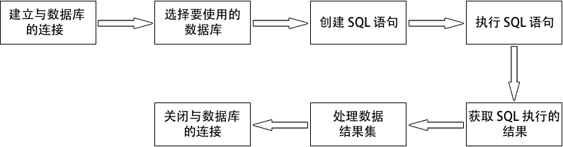
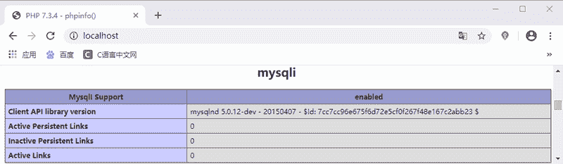

# PHP 连接数据库

> 原文：[`c.biancheng.net/view/7670.html`](http://c.biancheng.net/view/7670.html)

使用 PHP 操作 MySQL 数据库是进行 Web 开发的必然要求之一，PHP 中提供了完整的操作 MySQL 数据库的函数，这些函数包括了从连接数据库、执行 SQL 语句、处理数据结果集到关闭数据库的方方面面。通过这些函数，使基于 MySQL 数据库的 Web 开发高效而简单。通常 PHP 访问 MySQL 数据库的步骤如下图所示。


图：PHP 访问数据库的步骤
在此之前，我们需要确保开启了 PHP 中的 mysqli 扩展。以 Windows 系统为例，开启 mysqli 扩展就是将 php.ini 配置文件中 `extension=mysqli`（php7）或`extension=php_mysqli.dll`（php5）一项的注释去掉即可。

注意：在学习 PHP 操作 MySQL 数据库的过程中，会涉及到一些 MySQL 的相关知识，不了解的同学可以阅读本站的《MySQL 教程》。

开启成功后可以使用 phpinfo() 函数查看，示例代码如下：

```

<?php
    phpinfo();
?>
```

在输出的界面中搜索 mysqli，出现如下界面则表示开启成功。


图：使用 phpinfo() 函数查看是否开启成功

## 连接 MySQL 数据库

前面我们成功开启了 PHP 中的 mysqli 扩展，使用扩展中的 mysqli_connect() 函数就可以实现 MySQL 数据库的连接，函数语法格式如下：

mysqli_connect(
    [string $host = ini_get("mysqli.default_host")
    [, string $username = ini_get("mysqli.default_user")
    [, string $password = ini_get("mysqli.default_pw")
    [, string $dbname = ""
    [, int $port = ini_get("mysqli.default_port")
    [, string $socket = ini_get("mysqli.default_socket")
]]]]]] )

参数说明如下：

*   $host：可选参数，要连接的服务器。可以是主机名或者是 IP 地址；
*   $username：可选参数，登录所使用的 MySQL 用户名；
*   $password：可选参数，登录所用的密码；
*   $dbname：可选参数，执行查询时使用的默认数据库；
*   $port：可选参数，指定连接到 MySQL 服务器的端口号；
*   $socket：可选参数，指定 socket 或要使用的已命名 pipe，这个参数在开发中很少用到。

另外需要注意的是，mysqli_connect() 函数是 mysqli::__construct() 函数的别名，所有使用对象 mysqli() 也可以实现连接数据库。

【示例】下面通过一个简单的代码实现连接数据库。

#### 1) 面向过程风格的写法

```

<?php
    $host     = 'localhost';
    $username = 'root';
    $password = 'root';
    $dbname   = 'test';
    $port     = '3306';
    $link     = @mysqli_connect($host,$username,$password,$dbname,$port);   // 连接到数据库
    if($link){
        mysqli_set_charset($link,'UTF-8');      // 设置数据库字符集
        $sql    = 'select * from user';         // SQL 语句
        $result = mysqli_query($link, $sql);    // 执行 SQL 语句，并返回结果
        $data   = mysqli_fetch_all($result);    // 从结果集中获取所有数据
        mysqli_close($link);
    }else{
        die('数据库连接失败！');
    }
    echo '<pre>';
    print_r($data);
?>
```

#### 2) 面向对象风格的写法

```

<?php
    $host     = 'localhost';
    $username = 'root';
    $password = 'root';
    $dbname   = 'test';
    $mysql    = new Mysqli($host, $username, $password, $dbname);
    if($mysql -> connect_errno){
        die('数据库连接失败：'.$mysql->connect_errno);
    }else{
        $mysql -> set_charset('UTF-8'); //  设置数据库字符集
        $sql = 'select * from user';         // SQL 语句
        $result = $mysql -> query($sql);
        $data = $result -> fetch_all();
        $mysql -> close();
    }
    echo '<pre>';
    print_r($data);
?>
```

运行结果如下：

Array
(
    [0] => Array
        (
            [0] => 1
            [1] => 张三
        )
)