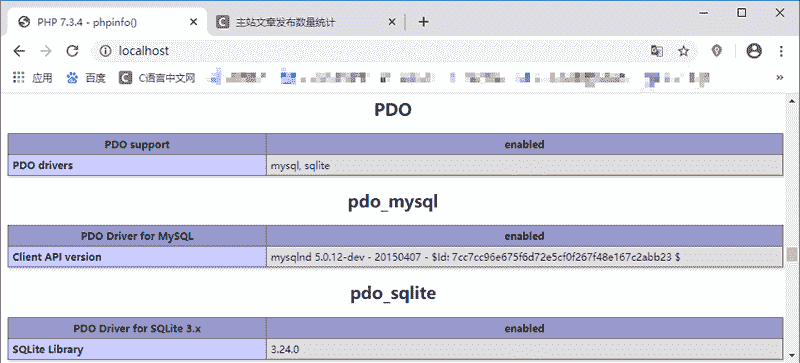

# PHP PDO 是什么

> 原文：[`c.biancheng.net/view/7705.html`](http://c.biancheng.net/view/7705.html)

前面几节我们介绍了 PHP 中 mysqli 类的一些相关知识，但是 mysqli 只能支持 MySQL 数据库。如果我们要连接其它的数据库该怎么办呢？本节我们就来了解一下 PHP 中另一个数据库相关的类——PDO 类。

## PDO 是什么

PDO 是 PHP Date Object（PHP 数据对象）的简称，它是 PHP 为访问数据库定义的一个轻量级的、一致性的接口，它提供了一个数据访问抽象层，这样无论你使用什么数据库，都可以通过同一函数执行查询和获取数据，大大简化了数据库的操作，并能够屏蔽不同数据库之间的差异。

PDO 是与 PHP5.1 版本一起发行的，使用 PDO 可以很方便地进行跨数据库程序的开发，以及不同数据库间的移植，目前 PDO 支持的数据库包括 Firebird、FreeTDS、Interbase、MySQL、SQL Server、ODBC、Oracle、Postgre SQL、SQLite 和 Sybase 等。

有了 PDO 就不必再使用 mysqli_* 的一系列函数了，只需要使用 PDO 中的方法就可以对数据库进行操作。

## PDO 的特点

我们可以将 PDO 看作是一个“数据库访问抽象层”，作用是统一各种数据库的访问接口。与 MySQL 和 MSSQL 函数库相比，PDO 让跨数据库的使用更具有亲和力，与 ADODB 和 MDB2 相比，PDO 更加高效。

PDO 将通过一种轻型、清晰、方便的函数，统一各种不同的数据库的共有特性，实现 PHP 脚本在最大程度上的抽象性和兼容性。

PDO 吸取了现有数据库扩展成功和失败的经验教训，利用 PHP5 的最新特性，可以轻松地与各种数据库进行交互。

PDO 扩展是模块化的，能够在运行时为用户数据库后端加载驱动程序，而不必重新编译或重新安装整个 PHP 程序。例如，PDO_MySQL 扩展会替代 PDO 扩展实现 MySQL 数据库 API，它还有一些用于 Oracle、Postgre SQL、ODBC 和 Firebird 的驱动程序。

## 开启 PDO

PDO 是与 PHP5.1 一起发行的，默认包含在 PHP5.1 中。由于 PDO 需要 PHP5 核心面向对象特性的支持，因此其无法在 PHP5.0 之前的版本中使用。

默认情况下，PDO 在 PHP 中为开启状态，但是要启用对某个数据库驱动程序的支持，仍需要进行相应的配置操作。

以 Windows 系统下为例，在配置文件 php.ini 中有关 PDO 相关的配置信息如下所示：

;extension=pdo_firebird
;extension=php_pdo_mysql.dll
;extension=pdo_oci
;extension=pdo_odbc
;extension=pdo_pgsql
;extension=pdo_sqlite

提示：开启相应的配置只需要去除配置项前面的分号;，然后重启 Apache 服务器即可。

验证相关的配置是否开启成功，只需要执行 phpinfo() 函数就行，在输出的页面中搜索配置的名称，如果存在则说明开启成功，如下图所示：

图：开启 PDO 中相应的配置项