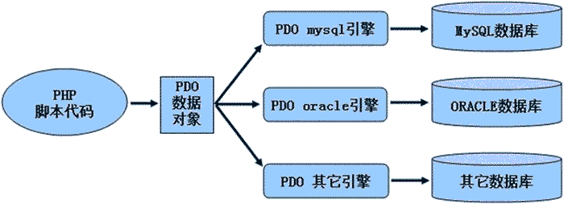

# PHP 使用 PDO 连接数据库

> 原文：[`c.biancheng.net/view/7717.html`](http://c.biancheng.net/view/7717.html)

在使用 PDO 与不同数据库之间交互时，PDO 对象中的成员方法是统一各种数据库的访问接口，所以在使用 PDO 与数据库交互之前，首先要创建一个 PDO 对象，然后再通过对象的构造函数来连接数据库。该构造函数的语法格式如下：

PDO::__construct(string $dsn[, string $username [, string $password [, array $driver_options]]])

参数说明如下：

*   $dsn：数据源名称或叫做 DSN（Data Source Name 的缩写），包含了请求连接到数据库的信息。通常一个 DSN 是由 PDO 驱动程序的名称，紧随其后是一个冒号，再后面是可选的驱动程序的数据库连接信息，比如主机名、端口和数据库名。以 MySQL 数据库为例 $dsn 可以定义为：`mysql:host=localhost;port=3306;dbname=dbname;charset=utf8`，分别定义了数据库类型、端口号、数据库名和字符集；
*   $username：可选参数，用来表示 DSN 字符串中的用户名；
*   $password：可选参数，用来表示 DSN 字符串中的密码；
*   $driver_options：可选参数，一个具体驱动的连接选项的键/值数组。

使用 PDO 连接数据库的流程如下图所示：


图：PDO 访问流程

## 创建 PDO 对象

可以以多种方式调用构造方法创建 PDO 对象，下面以连接 MySQL 数据库为例，为大家介绍构造方法的多种调用方式。

#### 1) 将参数嵌入到构造函数中

在下面的连接 MySQL 数据库的示例中，在 DSN 字符串中加载 mysql 驱动程序并指定了两个可选参数：第一个是数据库名称，第二个是数据库地址。完整的示例代码如下所示：

```

<?php
    $dsn  = 'mysql:dbname=test;host=127.0.0.1';
    $user = 'root';
    $pwd  = 'root';
    try{
        $obj = new PDO($dsn,$user,$pwd);
    }catch(PDOException $e){
        echo '数据库连接失败：'.$e -> getMessage();
    }
?>
```

其他的驱动程序会同样以不同的方式解释它的 DSN，如果无法加载驱动程序，或者发生了连接失败，则会抛出一个 PDOException，以便可以决定如何最好地处理该故障。

#### 2) 将参数存放在文件中

在创建 PDO 对象时，还可以把 DSN 字符串放在另一个本地或远程文件中，并在构造函数中引用这文件。完整的示例代码如下所示：

```

<?php
    $dsn  = 'uri:file:///install/phpstudy/WWW/dsn.txt';
    $user = 'root';
    $pwd  = 'root';
    try{
        $obj = new PDO($dsn,$user,$pwd);
    }catch(PDOException $e){
        echo '数据库连接失败：'.$e -> getMessage();
    }
?>
```

本地文件 dsn.txt 的内容如下所示：

mysql:dbname=test;host=127.0.0.1