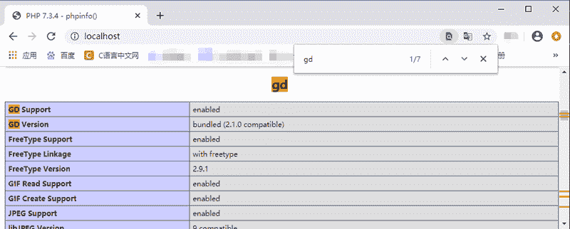

# PHP GD 库是什么

> 原文：[`c.biancheng.net/view/7938.html`](http://c.biancheng.net/view/7938.html)

PHP 在 Web 开发领域被广泛应用的原因在于，PHP 不仅可以生成 HTML 页面，还可以创建和操作二进制形式的数据，例如图像、文件等等。其中，使用 PHP 处理图像就需要 GD 库的支持，本节我们就来介绍一下 GD 库，以及如何启用 GD 库。

## 1、GD 库是什么

GD 库（也可以称为 GD2 函数库）是一个开源的用于创建图形图像的函数库，该函数库由 C 语言编写，可以在 Perl，PHP 等多种语言中使用。GD 库中提供了一系列用来处理图片的 API（接口），使用 GD 库可以处理图片、生成图片，也可以给图片加水印等。

另外，很多开源项目都对 GD 库提供了很好的技术支持，如 Jpgraph 类库就是基于 GD 库开发的用于制作复杂统计图的类库。

## 2、使用 GD 库可以做什么

在 PHP 中使用 GD 库可以在页面中绘制各种图形图像，以及统计图，如果与 Ajax 技术相结合还可以制作出各种强大的动态图表。还有就是在网站登陆页面中使用的验证码，也可以使用 GD 库来实现。

需要注意的是，GD 库开始时是支持 GIF 格式的，但由于 GIF 使用了有版权争议的 LZW 算法，会引起法律问题，于是从 GD 库 1.6 版起所有的 GIF 支持都移除了，但是又在 GD 库 2.0.28 版起又加了回来。如果使用了二者之间版本的 GD 库时，有关 GIF 相关函数是不可用。

## 3、加载 GD 库

GD 库在 PHP5 及以上的版本中是默认安装好的，但是在使用之前需要先开启 GD 库：

*   在 Windows 系统下我只需将 php.ini 配置文件中“extension=php_gd2.dll”一项前面的注释删除即可。
*   而在 Linux 系统下则是 php.ini 或 extenstion.ini 中修改“extension=gd2.so”一项。

注意：不同版本的 PHP，它们配置文件中关于 GD 库的配置项也能有所不同，比如在 php7.2 及之后的版本中 GD 库的配置项就变成了“extension=gd2”。

修改好配置文件后需要重启一下 Apache 服务器才会生效。在成功加载 GD2 函数库后，我们可以通过 phpinfo() 函数来获取 GD2 函数库的安装信息，验证 GD 库是否安装成功，如下图所示：


图：验证 GD 库是否安装成功
除了使用 phpinfo() 函数外，还可以通过打印 gd_info() 函数来验证 GD 库是否安装成功，如下所示：

```

<?php
    print_r(gd_info());
?>
```

输出如下信息则说明 GD 库安装成功：

Array ( [GD Version] => bundled (2.1.0 compatible) [FreeType Support] => 1 [FreeType Linkage] => with freetype [GIF Read Support] => 1 [GIF Create Support] => 1 [JPEG Support] => 1 [PNG Support] => 1 [WBMP Support] => 1 [XPM Support] => 1 [XBM Support] => 1 [WebP Support] => 1 [BMP Support] => 1 [JIS-mapped Japanese Font Support] => )