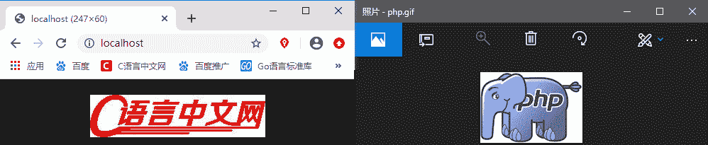

# PHP 输出图片

> 原文：[`c.biancheng.net/view/7949.html`](http://c.biancheng.net/view/7949.html)

前面我们介绍了如何《创建画布》，但是并不能看到画布中的图像是什么样子的，那么接下来就带大家来看看要怎么查看我们创建的图像。在 PHP 中可以使用不同的函数输出不同格式的图像，如下表所示是常用的图像输出函数。

| 函数名 | 描述 |
| imagegif() | 输出一个 GIF 格式图像到浏览器或文件 |
| imagejpeg() | 输出一个 JPEG 格式图像到浏览器或文件 |
| imagepng()  | 输出一个 PNG 格式图像到浏览器或文件 |

上表中函数的语法格式如下所示：

imagegif(resource $image[, string $filename])
imagejpeg(resource $image[, string $filename[, int $quality]])
imagepng(resource $image[, string $filename])

其中，$image 为创建的图像资源；$filename 为可选参数，用来设置文件的保存路径，如果设置为 NULL，则将会直接输出原始图像流；$quality 为可选参数，用来设置输出图片的质量，范围从 0（最差质量，文件更小）到 100（最佳质量，文件最大）。默认为 IJG 默认的质量值（大约为 75）。

【示例】使用图像输出函数输出创建的图像。

```

<?php
    header('Content-type:image/jpeg');
    $image1 = imagecreatefromgif('http://c.biancheng.net/uploads/allimg/191023/1-1910231P5435C.gif');
    $image2 = imagecreatefromjpeg('./logo.jpg');
    imagepng($image1,'php.png');
    imagejpeg($image2);
?>
```

运行上面的代码，会在本地生成一个 php.png 文件，并在浏览器输出 logo.jpg 图片的内容，如下图所示：


图：示例的运行效果
示例代码中第二行的 header() 是用来告诉浏览器以什么形式输出图像的，不能省略。如果省略可能会出现乱码。