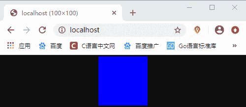
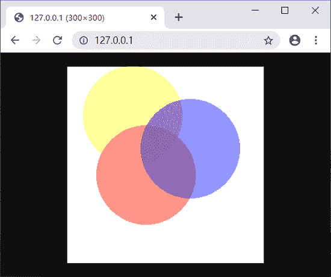

# PHP imagecolorallocate()和 imagecolorallocatealpha()：定义颜色

> 原文：[`c.biancheng.net/view/6264.html`](http://c.biancheng.net/view/6264.html)

在使用 PHP 动态输出漂亮图像的同时，也离不开颜色的设置，就像画画时需要使用调色板一样。在 PHP 中提供了 imagecolorallocate() 和 imagecolorallocatealpha() 两个函数来设置图像的颜色，下面就来详细介绍一下。

## 1、imagecolorallocate() 函数

imagecolorallocate() 函数可以为一个图像资源分配颜色，如果在图像中需要设置多种颜色，只要多次调用该函数即可。函数的语法格式如下所示：

imagecolorallocate(resource $image, int $red, int $green, int $blue)

其中，$image 为要设置颜色的图像资源，imagecolorallocate() 函数会返回一个标识符，代表了由给定的 RGB 成分组成的颜色；$red，$green 和 $blue 分别是所需要的颜色的红，绿，蓝成分，取值范围是 0 到 255 的整数或者十六进制的 0x00 到 0xFF。

提示：如果是使用 imagecreate() 函数创建的图像资源，在第一次调用 imagecolorallocate() 函数时会默认为其填充背景色。

【示例】使用 imagecolorallocate() 函数为图像设置颜色。

```

<?php
    $image = imagecreate(100, 100);
    $blue = imagecolorallocate($image, 0, 0, 255);
    $red = imagecolorallocate($image, 255, 0, 0);
    $green = imagecolorallocate($image, 0, 255, 0);
    header('Content-type:image/jpeg');
    imagejpeg($image);
    imagedestroy($image);
?>
```

运行结果如下图所示：


图：imagecolorallocate() 函数示例程序运行结果

## 2、imagecolorallocatealpha() 函数

imagecolorallocatealpha() 函数的作用和 imagecolorallocate() 相同，但多了一个额外的设置透明度的参数 alpha，函数的语法格式如下：

imagecolorallocatealpha(resource $image, int $red, int $green, int $blue, int $alpha)

其中，$image 为要设置颜色的图像资源；$red，$green 和 $blue 分别是所需要的颜色的红，绿，蓝成分，取值范围是 0 到 255 的整数或者十六进制的 0x00 到 0xFF；$alpha 用来设置颜色的透明的，取值范围在 0 到 127 之间，0 表示完全不透明，127 则表示完全透明。

【示例】使用 imagecolorallocatealpha() 函数为图像设置颜色。

```

<?php
    $size=300;
    $image=imagecreatetruecolor($size,$size);
    //用白色背景加黑色边框画个方框
    $back=imagecolorallocate($image,255,255,255);
    $border=imagecolorallocate($image,0,0,0);
    imagefilledrectangle($image,0,0,$size-1,$size-1,$back);
    imagerectangle($image,0,0,$size-1,$size-1,$border);
    $yellow_x=100;
    $yellow_y=75;
    $red_x=120;
    $red_y=165;
    $blue_x=187;
    $blue_y=125;
    $radius=150;
    //用 alpha 值分配一些颜色
    $yellow=imagecolorallocatealpha($image,255,255,0,75);
    $red=imagecolorallocatealpha($image,255,0,0,75);
    $blue=imagecolorallocatealpha($image,0,0,255,75);
    //画 3 个交迭的圆
    imagefilledellipse($image,$yellow_x,$yellow_y,$radius,$radius,$yellow);
    imagefilledellipse($image,$red_x,$red_y,$radius,$radius,$red);
    imagefilledellipse($image,$blue_x,$blue_y,$radius,$radius,$blue);
    //不要忘记输出正确的 header!
    header('Content-type:image/png');
    //最后输出结果
    imagepng($image);
    imagedestroy($image);
?>
```

运行结果如下图所示：


示例中涉及到了一些还不认识的函数，大家不必担心，我们会在后面的学习中为大家详细介绍。