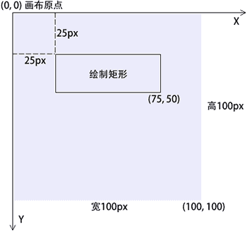
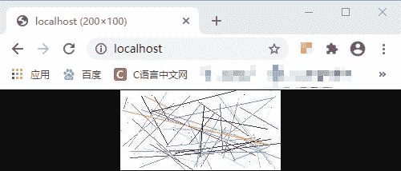
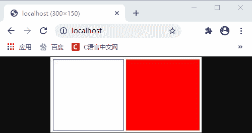
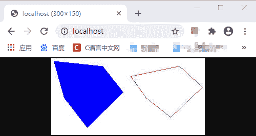
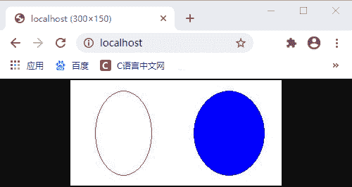
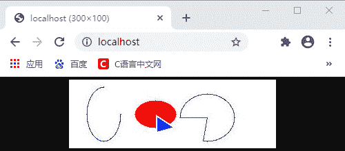

# PHP 绘制图像

> 原文：[`c.biancheng.net/view/8000.html`](http://c.biancheng.net/view/8000.html)

在 PHP 中绘制图像的函数非常丰富，包括点、线、各种几何图形等可以想象出来的平面图形，都可以通过 PHP 中提供的各种画图函数完成。无论是多么复杂的图形都是在这些最基本的图形基础上进行深化的，只有掌握了最基本图形的绘制方法，才能够绘制出各种具有独特风格的图形。

使用 PHP 绘制一个图像通常需要以下 4 个步骤：

*   创建一个背景图像，以后所有操作都是基于此背景；
*   在图像上绘图轮廓或者输入文本；
*   输出最终图形；
*   清除内存中所有资源。

绘制图形函数都需要使用画布资源，并在画布中的位置通过坐标（原点是该画布左上角的起始位置，以像素为单位，沿着 X 轴正方向向右延伸，Y 轴正方向向下延伸）决定，而且还可以通过函数中的最后一个参数，设置每个图形的颜色。画布中的坐标系统如下所示。


图：使用 PHP 绘制图像的坐标

## 1、区域填充

区域填充不可以用来绘制图像，但它可以将一个已存在图像的颜色替换为其它颜色。在 PHP 中通过 imagefill() 函数来执行区域填充，它的语法格式如下所示：

imagefill(resource $image, int $x, int $y, int $color)

其中，$image 为创建的图像资源；$x 和 $y 为要设置颜色的横纵坐标；$color 为要设置的颜色。

imagefill() 会将与坐标（x，y）相邻的颜色替换为 $color 设置的颜色。

【示例】使用 imagefill() 函数将一张图片某个区域替换为蓝色。

```

<?php
    header('Content-type:image/png');
    $img = imagecreatefrompng('http://c.biancheng.net/templets/new/images/logo.png');
    $blue = imagecolorallocate($img, 0, 0, 255);
    imagefill($img, 5, 0, $blue);
    // 关闭 alpha 渲染并设置 alpha 标志
    imagealphablending($img, false);
    imagesavealpha($img, true);
    // 输出图像到浏览器
    imagepng($img);
    imagedestroy($img);
?>
```

运行结果如下图所示：


图：使用 imagefill() 函数进行区域填充

## 2、绘制点和线

画点和线是绘制图像中最基本的操作，如果灵活使用，可以通过它们绘制出千变万化的图像。在 PHP 中，使用 imagesetpixel() 函数在画布中绘制一个单一像素的点，并且可以设置点的颜色，函数的语法格式如下：

imagesetpixel(resource $image, int $x, int $y, int $color)

该函数可以在第一个参数 $image 提供的画布中，在（$x，$y）的坐标位置上，绘制一个颜色为 $color 的一个像素点。在实际开发中还可以通过循环和随机数的结合来绘制更多的像素点。

如果需要绘制一条线段，则可以使用 imageline() 函数，其语法格式如下：

imageline(resource $image, int $x1, int $y1, int $x2, int $y2, int $color)

我们都知道两个点可以确定一条线段，所以该函数可以在 $image 提供的画布中，从坐标（$x1，$y1）到坐标（$x2，$y2）绘制一条颜色为 $color 的线段。

【示例】使用 imagesetpixel() 和 imageline() 函数在画布中绘制一些点和直线。

```

<?php
    $img = imagecreate(200, 100);
    imagecolorallocate($img, 255, 255, 255);
    $blue = imagecolorallocate($img, 0, 0, 255);
    $red = imagecolorallocate($img, 255, 0, 0);
    for ($i=0; $i <= 50; $i++) {
        $color = imagecolorallocate($img, rand(0, 255), rand(0, 255), rand(0, 255));
        imagesetpixel($img, rand(0, 200), rand(0, 100), $color);
        imageline($img, rand(0, 200), rand(0, 100), rand(0, 200), rand(0, 100), $color);
    }
    header('Content-type:image/jpeg');
    imagejpeg($img);
    imagedestroy($img);
?>
```

运行结果如下图所示：


图：绘制随机的点和线

## 3、绘制矩形

在 PHP 中我们可以使用 imagerectangle() 或者 imagefilledrectangle() 函数来绘制一个矩形，与 imagerectangle() 函数不同的是 imagefilledrectangle() 函数会在绘制完成矩形后填充矩形，它们的语法格式如下所示：

imagerectangle(resource $image, int $x1, int $y1, int $x2, int $y2, int $color)
imagefilledrectangle(resource $image, int $x1, int $y1, int $x2, int $y2, int $color)

这两个函数的功能类似，都是在 $image 画布中画一个矩形，矩形的左上角坐标为（$x1，$y1），右下角坐标为（$x2，$y2），不同的是 imagerectangle() 是使用 $color 参数指定矩形的边线颜色，而 imagefilledrectangle() 则是使用这个颜色填充矩形。

【示例】使用 imagerectangle() 和 imagefilledrectangle() 函数分别绘制一个矩形。

```

<?php
    $img = imagecreate(300, 150);
    imagecolorallocate($img, 255, 255, 255);
    $blue = imagecolorallocate($img, 0, 0, 255);
    $red = imagecolorallocate($img, 255, 0, 0);
    imagerectangle($img, 5, 5, 145, 145, $blue);
    imagefilledrectangle($img, 150, 5, 295, 145, $red);
    header('Content-type:image/jpeg');
    imagejpeg($img);
    imagedestroy($img);
?>
```

运行结果如下图所示：


图：绘制矩形

## 4、绘制多边形

学会了绘制矩形，那如果想要绘制三角形、五边形等多边形呢？在 PHP 中可以使用 imagepolygon() 函数来绘制一个多边形；也可以使用 imagefilledpolygon() 来绘制并填充一个多边形，它们的语法格式如下所示：

imagepolygon(resource $image, array $points, int $num_points, int $color)
imagefilledpolygon(resource $image, array $points, int $num_points, int $color)

这两个函数都是可以在画布 $image 中画一个多边形；第二个参数 $points 是一个数组，包含了多边形的各个顶点坐标，例如 $points[0]=x0，$points[1]=y0，$points[2]=x1，$points[3]=y1，依此类推；第三个参数 $num_points 用来设置多边形的顶点数，必须大于 3；至于第四个参数，imagepolygon() 函数会使用 $color 颜色来指定多边形边线的颜色，而 imagefilledpolygon() 则是使用 $color 来填充多边形。

注意：$points 数组中的顶点坐标数（坐标是成对出现的）不得小于多边形的顶点数 $num_points。

【示例】使用 imagepolygon() 和 imagefilledpolygon() 函数结合随机数绘制随机的多边形图像。

```

<?php
    $img = imagecreate(300, 150);
    imagecolorallocate($img, 255, 255, 255);
    $blue = imagecolorallocate($img, 0, 0, 255);
    $red = imagecolorallocate($img, 255, 0, 0);
    $points1 = array(
        155,35,
        250,15,
        295,56,
        233,115,
        185,77
    );
    $points2 = array(
        5,5,
        100,15,
        140,66,
        70,135,
        25,77
    );
    imagepolygon($img, $points1, rand(3, 5), $red);
    imagefilledpolygon($img, $points2, rand(3, 5), $blue);
    header('Content-type:image/jpeg');
    imagejpeg($img);
    imagedestroy($img);
?>
```

运行结果如下图所示：


图：绘制随机的多边形

## 5、绘制椭圆

在 PHP 中可以使用 imageellipse() 函数来绘制一个椭圆，或者使用 imagefilledellipse() 函数绘制并填充一个椭圆，它们的语法如下所示：

imageellipse(resource $image, int $cx, int $cy, int $width, int $height, int $color)
imagefilledellipse(resource $image, int $cx, int $cy, int $width, int $height, int $color)

这两个函数都可以在画布 $image 上绘制一个椭圆，其中 $cx 和 $cy 分别代表椭圆圆心的横纵坐标；$width 和 $height 分别代表椭圆的宽度和高度；至于 $color，imageellipse() 用来指定椭圆边线的颜色，而 imagefilledellipse() 则用 $color 颜色来填充椭圆。

【示例】分别使用 imageellipse() 和 imagefilledellipse() 函数来绘制椭圆。

```

<?php
    $img = imagecreate(300, 150);
    imagecolorallocate($img, 255, 255, 255);
    $blue = imagecolorallocate($img, 0, 0, 255);
    $red = imagecolorallocate($img, 255, 0, 0);
    imageellipse($img, 75, 75, 80, 120, $red);
    imagefilledellipse($img, 225, 75, 100, 120, $blue);
    header('Content-type:image/jpeg');
    imagejpeg($img);
    imagedestroy($img);
?>
```

运行结果如下图所示：


图：绘制椭圆

## 6、绘制弧线

在 PHP 中可以使用 imagearc() 函数来画出一条弧线或者圆形，也可以使用 imagefilledarc() 函数来绘制弧线或者圆形并填充，它们的语法格式如下所示：

imagearc(resource $image, int $cx, int $cy, int $width, int $height, int $start, int $end, int $color)
imagefilledarc(resource $image, int $cx, int $cy, int $width, int $height, int $start, int $end, int $color, int $style)

这两个函数都可以在画布 $image 上绘制一个椭圆弧，其中 $cx 和 $cy 分别为圆弧中心点的横纵坐标；$width 和 $height 分别为圆弧的宽度和高度；$start 和 $end 分别代表圆弧的起点角度和终点角度，0° 为钟表 3 点钟的位置，以顺时针方向递增；至于 $color 参数，imagearc() 用来表示圆弧的线条颜色，而 imagefilledarc() 用来表示弧线区域的填充色；

imagefilledarc() 函数比 imagearc() 函数多了一个 $style 参数，它用来设置颜色的填充类型，可以是如下的值：

*   IMG_ARC_PIE：普通填充，产生圆形边界；
*   IMG_ARC_CHORD：只使用直线连接起点和终点，与 IMG_ARC_PIE 互斥；
*   IMG_ARC_NOFILL：指明弧或弦只有轮廓，不填充；
*   IMG_ARC_EDGED：用直线将起始和结束点与中心点相连，和 IMG_ARC_NOFILL 一起使用是画饼状图轮廓的好方法。

【示例】分别使用 imagefilledarc() 和 imagearc() 函数绘制圆弧。

```

<?php
    $img = imagecreate(300, 100);
    imagecolorallocate($img, 255, 255, 255);
    $blue = imagecolorallocate($img, 0, 0, 255);
    $red = imagecolorallocate($img, 255, 0, 0);
    imagearc($img, 50, 50, 50, 80, 0, 270, $blue);
    imagefilledarc($img, 125, 50, 60, 40, 90, 45, $red, IMG_ARC_PIE);
    imagefilledarc($img, 128, 55, 60, 40, 90, 45, $blue, IMG_ARC_CHORD);
    imagefilledarc($img, 200, 55, 80, 70, 180, 100, $blue, IMG_ARC_EDGED|IMG_ARC_NOFILL);
    header('Content-type:image/jpeg');
    imagejpeg($img);
    imagedestroy($img);
?>
```

运行结果如下所示：


图：绘制弧线