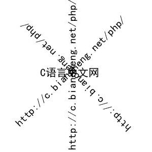

# PHP 在图像上绘制文字

> 原文：[`c.biancheng.net/view/8012.html`](http://c.biancheng.net/view/8012.html)

想要在图像中显示文字也需要按坐标位置画上去。在 PHP 中不仅支持多种的字体库，还提供了非常灵活的文字绘制方法。例如，在图像中绘制缩放、倾斜、旋转的文字等。常用的绘制文字的函数如下表所示：

| 函数名  | 描述 |
| imagestring() | 水平绘制一行字符串 |
| imagestringup() | 垂直绘制一行字符串 |
| imagechar() | 水平绘制一个字符 |
| imagecharup() | 垂直绘制一个字符 |
| imagettftext() | 用 TrueType 字体向图像中写入文本 |

虽然这几个函数的功能有所差异，但调用方式是类似的，尤其是 imagestring()、imagestringup()、imagechar() 以及 imagecharup() 函数，它们的参数都是相同的，因此就不再分开介绍了，这些函数的语法格式如下：

imagestring(resource $image, int $font, int $x, int $y, string $s, int $color)
imagestringup(resource $image, int $font, int $x, int $y, string $s, int $col)
imagechar(resource $image, int $font, int $x, int $y, string $c, int $color)
imagecharup(resource $image, int $font, int $x, int $y, string $c, int $color)

使用这些函数可以在画布 $image 上，坐标为（$x，$y）的位置，绘制字符串（或字符） $s，字符串的颜色为 $color，字体为 $font。如果 $font 是 1，2，3，4 或 5，则使用内置字体。

【示例】使用 imagestring()、imagestringup()、imagechar() 和 imagecharup() 函数在画布上绘制文字。

```

<?php
    $str = 'http://c.biancheng.net/php/';
    $img = imagecreate(300, 200);
    imagecolorallocate($img, 255, 255, 255);
    $red = imagecolorallocate($img, 255, 0, 0);
    imagestring($img, 5, 0, 0, $str, $red);
    imagestringup($img, 2, 150, 180, $str, $red);
    imagechar($img, 3, 50, 50, $str, $red);
    imagecharup($img, 4, 50, 100, $str, $red);
    header('Content-type:image/jpeg');
    imagejpeg($img);
    imagedestroy($img);
?>
```

运行结果如下图所示：


图：绘制文字
除了上面介绍的那些函数，PHP 中还提供了一个 imagettftext() 函数，它可以使用 TrueType 字体（Windows 系统中扩展名为 .ttf 格式的字体）向图像中写入文本，函数的语法格式如下：

imagettftext(resource $image, float $size, float $angle, int $x, int $y, int $color, string $fontfile, string $text)

参数说明如下：

*   $image：由图象创建函数（例如 imagecreatetruecolor()）返回的图象资源；
*   $size：字体的尺寸；
*   $angle：角度制表示的角度，0 度为从左向右读的文本，数值越高则表示将文本进行逆时针旋转。例如 90 度表示从下向上读的文本；
*   $x、$y：表示文本中第一个字符的坐标点（大概是字符左下角的位置）；
*   $color：用来设置文本的颜色；
*   $fontfile：是要使用的 TrueType 字体文件的路径；
*   $text：UTF-8 编码的文本字符串。

【示例】使用 imagettftext() 函数在图像上绘制字符。

```

<?php
    $str1 = 'http://c.biancheng.net/php/';
    $str2 = 'C 语言中文网';
    $font = 'C:\Windows\Fonts\simhei.ttf';
    $img = imagecreate(300, 300);
    imagecolorallocate($img, 255, 255, 255);
    $black = imagecolorallocate($img, 0, 0, 0);
    imagettftext($img, 16, 0, 80, 150, $black, $font, $str2);
    imagettftext($img, 16, 90, 150, 295, $black, $font, $str1);
    imagettftext($img, 16, 135, 260, 250, $black, $font, $str1);
    imagettftext($img, 16, 45, 40, 250, $black, $font, $str1);
    header('Content-type:image/jpeg');
    imagejpeg($img);
    imagedestroy($img);
?>
```

运行结果如下图所示：


图：使用 imagettftext() 绘制文本