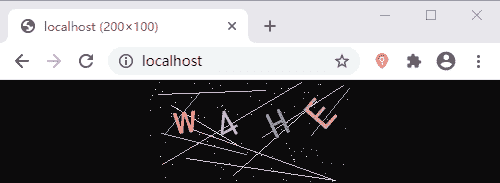
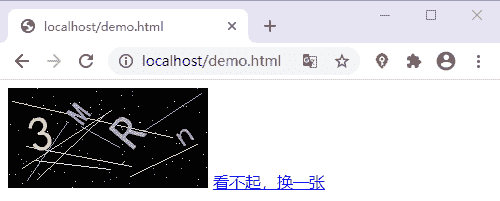

# PHP 生成图形验证码

> 原文：[`c.biancheng.net/view/8017.html`](http://c.biancheng.net/view/8017.html)

通过前面对 PHP 中常用的图形图像处理函数的学习，相信大家都有了一定的收获。在网上注册或者登陆账号的时候常常需要我们输入验证码，那么验证码是怎么实现的呢？本节我们就将前面所学的知识综合起来，来为大家演示一下实现验证码过程。

具体的实现步骤如下所示：

*   创建画布；
*   随机绘制字符；
*   绘制干扰元素；
*   输出图像到浏览器；
*   释放资源。

完整的实现代码如下所示：

```

<?php
    function rand_str($length) {
        // 验证码中所需要的字符
        $chars = 'abcdefghijklmnopqrstuvwxyzABCDEFGHIJKLMNOPQRSTUVWXYZ0123456789';
        $str = '';
        for($i = 0; $i < $length; $i++)
        {
            // 随机截取 $chars 中的任意一位字符；
            $str .= substr($chars, mt_rand(0, strlen($chars) - 1), 1);
        }
        return $str;
    }
    function rand_color($image){
        // 生成随机颜色
        return imagecolorallocate($image, rand(127, 255), rand(127, 255), rand(127, 255));
    }

    $image = imagecreate(200, 100);
    imagecolorallocate($image, 0, 0, 0);
    for ($i=0; $i <= 9; $i++) {
        // 绘制随机的干扰线条
        imageline($image, rand(0, 200), rand(0, 100), rand(0, 200), rand(0, 100), rand_color($image));
    }
    for ($i=0; $i <= 100; $i++) {
        // 绘制随机的干扰点
        imagesetpixel($image, rand(0, 200), rand(0, 100), rand_color($image));
    }
    $length = 4;//验证码长度
    $str = rand_str($length);//获取验证码
    $font = 'C:\Windows\Fonts\simhei.ttf';
    for ($i=0; $i < $length; $i++) {
        // 逐个绘制验证码中的字符
        imagettftext($image, rand(20, 38), rand(0, 60), $i*50+25, rand(30,70), rand_color($image), $font, $str[$i]);
    }
    header('Content-type:image/jpeg');
    imagejpeg($image);
    imagedestroy($image);
?>
```

运行结果如下图所示：


图：生成验证码图片
通过上面的结果可以看出，我们成功的生成了验证码图片，接下来只需要把它引用到网页中的指定位置就可以了。下面通过一个简单的示例来演示一下，代码如下所示：

```

<!DOCTYPE html>
<html lang="en">
<head>
    <meta charset="UTF-8">
    <title></title>
</head>
<body>
    
    <a href="javacript:;" onclick="document.getElementById('refresh').src='index.php?'+Math.random();">看不起，换一张</a>
</body>
</html>
```

示例代码与生成验证码的代码是分开的，运行上面的代码，效果如下所示：


图：应用验证码