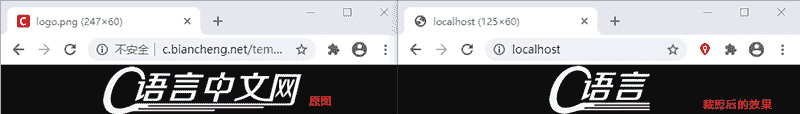

# PHP imagecopyresampled()和 imagecopyresized()：图片压缩

> 原文：[`c.biancheng.net/view/8022.html`](http://c.biancheng.net/view/8022.html)

图像是网站中主要的内容展现方式之一。当我们将图片上传到服务器时，为了节省存储空间往往需要将图片进行压缩，同时也可以提高网页加载的速度。压缩通常是指将图片按比例进行缩放，以此来减少图片的体积。

实际开发中，一般在上传图片时就需要对图片进行压缩操作，想要压缩图片可以使用 imagecopyresized() 或者 imagecopyresampled() 函数，而使用 imagecopyresampled() 函数处理后图片的质量会好一些，所以在进行图片压缩时可以优先使用 imagecopyresampled() 函数。

首页来看一下这两个函数的语法格式

imagecopyresized(resource $dst_image, resource $src_image, int $dst_x, int $dst_y, int $src_x, int $src_y, int $dst_w, int $dst_h, int $src_w, int $src_h)
imagecopyresampled(resource $dst_image, resource $src_image, int $dst_x, int $dst_y, int $src_x, int $src_y, int $dst_w, int $dst_h, int $src_w, int $src_h)

两个函数的参数是完全一样的，说明如下：

*   $dst_image：目标图象连接资源。
*   $src_image：源图象连接资源。
*   $dst_x：目标 X 坐标点。
*   $dst_y：目标 Y 坐标点。
*   $src_x：源的 X 坐标点。
*   $src_y：源的 Y 坐标点。
*   $dst_w：目标宽度。
*   $dst_h：目标高度。
*   $src_w：源图象的宽度。
*   $src_h：源图象的高度。

这两个函数都可以将一幅图像中的一块矩形区域拷贝到另一个图像中，而 imagecopyresampled() 函数更是可以平滑地插入像素值，因此，在减小了图像的大小的同时仍然保持极大的清晰度。

通俗来讲就是，这两个函数可以从图像 $src_image 的（$src_x，$src_y）位置，截取一个宽 $src_w 高 $src_h 的矩形区域，并将其复制到图像 $dst_image 中（$dst_x，$dst_y）处，宽 $dst_w 高 $dst_h 的矩形区域中。

如果源和目标的宽度和高度不同，则会进行相应的图像收缩和拉伸。而坐标则是指的矩形区域的左上角。另外，两个函数都可用来在同一幅图（$dst_image 和 $src_image 相同）内部进行拷贝，但如果拷贝区域交迭的话则结果不可预知。

【示例】使用 imagecopyresampled() 函数来压缩图片尺寸。

```

<?php
    /**
     * @param  $file  要缩放的图片路径
     * @param  $width 缩放后的宽度
     * @param  $height 缩放后的高度
     * @param  $eq    是否等比缩放
     * @return [type]
     */
    function compress($file,$width,$height='',$eq=true){
        $image = imagecreatefrompng($file);
        $img_info = getimagesize($file);
        if($eq) $height = $img_info[1]*($width/$img_info[0]);
        $com_image = imagecreatetruecolor($width, $height);
        imagecopyresampled($com_image, $image, 0, 0, 0, 0, $width, $height, $img_info[0], $img_info[1]);
        header('Content-type:image/jpeg');
        imagejpeg($com_image);
        imagedestroy($com_image);
    }
    $file = 'http://c.biancheng.net/templets/new/images/logo.png';
    compress($file,200);
?>
```

运行上面的代码，即可将图片等比缩放到指定的宽度和高度，如下图所示：


图：图片缩放后的效果
示例程序并不完善，只能演示基本的图片压缩公能，有兴趣的同学可以试着完善一下，比如加上根据文件格式来调用不同的函数，让程序可以处理多种格式的图片。

使用本节介绍的这两个函数，不仅可以实现图片缩放，还可以实现图片裁剪的功能，将上面示例中的代码略作修改即可，如下所示：

```

<?php
    /**
     * @param  $file    需要裁剪的原图
     * @param  $x       裁剪的起始位置的 X 坐标
     * @param  $y       裁剪的起始位置的 Y 坐标
     * @param  $width   裁剪的区域的宽度
     * @param  $height  裁剪的区域的高度
     * @return [type]
     */
    function compress($file,$x,$y,$width,$height){
        $image = imagecreatefrompng($file);
        $com_image = imagecreatetruecolor($width, $height);
        imagecopyresampled($com_image, $image, 0, 0, $x, $y, $width, $height, $width, $height);
        header('Content-type:image/jpeg');
        imagejpeg($com_image);
        imagedestroy($com_image);
    }

    $file = 'http://c.biancheng.net/templets/new/images/logo.png';
    compress($file,0,0,125,60);
?>
```

运行效果如下所示：


图：裁剪前后的效果对比